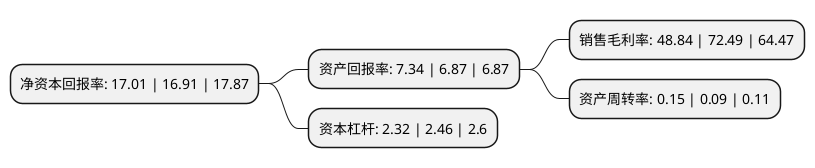

> 本页面由自动化程序生成于 2022年5月20日 01:24
> 内容可能存在错误，如有bug请提交issue至：https://github.com/Eroleice/doc-pi/issues
{.is-warning}

# 上市公司基本情况

## 基本资料

南京高科股份有限公司（以下简称“南京高科”）成立于1992年07月08日，南京市。于1997年05月06日在上交所主板上市。

南京高科注册资本123,595.689万元，主要业务:市政基础设施承建，土地成片开发转让，电力销售，药品销售，商品销售。以下是详细信息：

- 公司名称: 南京高科股份有限公司
- 股票代码: 600064.SH
- 所在地: 江苏 - 南京市
- 成立日期: 1992年07月08日
- 注册资本: 123,595.689万元
- 法定代表人: 徐益民
- 主营业务: 市政基础设施承建，土地成片开发转让，电力销售，药品销售，商品销售
- 公司官网: www.600064.com
- 公司介绍: 公司是1992年7月4日经南京市经济体制改革委员会批准设立的定向募集股份有限公司。公司主要从事高新技术产业投资、开发；市政基础设施建设、投资及管理；土地成片开发；建筑安装工程；商品房开发、销售；物业管理；自有房屋租赁；工程设计；咨询服务；污水处理、环保项目建设、投资及管理。公司产业横跨房地产、市政、医药、股权投资等多个领域，搭建了投资控股型集团公司模式。公司抓住资本市场大发展的机遇，依托上市公司的品牌优势、资金优势，在立足开发区建设和经营的同时，以实现持续成长为目标，积极培育公司新的利润增长点。公司秉承“整合资源、创造价值”的经营理念，结合自身资源禀赋，在稳健发展房地产、市政等传统主营业务，推动其内部转型的同时，积极提升公司“大创投”的战略转型，并着力培育“大健康”等新型业务增长新动能，形成公司业务发展新格局。

## 股东及高管情况

上市公司第一大股东为南京新港开发总公司，持股429,345,157股，占比34.74%，为上市公司实际控制人。

截至2022年03月31日，上市公司的前十大股东中，共有3名自然人股东，4名机构股东，3个产品账户，其中5%以上大股东共有1名。上市公司前十大股东明细如下：

> 截至2022年03月31日，上市公司前十大股东信息如下：

| 股东名称 | 持股数量（股） | 持股比例 |
| --- | --- | --- |
| 南京新港开发总公司 | 429,345,157 | 34.74% |
| 杨廷栋 | 50,900,000 | 4.12% |
| 中央汇金资产管理有限责任公司 | 32,986,345 | 2.67% |
| 南京港(集团)有限公司 | 30,760,000 | 2.49% |
| 刘少鸾 | 18,330,100 | 1.48% |
| 中欧基金-农业银行-中欧中证金融资产管理计划 | 9,689,144 | 0.78% |
| 博时基金-农业银行-博时中证金融资产管理计划 | 9,689,144 | 0.78% |
| 工银瑞信基金-农业银行-工银瑞信中证金融资产管理计划 | 9,652,800 | 0.78% |
| 杨伟 | 9,465,300 | 0.77% |
| 苏州联胜化学有限公司 | 7,300,000 | 0.59% |

## 杜邦分析

> 数据列示周期：2021年 | 2020年 | 2019年
{.is-info}

上市公司的净资产收益率在近一年有所上升，上升幅度为0.59%，其变化情况分解如下：
- 上市公司的销售毛利率在近一年下降了-32.63%，可能是生产效率的下降、商品原材料价格上涨或商品价格的下跌所致。
- 上市公司的资产周转率在近一年上升了66.67%，可能是源自于更快的销售回款或库存管理效果提升。
- 上市公司的财务杠杆比率在近一年下降了-5.69%，可能是减少负债降低财务费用。

