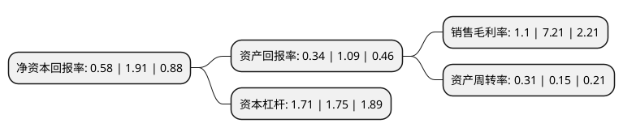

> 本页面由自动化程序生成于 2022年5月20日 01:24
> 内容可能存在错误，如有bug请提交issue至：https://github.com/Eroleice/doc-pi/issues
{.is-warning}

# 上市公司基本情况

## 基本资料

天津海泰科技发展股份有限公司（以下简称“海泰发展”）成立于1993年01月05日，天津市。于1997年06月20日在上交所主板上市。

海泰发展注册资本64,611.583万元，主营业务涉及地产，高新产业投资，股权投资三个业务板块。主营商品批发及房地产销售，以下是详细信息：

- 公司名称: 天津海泰科技发展股份有限公司
- 股票代码: 600082.SH
- 所在地: 天津 - 天津市
- 成立日期: 1993年01月05日
- 注册资本: 64,611.583万元
- 法定代表人: 董建新
- 主营业务: 主营业务涉及地产，高新产业投资，股权投资三个业务板块主营商品批发及房地产销售，
- 公司官网: www.hitech-develop.com
- 公司介绍: 公司是国内最早一家“以创业孵化带动工业地产与产业投资”的工业园区类上市公司，以创业孵化服务为基础，孵化器及高新区基础设施建设、运营与产业投资两翼并举，主营业务涉及地产、高新产业投资、孵化服务、贸易等。公司在滨海高新区长期从事工业地产开发运营，拥有雄厚的资源储备和开发经验，多年来为滨海高新区招商引资做出了贡献。公司拥有天津滨海高新区标准厂房示范园、蓝海科技园一期等项目，为公司提供了更多的招商资源。

## 股东及高管情况

上市公司第一大股东为天津海泰控股集团有限公司，持股156,938,768股，占比24.29%，**疑似为**上市公司实际控制人。

截至2022年03月31日，上市公司的前十大股东中，共有4名自然人股东，3名机构股东，3个产品账户，其中5%以上大股东共有2名。上市公司前十大股东明细如下：

> 未能通过持股比例判定出上市公司实际控制人（持股30%以上）
> 可能存在通过间接持股、联合持股、协议控制等方式拥有实际控制权的主体，具体请参考上市公司定期公告！
{.is-warning}

> 截至2022年03月31日，上市公司前十大股东信息如下：

| 股东名称 | 持股数量（股） | 持股比例 |
| --- | --- | --- |
| 天津海泰控股集团有限公司 | 156,938,768 | 24.29% |
| 天津海泰控股集团有限公司 | 156,938,768 | 24.29% |
| 天津华苑置业有限公司 | 31,730,164 | 4.91% |
| 李鲁超 | 9,990,300 | 1.55% |
| 李鲁超 | 9,990,300 | 1.55% |
| 孙婉茹 | 5,067,400 | 0.8% |
| 上海迎水投资管理有限公司-迎水聚宝18号私募证券投资基金 | 4,804,049 | 0.76% |
| 上海迎水投资管理有限公司-迎水聚宝18号私募证券投资基金 | 4,804,049 | 0.76% |
| 国信证券股份有限公司-华夏中证500指数智选增强型证券投资基金 | 3,343,600 | 0.53% |
| 周云华 | 2,808,000 | 0.44% |

## 利润表分析

上市公司2021年总收入为9.11亿元，净利润为0.1亿元，实现盈利。

## 杜邦分析

> 数据列示周期：2021年 | 2020年 | 2019年
{.is-info}

上市公司的净资产收益率在近一年有所下降，下降幅度为-69.63%，其变化情况分解如下：
- 上市公司的销售毛利率在近一年下降了-84.74%，可能是生产效率的下降、商品原材料价格上涨或商品价格的下跌所致。
- 上市公司的资产周转率在近一年上升了106.67%，可能是源自于更快的销售回款或库存管理效果提升。
- 上市公司的财务杠杆比率在近一年下降了-2.29%，可能是减少负债降低财务费用。

