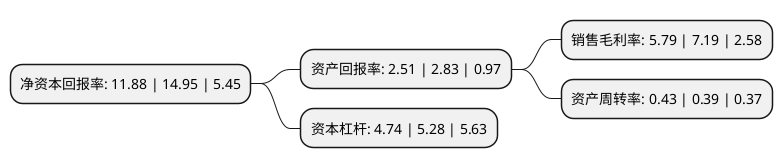

> 本页面由自动化程序生成于 2022年5月20日 01:24
> 内容可能存在错误，如有bug请提交issue至：https://github.com/Eroleice/doc-pi/issues
{.is-warning}

# 上市公司基本情况

## 基本资料

武汉东湖高新集团股份有限公司（以下简称“东湖高新”）成立于1993年03月19日，武汉市。于1998年02月12日在上交所主板上市。

东湖高新注册资本79,555.474万元，主要业务:科技园区，发电，火电厂烟气脱硫服务等。以下是详细信息：

- 公司名称: 武汉东湖高新集团股份有限公司
- 股票代码: 600133.SH
- 所在地: 湖北 - 武汉市
- 成立日期: 1993年03月19日
- 注册资本: 79,555.474万元
- 法定代表人: 杨涛
- 主营业务: 科技园区，发电，火电厂烟气脱硫服务等
- 公司官网: www.elht.com
- 公司介绍: 公司是“武汉·中国光谷”的开发业主，主要从事科技工业园、烟气脱硫和环保电力的建设、开发及运营。近年来，湖北路桥积极推进产业结构升级，向BT、BOT、BOT+EPC、工程项目总承包、项目代建等高端模式升级；向下游延伸产业链，大力拓展公路养护、市政、园林、水利等辅助主业；同时，实施“立足华中、面向全国、拓展海外”的发展战略，主动融入国家“一带一路”、周边国家互联互通等大战略，加速开发海外市场。产业投资板块抢占国家战略新兴产业高地，重点关注和投资节能环保、集成电路、光电子信息、软件与互联网、大健康等领域。组建产业投资和资本运作平台，打造专业的投融资管理团队，通过直接投资和基金投资，推动产业转型升级。

## 股东及高管情况

上市公司第一大股东为湖北省建设投资集团有限公司，持股168,650,053股，占比21.2%，**疑似为**上市公司实际控制人。

截至2022年03月31日，上市公司的前十大股东中，共有4名自然人股东，4名机构股东，2个产品账户，其中5%以上大股东共有1名。上市公司前十大股东明细如下：

> 未能通过持股比例判定出上市公司实际控制人（持股30%以上）
> 可能存在通过间接持股、联合持股、协议控制等方式拥有实际控制权的主体，具体请参考上市公司定期公告！
{.is-warning}

> 截至2022年03月31日，上市公司前十大股东信息如下：

| 股东名称 | 持股数量（股） | 持股比例 |
| --- | --- | --- |
| 湖北省建设投资集团有限公司 | 168,650,053 | 21.2% |
| 武汉长江通信产业集团股份有限公司 | 33,640,685 | 4.23% |
| 青岛金石灏汭投资有限公司-金石灏沣股权投资(杭州)合伙企业(有限合伙) | 23,478,260 | 2.95% |
| 天风天成资管-浦发银行-天风天成天智6号资产管理计划 | 13,473,209 | 1.69% |
| 张素芬 | 6,620,000 | 0.83% |
| 严延芳 | 5,598,450 | 0.7% |
| 徐文辉 | 3,900,664 | 0.49% |
| 上海通怡投资管理有限公司-通怡海阳7号私募证券投资基金 | 3,500,000 | 0.44% |
| 邵永丽 | 3,303,328 | 0.42% |
| 中国国际金融香港资产管理有限公司-客户资金2 | 3,182,917 | 0.4% |

## 杜邦分析

> 数据列示周期：2021年 | 2020年 | 2019年
{.is-info}

上市公司的净资产收益率在近一年有所下降，下降幅度为-20.54%，其变化情况分解如下：
- 上市公司的销售毛利率在近一年下降了-19.47%，可能是生产效率的下降、商品原材料价格上涨或商品价格的下跌所致。
- 上市公司的资产周转率在近一年上升了10.26%，可能是源自于更快的销售回款或库存管理效果提升。
- 上市公司的财务杠杆比率在近一年下降了-10.23%，可能是减少负债降低财务费用。

