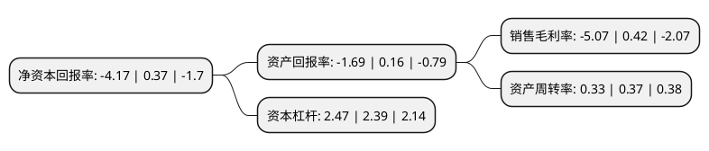

> 本页面由自动化程序生成于 2022年5月20日 01:26
> 内容可能存在错误，如有bug请提交issue至：https://github.com/Eroleice/doc-pi/issues
{.is-warning}

# 上市公司基本情况

## 基本资料

北京空港科技园区股份有限公司（以下简称“空港股份”）成立于2000年03月28日，北京市。于2004年03月18日在上交所主板上市。

空港股份注册资本30,000万元，主要业务:园区开发建设，工业地产开发，建筑施工，物业经营与管理。以下是详细信息：

- 公司名称: 北京空港科技园区股份有限公司
- 股票代码: 600463.SH
- 所在地: 北京 - 北京市
- 成立日期: 2000年03月28日
- 注册资本: 30,000万元
- 法定代表人: 王鹏
- 主营业务: 园区开发建设，工业地产开发，建筑施工，物业经营与管理
- 公司官网: www.600463.com.cn
- 公司介绍: 公司是一家临空型园区类上市公司，公司立足北京临空经济核心区，以园区开发建设为主营业务，形成了包括土地一级开发、工业地产开发、建筑工程施工、物业租赁和管理业务在内的园区开发建设产业链。在发展方向和定位上，以园区的开发建设为基础，通过加大房地产开发力度、不断优化产业结构、增持优质物业，实现土地资本、科技资本与金融资本相融合，保持土地开发业务稳定增长，促进建筑施工业务的规模增长，大力拓展标准化厂房增值业务，积极发展高附加值临空工业地产，从而全面推动了空港股份的可持续发展，在同行业中赢得了较强的竞争优势和优异的经营业绩。公司在临空产业园区、工业地产及商务办公等产品开发方面不断积累经验，对临空经济产业发展及工业地产有着深刻的理解，通过产品创新，打造出MAX企业独栋品牌，成为临空工业地产开发领域的先行者。

## 股东及高管情况

上市公司第一大股东为北京空港经济开发有限公司，持股147,946,207股，占比49.32%，为上市公司实际控制人。

截至2022年04月20日，上市公司的前十大股东中，共有5名自然人股东，3名机构股东，1个产品账户，1个海外主体，其中5%以上大股东共有3名。上市公司前十大股东明细如下：

> 截至2022年04月20日，上市公司前十大股东信息如下：

| 股东名称 | 持股数量（股） | 持股比例 |
| --- | --- | --- |
| 北京空港经济开发有限公司 | 147,946,207 | 49.32% |
| 北京空港经济开发有限公司 | 147,946,207 | 49.32% |
| 国开金融有限责任公司 | 46,340,700 | 15.4469% |
| 周宇光 | 5,300,163 | 1.77% |
| 北京临空兴融私募基金管理有限公司 | 1,791,912 | 0.6% |
| 赵荣全 | 1,476,100 | 0.49% |
| 王春林 | 1,366,600 | 0.46% |
| 潘建华 | 1,272,300 | 0.42% |
| 高华-汇丰-GOLDMAN, SACHS & CO.LLC | 1,201,900 | 0.4% |
| 李东清 | 1,164,200 | 0.39% |

## 利润表分析

上市公司2021年总收入为10.13亿元，净利润为-0.52亿元，**未实现盈利**。

## 杜邦分析

> 数据列示周期：2021年 | 2020年 | 2019年
{.is-info}

上市公司的净资产收益率在近一年有所下降，下降幅度为-1227.03%，其变化情况分解如下：
- 上市公司的销售毛利率在近一年下降了-1307.14%，可能是生产效率的下降、商品原材料价格上涨或商品价格的下跌所致。
- 上市公司的资产周转率在近一年下降了-10.81%，可能是源自于更慢的销售回款或库存管理效果下降。
- 上市公司的财务杠杆比率在近一年上升了3.35%，可能是增加负债扩大生产规模。

