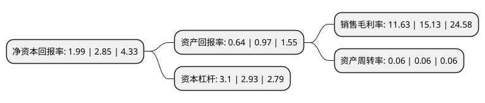

> 本页面由自动化程序生成于 2022年5月20日 01:27
> 内容可能存在错误，如有bug请提交issue至：https://github.com/Eroleice/doc-pi/issues
{.is-warning}

# 上市公司基本情况

## 基本资料

上海市北高新股份有限公司（以下简称“市北高新”）成立于1993年11月10日，上海市。于1992年03月27日在上交所主板上市。

市北高新注册资本187,330.48万元，主营业务:企业管理，投资管理，房地产开发经营，自有房屋出租，商务信息咨询，企业管理咨询以下是详细信息：

- 公司名称: 上海市北高新股份有限公司
- 股票代码: 600604.SH
- 所在地: 上海 - 上海市
- 成立日期: 1993年11月10日
- 注册资本: 187,330.48万元
- 法定代表人: 罗岚
- 主营业务: 主营业务:企业管理，投资管理，房地产开发经营，自有房屋出租，商务信息咨询，企业管理咨询
- 公司官网: www.shibeiht.com
- 公司介绍: 公司是开发区投资服务综合运营商，主营业务为园区产业载体开发经营及园区产业投资业务。公司紧抓上海大力发展生产性服务业的契机，顺应中心城区发展现代服务业的产业布局，凭借市北园区作为市中心区域唯一的上海国家高技术产业基地，以园区为主要载体，以“平台招商”、“模块招商”为主要手段，通过搭建上海基础软件产业基地、亚太数据港、金融服务后台中心等招商平台，推动研发设计、服务外包以及总部经济等生产性服务业高端集聚；建立并促进园区企业间网络的形成，让企业成为园区内上下游产业链的组成部分，从而提高整个园区内企业的自主创新能力和生产效率，打造最具竞争力园区，带动区域产业进步、技术进步和经济发展。

## 股东及高管情况

上市公司第一大股东为上海市北高新(集团)有限公司，持股694,465,512股，占比37.07%，为上市公司实际控制人。

截至2022年03月31日，上市公司的前十大股东中，共有3名自然人股东，2名机构股东，2个产品账户，3个海外主体，其中5%以上大股东共有2名。上市公司前十大股东明细如下：

> 截至2022年03月31日，上市公司前十大股东信息如下：

| 股东名称 | 持股数量（股） | 持股比例 |
| --- | --- | --- |
| 上海市北高新(集团)有限公司 | 694,465,512 | 37.07% |
| 市北集团-海通证券-20市北E1担保及信托财产专户 | 150,000,000 | 8.01% |
| 市北高新集团(香港)有限公司 | 15,245,547 | 0.81% |
| VANGUARD TOTAL INTERNATIONAL STOCK INDEX FUND | 7,357,725 | 0.39% |
| VANGUARD EMERGING MARKETS STOCK INDEX FUND | 5,596,869 | 0.3% |
| 周永山 | 4,771,501 | 0.25% |
| 吴东魁 | 4,590,100 | 0.25% |
| 华夏基金-中央汇金资产管理有限责任公司-华夏基金-汇金资管单一资产管理计划 | 3,123,934 | 0.17% |
| 中国工商银行股份有限公司-南方中证全指房地产交易型开放式指数证券投资基金 | 3,115,543 | 0.17% |
| 饶张义 | 2,913,600 | 0.16% |

## 利润表分析

上市公司2021年总收入为11.14亿元，净利润为1.29亿元，实现盈利。

## 杜邦分析

> 数据列示周期：2021年 | 2020年 | 2019年
{.is-info}

上市公司的净资产收益率在近一年有所下降，下降幅度为-30.18%，其变化情况分解如下：
- 上市公司的销售毛利率在近一年下降了-23.13%，可能是生产效率的下降、商品原材料价格上涨或商品价格的下跌所致。
- 上市公司的资产周转率在近一年下降了0%，可能是源自于更慢的销售回款或库存管理效果下降。
- 上市公司的财务杠杆比率在近一年上升了5.8%，可能是增加负债扩大生产规模。

