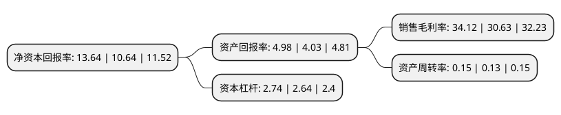

> 本页面由自动化程序生成于 2022年5月20日 01:27
> 内容可能存在错误，如有bug请提交issue至：https://github.com/Eroleice/doc-pi/issues
{.is-warning}

# 上市公司基本情况

## 基本资料

上海金桥出口加工区开发股份有限公司（以下简称“浦东金桥”）成立于1993年10月07日，上海市。于1993年03月26日在上交所主板上市。

浦东金桥注册资本112,241.289万元，房地产销售，房地产租赁。以下是详细信息：

- 公司名称: 上海金桥出口加工区开发股份有限公司
- 股票代码: 600639.SH
- 所在地: 上海 - 上海市
- 成立日期: 1993年10月07日
- 注册资本: 112,241.289万元
- 法定代表人: 王颖
- 主营业务: 房地产销售，房地产租赁
- 公司官网: www.shpdjq.com
- 公司介绍: 公司已经成长为一家资产质量优良、业绩稳定、成长可期的知名上市公司。公司抓住浦东开发开放契机，依托上市公司的品牌优势、资金优势、积极承担着上海金桥自由贸易试验区的开发建设、招商引资、产业发展和载体运营管理，着力打造产城融合的示范园区。公司的核心竞争力是功能集聚区的设计、开发、经营和管理能力；核心品牌是“金桥”、“碧云”；核心产品是“开发区及功能集聚区市场化的产业、商业、住宅、办公、研发、学校等建筑房产”。在建立市场化运作机制和标准化业务操作模式的基础上，强化服务，深化功能，使公司发展成为在功能集聚区的设计、开发、经营和管理方面具有国际竞争力的大型股份制企业。

## 股东及高管情况

上市公司第一大股东为上海金桥(集团)有限公司，持股554,081,457股，占比49.37%，为上市公司实际控制人。

截至2022年03月31日，上市公司的前十大股东中，共有1名自然人股东，3名机构股东，2个产品账户，4个海外主体，其中5%以上大股东共有1名。上市公司前十大股东明细如下：

> 截至2022年03月31日，上市公司前十大股东信息如下：

| 股东名称 | 持股数量（股） | 持股比例 |
| --- | --- | --- |
| 上海金桥(集团)有限公司 | 554,081,457 | 49.37% |
| 上海国际集团资产管理有限公司 | 19,886,570 | 1.77% |
| 中国证券金融股份有限公司 | 16,854,460 | 1.5% |
| 香港中央结算有限公司(陆股通) | 13,430,457 | 1.2% |
| 上海高毅资产管理合伙企业(有限合伙)-高毅晓峰2号致信基金 | 12,897,783 | 1.15% |
| 中国对外经济贸易信托有限公司-外贸信托-高毅晓峰鸿远集合资金信托计划 | 12,665,077 | 1.13% |
| GUOTAI JUNAN SECURITIES(HONGKONG) LIMITED | 5,710,224 | 0.51% |
| 黄庆清 | 5,500,000 | 0.49% |
| VANGUARD EMERGING MARKETS STOCK INDEX FUND | 5,391,788 | 0.48% |
| VANGUARD TOTAL INTERNATIONAL STOCK INDEX FUND | 5,197,843 | 0.46% |

## 利润表分析

上市公司2021年总收入为46.17亿元，净利润为15.75亿元，实现盈利。

## 杜邦分析

> 数据列示周期：2021年 | 2020年 | 2019年
{.is-info}

上市公司的净资产收益率在近一年有所上升，上升幅度为28.2%，其变化情况分解如下：
- 上市公司的销售毛利率在近一年上升了11.39%，可能是生产效率的提升、商品原材料价格下跌或商品价格的上涨所致。
- 上市公司的资产周转率在近一年上升了15.38%，可能是源自于更快的销售回款或库存管理效果提升。
- 上市公司的财务杠杆比率在近一年上升了3.79%，可能是增加负债扩大生产规模。

