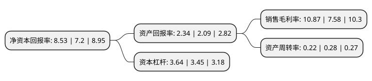

> 本页面由自动化程序生成于 2022年5月20日 01:28
> 内容可能存在错误，如有bug请提交issue至：https://github.com/Eroleice/doc-pi/issues
{.is-warning}

# 上市公司基本情况

## 基本资料

上海外高桥集团股份有限公司（以下简称“外高桥”）成立于1994年12月31日，上海市。于1993年05月04日在上交所主板上市。

外高桥注册资本113,534.912万元，房地产开发与租赁，贸易及物流，酒店经营管理等。以下是详细信息：

- 公司名称: 上海外高桥集团股份有限公司
- 股票代码: 600648.SH
- 所在地: 上海 - 上海市
- 成立日期: 1994年12月31日
- 注册资本: 113,534.912万元
- 法定代表人: 刘宏
- 主营业务: 房地产开发与租赁，贸易及物流，酒店经营管理等
- 公司官网: www.china-ftz.com
- 公司介绍: 公司是中国(上海)自由贸易试验区核心区域——外高桥保税区及其周边区域的开发主体。公司主要负责中国(上海)自由贸易试验区——外高桥保税区及周边相关土地等国有资产的投资、经营和管理，以10平方公里的外高桥保税区规划用地和周边相关地块的房地产开发和经营为主业，承担着自贸试验区及周边区域的开发建设、招商稳商、功能推进和运营服务。作为中国第一个保税区综合开发商，外高桥集团股份以海关特殊监管区和税收优惠的政策优势为起步点，推动外高桥保税区逐步发展成为集出口加工、国际贸易、转口贸易、保税仓储和商品展示等功能于一身的经济开放型区域。

## 股东及高管情况

上市公司第一大股东为上海外高桥资产管理有限公司，持股545,359,660股，占比48.03%，为上市公司实际控制人。

截至2022年03月31日，上市公司的前十大股东中，共有5名自然人股东，4名机构股东，1个海外主体，其中5%以上大股东共有1名。上市公司前十大股东明细如下：

> 截至2022年03月31日，上市公司前十大股东信息如下：

| 股东名称 | 持股数量（股） | 持股比例 |
| --- | --- | --- |
| 上海外高桥资产管理有限公司 | 545,359,660 | 48.03% |
| 上海浦东投资控股(集团)有限公司 | 56,767,456 | 5% |
| 陈丽钦 | 22,895,913 | 2.02% |
| 李少平 | 20,200,100 | 1.78% |
| 刘明星 | 16,469,131 | 1.45% |
| 刘丽云 | 14,881,600 | 1.31% |
| 中国长城资产管理股份有限公司 | 13,195,454 | 1.16% |
| 林燕 | 12,730,242 | 1.12% |
| 鑫益(香港)投资有限公司 | 6,923,640 | 0.61% |
| 香港中央结算有限公司(陆股通) | 6,749,701 | 0.59% |

## 利润表分析

上市公司2021年总收入为88.84亿元，净利润为9.5亿元，实现盈利。

## 杜邦分析

> 数据列示周期：2021年 | 2020年 | 2019年
{.is-info}

上市公司的净资产收益率在近一年有所上升，上升幅度为18.47%，其变化情况分解如下：
- 上市公司的销售毛利率在近一年上升了43.4%，可能是生产效率的提升、商品原材料价格下跌或商品价格的上涨所致。
- 上市公司的资产周转率在近一年下降了-21.43%，可能是源自于更慢的销售回款或库存管理效果下降。
- 上市公司的财务杠杆比率在近一年上升了5.51%，可能是增加负债扩大生产规模。

