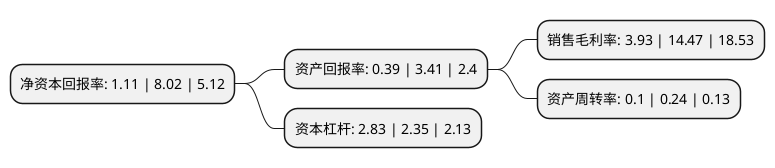

> 本页面由自动化程序生成于 2022年5月20日 01:28
> 内容可能存在错误，如有bug请提交issue至：https://github.com/Eroleice/doc-pi/issues
{.is-warning}

# 上市公司基本情况

## 基本资料

北京电子城高科技集团股份有限公司（以下简称“电子城”）成立于1986年12月24日，北京市。于1993年05月24日在上交所主板上市。

电子城注册资本111,858.505万元，主要业务:通信设备制造业务，印刷材料制造业务，金融设备制造业务。以下是详细信息：

- 公司名称: 北京电子城高科技集团股份有限公司
- 股票代码: 600658.SH
- 所在地: 北京 - 北京市
- 成立日期: 1986年12月24日
- 注册资本: 111,858.505万元
- 法定代表人: 潘金峰
- 主营业务: 通信设备制造业务，印刷材料制造业务，金融设备制造业务
- 公司官网: www.bez.com.cn
- 公司介绍: 公司是国内专业的高科技产业平台运营商和创新平台运营商，是中关村科技园区最早的开发建设成员之一。多年来，电子城集团依托产业背景优势，在成功开发建设了“电子城创新产业园”、“电子城科技研发中心”等主题高科技产业园的基础上，正积极凭借自身高科技产业平台建设经验、高科技产业招商引资渠道及已成型的高科技园区开发建设、运营服务的团队优势，以“构筑创新发展空间，促进经济转型增长”为使命，努力构建以“高科技产业、创新产业园区开发建设、运营服务”为主线，“产业价值链延伸投资”与“科技产业孵化”共同发展的“一加二”战略发展格局。通过品牌塑造、模式复制及多年形成的高科技产业、创新产业聚集能力。

## 股东及高管情况

上市公司第一大股东为北京电子控股有限责任公司，持股508,801,304股，占比45.49%，为上市公司实际控制人。

截至2022年03月31日，上市公司的前十大股东中，共有2名自然人股东，6名机构股东，2个产品账户，其中5%以上大股东共有2名。上市公司前十大股东明细如下：

> 截至2022年03月31日，上市公司前十大股东信息如下：

| 股东名称 | 持股数量（股） | 持股比例 |
| --- | --- | --- |
| 北京电子控股有限责任公司 | 508,801,304 | 45.49% |
| 弘创(深圳)投资中心(有限合伙) | 81,235,438 | 7.26% |
| 德邦基金-浦发银行-中融信托-中融-融昱28号集合资金信托计划 | 43,539,875 | 3.89% |
| 东久(上海)投资管理咨询有限公司 | 28,512,851 | 2.55% |
| 国泰君安证券股份有限公司约定购回式证券交易专用证券账户 | 22,350,000 | 2% |
| 京东方科技集团股份有限公司 | 13,747,290 | 1.23% |
| 北京兆维电子(集团)有限责任公司 | 10,004,098 | 0.89% |
| 联想控股股份有限公司 | 8,811,741 | 0.79% |
| 方奕忠 | 6,472,273 | 0.58% |
| 孙金海 | 4,913,884 | 0.44% |

## 利润表分析

上市公司2021年总收入为19.64亿元，净利润为0.77亿元，实现盈利。

## 杜邦分析

> 数据列示周期：2021年 | 2020年 | 2019年
{.is-info}

上市公司的净资产收益率在近一年有所下降，下降幅度为-86.16%，其变化情况分解如下：
- 上市公司的销售毛利率在近一年下降了-72.84%，可能是生产效率的下降、商品原材料价格上涨或商品价格的下跌所致。
- 上市公司的资产周转率在近一年下降了-58.33%，可能是源自于更慢的销售回款或库存管理效果下降。
- 上市公司的财务杠杆比率在近一年上升了20.43%，可能是增加负债扩大生产规模。

