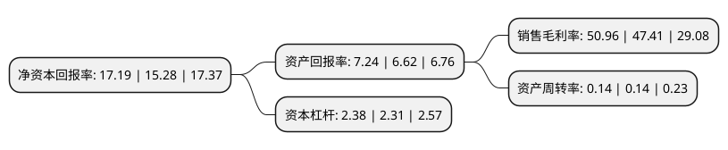

> 本页面由自动化程序生成于 2022年5月20日 01:31
> 内容可能存在错误，如有bug请提交issue至：https://github.com/Eroleice/doc-pi/issues
{.is-warning}

# 上市公司基本情况

## 基本资料

中新苏州工业园区开发集团股份有限公司（以下简称“中新集团”）成立于1994年08月13日，苏州市。于2019年12月20日在上交所主板上市。

中新集团注册资本149,889万元，主营业务为新型城镇化综合开发运营，集土地一级开发，房地产开发与经营，市政公用及多元化服务于一体，目前的主要客户为当地政府，区域入驻企业和居民。以下是详细信息：

- 公司名称: 中新苏州工业园区开发集团股份有限公司
- 股票代码: 601512.SH
- 所在地: 江苏 - 苏州市
- 成立日期: 1994年08月13日
- 注册资本: 149,889万元
- 法定代表人: 赵志松
- 主营业务: 主营业务为新型城镇化综合开发运营，集土地一级开发，房地产开发与经营，市政公用及多元化服务于一体，目前的主要客户为当地政府，区域入驻企业和居民
- 公司官网: www.cssd.com.cn
- 公司介绍: 公司是中国、新加坡两国政府间最大合作项目之一的载体和苏州工业园的开发主体，主营业务为园区开发运营，既有土地一级开发、又有房地产开发与经营业务(长租公寓、工业厂房、商业租赁)与热电、污泥处理等绿色公用及环境治理业务，还有招商与工程代理、服务型业务，业务较为多元，界定为综合性行业,公司以“筑中国梦想、建新型园区”为己任，确立了以园区开发运营为主体板块，以载体配套和绿色公用为两翼支撑板块，通过板块联动、资源集聚，实现高水平产城融合的“一体两翼”协同发展格局,公司获“2017年度纳税贡献二十强企业”,“苏州工业园区纪检监察考评优胜单位”,“2018年度中国产业园区运营商50强”,“苏州工业园区2018年度经济贡献突出企业(总部经济)”,“2019中国产业新城运营综合实力TOP10”等多项荣誉,并致力成为中国园区开发运营领军企业。

## 股东及高管情况

上市公司第一大股东为苏州中方财团控股股份有限公司，持股701,480,000股，占比46.8%，为上市公司实际控制人。

截至2022年03月31日，上市公司的前十大股东中，共有2名自然人股东，3名机构股东，2个产品账户，3个海外主体，其中5%以上大股东共有3名。上市公司前十大股东明细如下：

> 截至2022年03月31日，上市公司前十大股东信息如下：

| 股东名称 | 持股数量（股） | 持股比例 |
| --- | --- | --- |
| 苏州中方财团控股股份有限公司 | 701,480,000 | 46.8% |
| SINGAPORE-SUZHOU TOWNSHIP DEVELOPMENT PTE LTD | 377,720,000 | 25.2% |
| 港华投资有限公司 | 134,900,000 | 9% |
| CPG CORPORATION PTE LTD | 67,450,000 | 4.5% |
| 苏州新区高新技术产业股份有限公司 | 53,960,000 | 3.6% |
| 金利臣 | 3,962,100 | 0.26% |
| 上海宁泉资产管理有限公司-宁泉致远58号私募证券投资基金 | 3,494,741 | 0.23% |
| 香港中央结算有限公司(陆股通) | 3,032,744 | 0.2% |
| 马群 | 1,628,763 | 0.11% |
| 兴富投资管理有限公司-兴富1号战略投资基金 | 1,370,000 | 0.09% |

## 利润表分析

上市公司2021年总收入为39.17亿元，净利润为19.96亿元，实现盈利。

## 杜邦分析

> 数据列示周期：2021年 | 2020年 | 2019年
{.is-info}

上市公司的净资产收益率在近一年有所上升，上升幅度为12.5%，其变化情况分解如下：
- 上市公司的销售毛利率在近一年上升了7.49%，可能是生产效率的提升、商品原材料价格下跌或商品价格的上涨所致。
- 上市公司的资产周转率在近一年下降了0%，可能是源自于更慢的销售回款或库存管理效果下降。
- 上市公司的财务杠杆比率在近一年上升了3.03%，可能是增加负债扩大生产规模。

