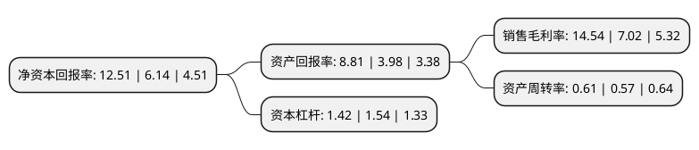

> 本页面由自动化程序生成于 2022年5月20日 01:04
> 内容可能存在错误，如有bug请提交issue至：https://github.com/Eroleice/doc-pi/issues
{.is-warning}

# 上市公司基本情况

## 基本资料

安徽国风新材料股份有限公司（以下简称“国风新材”）成立于1998年09月23日，合肥市。于1998年11月19日在深交所主板上市。

国风新材注册资本89,597.627万元，主要产品:塑料薄膜，化工原料，碳酸钙超细粉，工程塑料。以下是详细信息：

- 公司名称: 安徽国风新材料股份有限公司
- 股票代码: 000859.SZ
- 所在地: 安徽 - 合肥市
- 成立日期: 1998年09月23日
- 注册资本: 89,597.627万元
- 法定代表人: 黄琼宜
- 主营业务: 主要产品:塑料薄膜，化工原料，碳酸钙超细粉，工程塑料
- 公司官网: www.guofeng.com
- 公司介绍: 公司是国家级高新技术企业、国家级守合同重信用企业、省两化融合示范企业、省产学研联合示范企业和优秀出口企业，其技术中心被认定为国家级企业技术中心。公司主要生产经营双向拉伸聚丙烯薄膜和双向拉伸聚酯薄膜等包装膜材料和电子信息用膜材料、木塑新材料、工程塑料以及蓝宝石晶片等。公司是集研发、采购、生产、销售完整体系的制造型企业。公司先后通过ISO9001质量管理体系认证、ISO14001环境管理体系认证、OHSAS18001职业健康安全管理体系认证、QS生产许可证和ISO／TS16949质量管理体系认证，同时获得英国UKAS质量管理体系认证，取得了开拓国际市场的通行证。

## 股东及高管情况

上市公司第一大股东为合肥市产业投资控股(集团)有限公司，持股260,841,634股，占比29.11%，**疑似为**上市公司实际控制人。

截至2022年03月31日，上市公司的前十大股东中，共有9名自然人股东，1名机构股东，其中5%以上大股东共有1名。上市公司前十大股东明细如下：

> 未能通过持股比例判定出上市公司实际控制人（持股30%以上）
> 可能存在通过间接持股、联合持股、协议控制等方式拥有实际控制权的主体，具体请参考上市公司定期公告！
{.is-warning}

> 截至2022年03月31日，上市公司前十大股东信息如下：

| 股东名称 | 持股数量（股） | 持股比例 |
| --- | --- | --- |
| 合肥市产业投资控股(集团)有限公司 | 260,841,634 | 29.11% |
| 王子权 | 16,260,995 | 1.81% |
| 宋国强 | 4,436,370 | 0.5% |
| 缪荣凯 | 4,312,900 | 0.48% |
| 张和生 | 4,000,000 | 0.45% |
| 骆大同 | 3,782,700 | 0.42% |
| 尚鹏玉 | 3,619,000 | 0.4% |
| 刘玲玲 | 3,525,500 | 0.39% |
| 李选利 | 3,288,977 | 0.37% |
| 张明敏 | 3,200,000 | 0.36% |

## 利润表分析

上市公司2021年总收入为19.1亿元，净利润为2.77亿元，实现盈利。

## 杜邦分析

> 数据列示周期：2021年 | 2020年 | 2019年
{.is-info}

上市公司的净资产收益率在近一年有所上升，上升幅度为103.75%，其变化情况分解如下：
- 上市公司的销售毛利率在近一年上升了107.12%，可能是生产效率的提升、商品原材料价格下跌或商品价格的上涨所致。
- 上市公司的资产周转率在近一年上升了7.02%，可能是源自于更快的销售回款或库存管理效果提升。
- 上市公司的财务杠杆比率在近一年下降了-7.79%，可能是减少负债降低财务费用。

