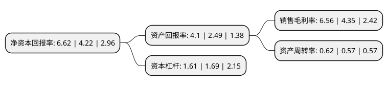

> 本页面由自动化程序生成于 2022年5月20日 01:04
> 内容可能存在错误，如有bug请提交issue至：https://github.com/Eroleice/doc-pi/issues
{.is-warning}

# 上市公司基本情况

## 基本资料

佛山佛塑科技集团股份有限公司（以下简称“佛塑科技”）成立于1988年06月28日，佛山市。于2000年05月25日在深交所主板上市。

佛塑科技注册资本96,742.317万元，主要产品:渗析材料，电工材料，光学材料，阻隔材料，PET切片材料，PVC压延材料，商品房，商铺销售，物流服务。以下是详细信息：

- 公司名称: 佛山佛塑科技集团股份有限公司
- 股票代码: 000973.SZ
- 所在地: 广东 - 佛山市
- 成立日期: 1988年06月28日
- 注册资本: 96,742.317万元
- 法定代表人: 唐强
- 主营业务: 主要产品:渗析材料，电工材料，光学材料，阻隔材料，PET切片材料，PVC压延材料，商品房，商铺销售，物流服务
- 公司官网: www.fspg.com.cn
- 公司介绍: 公司是中国塑料新材料行业的龙头企业、国家火炬计划重点高新技术企业、广东省战略新兴产业骨干企业。公司专注于面向新能源、新能源汽车、高端电子信息和节能环保等战略性新兴产业的高分子功能薄膜等新型材料的研发与生产，现已逐步形成以渗析材料、光电材料和阻隔材料为框架的产业布局，确定了“专注于新能源、新材料和节能环保产业的研发与生产，定位于产业高端化、经营国际化、依托技术创新和精细化管理，建设优秀企业文化和团队，打造卓越运营能力，成为新能源、新材料和节能环保产业的领跑者”的发展战略。公司拥有“汾江牌”、“鸿基牌”、“双象牌”、“双龙牌”、“HG牌”等多个广东省名牌产品、著名商标，体现了多年来专注积累的良好商誉，被评为“国家知识产权运用标杆企业”和“广东省知识产权优势企业”。

## 股东及高管情况

上市公司第一大股东为广东省广新控股集团有限公司，持股258,760,512股，占比26.75%，**疑似为**上市公司实际控制人。

截至2022年03月31日，上市公司的前十大股东中，共有7名自然人股东，2名机构股东，1个产品账户，其中5%以上大股东共有1名。上市公司前十大股东明细如下：

> 未能通过持股比例判定出上市公司实际控制人（持股30%以上）
> 可能存在通过间接持股、联合持股、协议控制等方式拥有实际控制权的主体，具体请参考上市公司定期公告！
{.is-warning}

> 截至2022年03月31日，上市公司前十大股东信息如下：

| 股东名称 | 持股数量（股） | 持股比例 |
| --- | --- | --- |
| 广东省广新控股集团有限公司 | 258,760,512 | 26.75% |
| 中央汇金资产管理有限责任公司 | 13,856,300 | 1.43% |
| 中国建设银行股份有限公司-信达澳银新能源产业股票型证券投资基金 | 4,962,300 | 0.51% |
| 曲小泉 | 4,811,197 | 0.5% |
| 陈妙初 | 3,726,900 | 0.39% |
| 曹仕美 | 2,718,600 | 0.28% |
| 丁华根 | 2,250,000 | 0.23% |
| 季阿静 | 2,164,800 | 0.22% |
| 张明峰 | 2,126,600 | 0.22% |
| 卓辽志 | 2,100,000 | 0.22% |

## 利润表分析

上市公司2021年总收入为24.57亿元，净利润为1.61亿元，实现盈利。

## 杜邦分析

> 数据列示周期：2021年 | 2020年 | 2019年
{.is-info}

上市公司的净资产收益率在近一年有所上升，上升幅度为56.87%，其变化情况分解如下：
- 上市公司的销售毛利率在近一年上升了50.8%，可能是生产效率的提升、商品原材料价格下跌或商品价格的上涨所致。
- 上市公司的资产周转率在近一年上升了8.77%，可能是源自于更快的销售回款或库存管理效果提升。
- 上市公司的财务杠杆比率在近一年下降了-4.73%，可能是减少负债降低财务费用。

