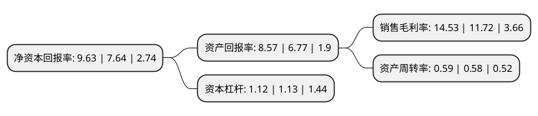

> 本页面由自动化程序生成于 2022年5月20日 01:07
> 内容可能存在错误，如有bug请提交issue至：https://github.com/Eroleice/doc-pi/issues
{.is-warning}

# 上市公司基本情况

## 基本资料

浙江大东南股份有限公司（以下简称“大东南”）成立于2000年06月08日，绍兴市。于2008年07月28日在深交所中小板上市。

大东南注册资本187,836.01万元，主要产品:BOPP薄膜，BOPET薄膜，并以CPP薄膜为有力补充。主营业务:各种塑料包装薄膜的生产及销售。以下是详细信息：

- 公司名称: 浙江大东南股份有限公司
- 股票代码: 002263.SZ
- 所在地: 浙江 - 绍兴市
- 成立日期: 2000年06月08日
- 注册资本: 187,836.01万元
- 法定代表人: 骆平
- 主营业务: 主要产品:BOPP薄膜，BOPET薄膜，并以CPP薄膜为有力补充主营业务:各种塑料包装薄膜的生产及销售
- 公司官网: www.chinaddn.com
- 公司介绍: 公司主导产品包括可降解多功能塑料膜新材料系列，电子、化工、医药、军工膜基材系列，光转换农膜系列等，是国内生产装备最先进、产能最大的企业，也是中国多功能包装材料全面走向现代化、国际化的开拓者。公司借鉴国外先进技术自主开发出军用VCI防锈膜、锂离子电池隔膜、光学膜、光转化农膜、BOPP防纸膜、耐高温新型电子绝缘材料等高端新材料膜，获得多项国家发明专利，实用新颖专利，并且是行业标准的起草单位。公司是中国制造业500强企业，是国内最大的塑料制品生产基地之一，其商标和产品均被认定为“中国驰名商标”和“中国名牌产品”，并符合美国FDA食品包装环境卫生认证标准要求。

## 股东及高管情况

上市公司第一大股东为诸暨市水务集团有限公司，持股524,158,020股，占比27.91%，**疑似为**上市公司实际控制人。

截至2022年03月31日，上市公司的前十大股东中，共有3名自然人股东，5名机构股东，1个产品账户，1名其他股东，其中5%以上大股东共有1名。上市公司前十大股东明细如下：

> 未能通过持股比例判定出上市公司实际控制人（持股30%以上）
> 可能存在通过间接持股、联合持股、协议控制等方式拥有实际控制权的主体，具体请参考上市公司定期公告！
{.is-warning}

> 截至2022年03月31日，上市公司前十大股东信息如下：

| 股东名称 | 持股数量（股） | 持股比例 |
| --- | --- | --- |
| 诸暨市水务集团有限公司 | 524,158,020 | 27.91% |
| 李福桥 | 19,548,370 | 1.04% |
| 胡赵娟 | 13,758,142 | 0.73% |
| 海南利多利经贸有限公司 | 13,123,760 | 0.7% |
| 海口慧平广告有限公司 | 12,468,028 | 0.66% |
| 中国包装进出口有限责任公司 | 8,798,350 | 0.47% |
| 法国兴业银行 | 8,254,900 | 0.44% |
| 浙江磐道投资管理有限公司 | 7,723,662 | 0.41% |
| 沈凤飞 | 7,011,300 | 0.37% |
| 中国建设银行股份有限公司-信达澳银新能源产业股票型证券投资基金 | 6,191,555 | 0.33% |

## 利润表分析

上市公司2021年总收入为16.73亿元，净利润为2.43亿元，实现盈利。

## 杜邦分析

> 数据列示周期：2021年 | 2020年 | 2019年
{.is-info}

上市公司的净资产收益率在近一年有所上升，上升幅度为26.05%，其变化情况分解如下：
- 上市公司的销售毛利率在近一年上升了23.98%，可能是生产效率的提升、商品原材料价格下跌或商品价格的上涨所致。
- 上市公司的资产周转率在近一年上升了1.72%，可能是源自于更快的销售回款或库存管理效果提升。
- 上市公司的财务杠杆比率在近一年下降了-0.88%，可能是减少负债降低财务费用。

