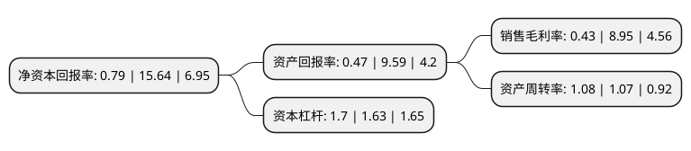

> 本页面由自动化程序生成于 2022年5月20日 01:08
> 内容可能存在错误，如有bug请提交issue至：https://github.com/Eroleice/doc-pi/issues
{.is-warning}

# 上市公司基本情况

## 基本资料

上海普利特复合材料股份有限公司（以下简称“普利特”）成立于1999年10月28日，上海市。于2009年12月18日在深交所中小板上市。

普利特注册资本101,406.232万元，主营业务:汽车用改性塑料产品的生产，研发，销售和服务，主要产品包括:改性聚烯烃类(改性聚丙烯类)，改性ABS类，塑料合金类(PC/ABS合金，PC/PBT合金，PC/PET合金等)以及其他类(改性尼龙，改性热塑性聚酯等)4大类。以下是详细信息：

- 公司名称: 上海普利特复合材料股份有限公司
- 股票代码: 002324.SZ
- 所在地: 上海 - 上海市
- 成立日期: 1999年10月28日
- 注册资本: 101,406.232万元
- 法定代表人: 周文
- 主营业务: 主营业务:汽车用改性塑料产品的生产，研发，销售和服务，主要产品包括:改性聚烯烃类(改性聚丙烯类)，改性ABS类，塑料合金类(PC/ABS合金，PC/PBT合金，PC/PET合金等)以及其他类(改性尼龙，改性热塑性聚酯等)4大类
- 公司官网: www.pret.com.cn
- 公司介绍: 公司所处行业为新材料行业中的化工新材料子行业，属国家重点发展的新材料技术领域。公司主要从事高分子新材料产品及其复合材料的研发、生产、销售和服务。公司主要产品包括改性聚烯烃材料(改性PP)、改性ABS材料、改性聚碳酸脂合金材料(改性PC合金)、改性尼龙材料(改性PA)、液晶高分子材料(TLCP)、特种材料等新材料产品。公司改性复合材料产品主要应用于汽车材料领域，特种工程材料产品广泛应用于汽车、电子电器、航天军工等领域。近年来，公司被评为上海市企业技术中心、上海汽车用塑料材料工程技术研究中心、国家认可实验室、上海市科技小巨人企业、上海市知识产权示范企业、上海市质量金奖、上海市著名商标和名牌产品、上海市科技进步一等奖、上海市创新型企业等荣誉称号。

## 股东及高管情况

上市公司第一大股东为周文，持股446,987,270股，占比44.08%，为上市公司实际控制人。

截至2022年03月31日，上市公司的前十大股东中，共有4名自然人股东，1名机构股东，4个产品账户，1个海外主体，其中5%以上大股东共有1名。上市公司前十大股东明细如下：

> 截至2022年03月31日，上市公司前十大股东信息如下：

| 股东名称 | 持股数量（股） | 持股比例 |
| --- | --- | --- |
| 周文 | 446,987,270 | 44.08% |
| 深圳市恒信华业股权投资基金管理有限公司-平潭华业领航股权投资合伙企业(有限合伙) | 50,703,116 | 5% |
| 郭艺群 | 44,006,976 | 4.34% |
| 上海浦东发展银行股份有限公司-广发小盘成长混合型证券投资基金(LOF) | 28,175,678 | 2.78% |
| 中国建设银行股份有限公司-广发多元新兴股票型证券投资基金 | 16,225,777 | 1.6% |
| 张鑫良 | 12,448,437 | 1.23% |
| 香港中央结算有限公司(陆股通) | 10,570,758 | 1.04% |
| 广发基金-国新投资有限公司-广发基金-国新2号单一资产管理计划 | 8,388,791 | 0.83% |
| 上海翼鹏企业发展有限公司 | 8,009,513 | 0.79% |
| 周武 | 7,920,024 | 0.78% |

## 利润表分析

上市公司2021年总收入为48.7亿元，净利润为0.21亿元，实现盈利。

## 杜邦分析

> 数据列示周期：2021年 | 2020年 | 2019年
{.is-info}

上市公司的净资产收益率在近一年有所下降，下降幅度为-94.95%，其变化情况分解如下：
- 上市公司的销售毛利率在近一年下降了-95.2%，可能是生产效率的下降、商品原材料价格上涨或商品价格的下跌所致。
- 上市公司的资产周转率在近一年上升了0.93%，可能是源自于更快的销售回款或库存管理效果提升。
- 上市公司的财务杠杆比率在近一年上升了4.29%，可能是增加负债扩大生产规模。

