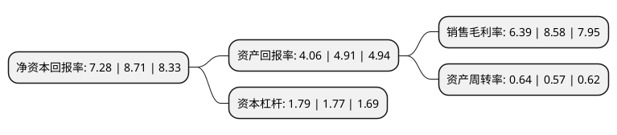

> 本页面由自动化程序生成于 2022年5月20日 01:09
> 内容可能存在错误，如有bug请提交issue至：https://github.com/Eroleice/doc-pi/issues
{.is-warning}

# 上市公司基本情况

## 基本资料

宁夏青龙管业集团股份有限公司（以下简称“青龙管业”）成立于1999年03月01日，吴忠市。于2010年08月03日在深交所中小板上市。

青龙管业注册资本33,499.2万元，主要产品:混凝土管和塑料管两大系列，其中混凝土管道包括预应力钢筒混凝土管(PCCP)，预应力钢筋混凝土管(PCP)和钢筋混凝土排水管道(RCP)三大类产品;塑料管道包括硬质给水用聚氯乙烯(PVC-U)管和高密度聚乙烯(HDPE)管两大类产品。主营业务:研发，制造和销售供水，排水管道，并根据客户需求生产少量其他用途压力管道。以下是详细信息：

- 公司名称: 宁夏青龙管业集团股份有限公司
- 股票代码: 002457.SZ
- 所在地: 宁夏 - 吴忠市
- 成立日期: 1999年03月01日
- 注册资本: 33,499.2万元
- 法定代表人: 李骞
- 主营业务: 主要产品:混凝土管和塑料管两大系列，其中混凝土管道包括预应力钢筒混凝土管(PCCP)，预应力钢筋混凝土管(PCP)和钢筋混凝土排水管道(RCP)三大类产品;塑料管道包括硬质给水用聚氯乙烯(PVC-U)管和高密度聚乙烯(HDPE)管两大类产品主营业务:研发，制造和销售供水，排水管道，并根据客户需求生产少量其他用途压力管道
- 公司官网: www.qlgd.com.cn
- 公司介绍: 公司专注于高品质输水管道及相关产品的研发、设计、生产、安装和服务，并提供智能节水灌溉整体解决方案和综合管廊的设计与制造。公司始终秉承“质量为本、精益求精”的质量理念，承接了上百项国家级、省市级的重点工程项目，优质的产品和良好的服务赢得了政府和用户的信赖与好评。特别是在南水北调工程建设中，公司在产品质量、安全生产、供货进度和施工协调等方面的综合评比中名列前茅，受到了各项目业主的嘉奖。公司现为中国混凝土与水泥制品协会副会长单位，中国预应力钢筒混凝土管质量联盟首届理事长单位，中国塑料管道专业委员会副理事长单位，多次被评为“全国优秀水利企业”和全国“守合同重信用”单位，“青龙”商标荣获“中国驰名商标”。公司在宁夏、北京、天津、河北、河南、湖北、福建、山西、陕西、甘肃、内蒙古、新疆等地设有子公司和生产基地，产品被广泛应用于水利、电力、城市供排水、节水灌溉、城市燃气输配、供热和交通等多个领域。

## 股东及高管情况

上市公司第一大股东为宁夏青龙投资控股有限公司，持股71,300,654股，占比21.28%，**疑似为**上市公司实际控制人。

截至2022年03月31日，上市公司的前十大股东中，共有4名自然人股东，1名机构股东，5个产品账户，其中5%以上大股东共有2名。上市公司前十大股东明细如下：

> 未能通过持股比例判定出上市公司实际控制人（持股30%以上）
> 可能存在通过间接持股、联合持股、协议控制等方式拥有实际控制权的主体，具体请参考上市公司定期公告！
{.is-warning}

> 截至2022年03月31日，上市公司前十大股东信息如下：

| 股东名称 | 持股数量（股） | 持股比例 |
| --- | --- | --- |
| 宁夏青龙投资控股有限公司 | 71,300,654 | 21.28% |
| 陈家兴 | 33,774,705 | 10.08% |
| 宁夏青龙管业集团股份有限公司-第一期员工持股计划 | 7,456,000 | 2.23% |
| 中国建设银行股份有限公宁夏青龙投资控股有限公司司-华泰柏瑞富利灵活配置混合型证券投资基金 | 3,752,300 | 1.12% |
| 中国建设银行股份有限公宁夏青龙投资控股有限公司-华泰柏瑞富利灵活配置混合型证券投资基金 | 3,752,300 | 1.12% |
| 中国建设银行股份有限公司宁夏青龙投资控股有限公司-华泰柏瑞富利灵活配置混合型证券投资基金 | 3,752,300 | 1.12% |
| 路立新 | 2,600,009 | 0.78% |
| 中国农业银行股份有限公司-中海消费主题精选混合型证券投资基金 | 1,262,100 | 0.38% |
| 杜学智 | 1,001,151 | 0.3% |
| 汪平 | 940,000 | 0.28% |

## 利润表分析

上市公司2021年总收入为24.37亿元，净利润为1.55亿元，实现盈利。

## 杜邦分析

> 数据列示周期：2021年 | 2020年 | 2019年
{.is-info}

上市公司的净资产收益率在近一年有所下降，下降幅度为-16.42%，其变化情况分解如下：
- 上市公司的销售毛利率在近一年下降了-25.52%，可能是生产效率的下降、商品原材料价格上涨或商品价格的下跌所致。
- 上市公司的资产周转率在近一年上升了12.28%，可能是源自于更快的销售回款或库存管理效果提升。
- 上市公司的财务杠杆比率在近一年上升了1.13%，可能是增加负债扩大生产规模。

