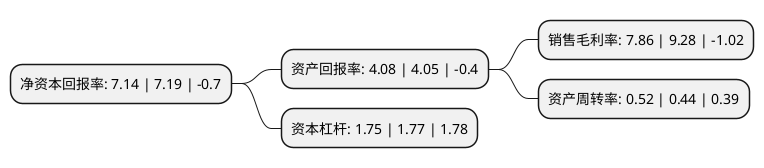

> 本页面由自动化程序生成于 2022年5月20日 01:09
> 内容可能存在错误，如有bug请提交issue至：https://github.com/Eroleice/doc-pi/issues
{.is-warning}

# 上市公司基本情况

## 基本资料

浙江众成包装材料股份有限公司（以下简称“浙江众成”）成立于2001年10月23日，嘉兴市。于2010年12月10日在深交所中小板上市。

浙江众成注册资本90,577.939万元，主营业务为多层共挤聚烯烃热收缩薄膜(简称POF热收缩膜)产品的研发，生产和销售。产品包括POF普通型膜，POF交联膜和POF高性能膜等3大类8个系列。以下是详细信息：

- 公司名称: 浙江众成包装材料股份有限公司
- 股票代码: 002522.SZ
- 所在地: 浙江 - 嘉兴市
- 成立日期: 2001年10月23日
- 注册资本: 90,577.939万元
- 法定代表人: 易先云
- 主营业务: 主营业务为多层共挤聚烯烃热收缩薄膜(简称POF热收缩膜)产品的研发，生产和销售产品包括POF普通型膜，POF交联膜和POF高性能膜等3大类8个系列
- 公司官网: www.zjzhongda.com
- 公司介绍: 公司是一家集科研、设计、生产、销售及售后服务于一体的全过程制造企业，是全球知名的高品质POF热收缩膜制造商和国内优秀的POF热收缩膜整体包装解决方案提供商。公司主要从事POF热收缩膜业务和热塑性弹性体业务。主要产品为POF热收缩膜，按具体用途及工艺可以细分为POF普通型膜、POF交联膜、POF高性能膜；POF热收缩膜对于原材料品质要求较高，公司所需原材料(主要为PP、PE)主要向专业生产厂商直接采购。经过多年扎实经营，公司自主研发制造的装备处于行业领先水平，生产的产品与国际同步，积累了众多优质客户，产品远销全球多个国家和地区。

## 股东及高管情况

上市公司第一大股东为常德市城市发展集团有限公司，持股226,444,847股，占比25%，**疑似为**上市公司实际控制人。

截至2022年03月31日，上市公司的前十大股东中，共有7名自然人股东，1名机构股东，1个产品账户，1个海外主体，其中5%以上大股东共有3名。上市公司前十大股东明细如下：

> 未能通过持股比例判定出上市公司实际控制人（持股30%以上）
> 可能存在通过间接持股、联合持股、协议控制等方式拥有实际控制权的主体，具体请参考上市公司定期公告！
{.is-warning}

> 截至2022年03月31日，上市公司前十大股东信息如下：

| 股东名称 | 持股数量（股） | 持股比例 |
| --- | --- | --- |
| 常德市城市发展集团有限公司 | 226,444,847 | 25% |
| 陈大魁 | 72,011,553 | 7.95% |
| 陈健 | 63,390,329 | 7% |
| 楼立峰 | 34,796,478 | 3.84% |
| 浙江银万斯特投资管理有限公司-全盈2号私募证券投资基金 | 16,038,600 | 1.77% |
| 陈晨 | 12,221,674 | 1.35% |
| 穆宏伟 | 8,640,700 | 0.95% |
| 葛政寿 | 6,033,900 | 0.67% |
| 何雪平 | 4,000,000 | 0.44% |
| 香港中央结算有限公司(陆股通) | 3,378,463 | 0.37% |

## 利润表分析

上市公司2021年总收入为17.95亿元，净利润为1.41亿元，实现盈利。

## 杜邦分析

> 数据列示周期：2021年 | 2020年 | 2019年
{.is-info}

上市公司的净资产收益率在近一年有所下降，下降幅度为-0.7%，其变化情况分解如下：
- 上市公司的销售毛利率在近一年下降了-15.3%，可能是生产效率的下降、商品原材料价格上涨或商品价格的下跌所致。
- 上市公司的资产周转率在近一年上升了18.18%，可能是源自于更快的销售回款或库存管理效果提升。
- 上市公司的财务杠杆比率在近一年下降了-1.13%，可能是减少负债降低财务费用。

