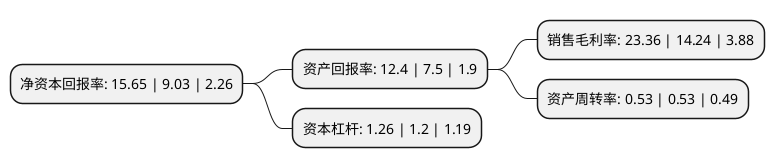

> 本页面由自动化程序生成于 2022年5月20日 01:10
> 内容可能存在错误，如有bug请提交issue至：https://github.com/Eroleice/doc-pi/issues
{.is-warning}

# 上市公司基本情况

## 基本资料

江苏双星彩塑新材料股份有限公司（以下简称“双星新材”）成立于1997年12月24日，宿迁市。于2011年06月02日在深交所中小板上市。

双星新材注册资本115,627.809万元，从事新型塑料包装薄膜的研发，生产和销售。公司的主要产品包括:聚酯薄膜，镀铝膜，PVC功能膜等，其中聚酯薄膜为公司目前的主要产品。以下是详细信息：

- 公司名称: 江苏双星彩塑新材料股份有限公司
- 股票代码: 002585.SZ
- 所在地: 江苏 - 宿迁市
- 成立日期: 1997年12月24日
- 注册资本: 115,627.809万元
- 法定代表人: 吴培服
- 主营业务: 从事新型塑料包装薄膜的研发，生产和销售公司的主要产品包括:聚酯薄膜，镀铝膜，PVC功能膜等，其中聚酯薄膜为公司目前的主要产品
- 公司官网: www.shuangxingcaisu.com
- 公司介绍: 公司是一家专业致力于先进高分子复合材料领域产品技术研发、生产销售、进出口贸易为一体的国家高新技术企业。公司主要从事先进高分子复合材料、光电新材料、光学膜、太阳能电池背板、聚酯电容膜、信息材料、热收缩材料等聚酯薄膜的研发、生产和销售。公司统筹推进“五大板块”总体布局，产品向液晶显示、智能手机、触摸面板、汽车、建筑节能玻璃光伏新能源等领域全面升级，尤其在聚酯功能膜材料、光学材料、节能窗膜、信息材料、新能源材料等方面战略推进，服务于新兴产业更多领域。公司设备先进，产品质量一流，各项指标均达到国际知名品牌质量标准，通过ISO9001:2008质量管理体系认证、ISO14001:2004环境管理体系认证、OHSAS18001。

## 股东及高管情况

上市公司第一大股东为吴培服，持股301,388,029股，占比26.07%，**疑似为**上市公司实际控制人。

截至2022年04月26日，上市公司的前十大股东中，共有3名自然人股东，3名机构股东，2个产品账户，1个海外主体，1名其他股东，其中5%以上大股东共有4名。上市公司前十大股东明细如下：

> 未能通过持股比例判定出上市公司实际控制人（持股30%以上）
> 可能存在通过间接持股、联合持股、协议控制等方式拥有实际控制权的主体，具体请参考上市公司定期公告！
{.is-warning}

> 截至2022年04月26日，上市公司前十大股东信息如下：

| 股东名称 | 持股数量（股） | 持股比例 |
| --- | --- | --- |
| 吴培服 | 301,388,029 | 26.07% |
| 香港中央结算有限公司(陆股通) | 63,190,871 | 5.47% |
| 宿迁市迪智成投资咨询有限公司 | 60,840,000 | 5.26% |
| 宿迁市启恒投资有限公司 | 60,840,000 | 5.26% |
| 吴迪 | 50,472,180 | 4.37% |
| 交通银行股份有限公司-富国天益价值混合型证券投资基金 | 8,152,123 | 0.71% |
| 林满文 | 7,661,300 | 0.66% |
| 山东省农村经济开发投资有限公司 | 5,713,051 | 0.49% |
| 法国兴业银行 | 5,272,323 | 0.46% |
| 全国社保基金四一四组合 | 5,099,933 | 0.44% |

## 利润表分析

上市公司2021年总收入为59.31亿元，净利润为13.85亿元，实现盈利。

## 杜邦分析

> 数据列示周期：2021年 | 2020年 | 2019年
{.is-info}

上市公司的净资产收益率在近一年有所上升，上升幅度为73.31%，其变化情况分解如下：
- 上市公司的销售毛利率在近一年上升了64.04%，可能是生产效率的提升、商品原材料价格下跌或商品价格的上涨所致。
- 上市公司的资产周转率在近一年下降了0%，可能是源自于更慢的销售回款或库存管理效果下降。
- 上市公司的财务杠杆比率在近一年上升了5%，可能是增加负债扩大生产规模。

