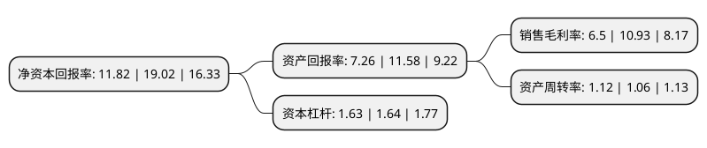

> 本页面由自动化程序生成于 2022年5月20日 01:10
> 内容可能存在错误，如有bug请提交issue至：https://github.com/Eroleice/doc-pi/issues
{.is-warning}

# 上市公司基本情况

## 基本资料

公元股份有限公司（以下简称“公元股份”）成立于1993年03月19日，台州市。于2011年12月08日在深交所中小板上市。

公元股份注册资本123,515.387万元，主营业务为从事塑料管道业务，太阳能业务和电器开关业务。以下是详细信息：

- 公司名称: 公元股份有限公司
- 股票代码: 002641.SZ
- 所在地: 浙江 - 台州市
- 成立日期: 1993年03月19日
- 注册资本: 123,515.387万元
- 法定代表人: 卢震宇
- 主营业务: 主营业务为从事塑料管道业务，太阳能业务和电器开关业务
- 公司官网: www.yonggao.com\www.era.com.cn
- 公司介绍: 公司是国内生产塑料管道产品的大型综合供应商，中国化学建材研发制造龙头企业。公司主要从事塑料管道业务，太阳能业务和电器开关业务尚处于市场培育阶段。公司是中国塑料加工工业协会和塑料管道专委会副理事长单位及全国塑料制品标准化技术委员会塑料管材管件及阀门分技术委员会(SAC/TC48/SC3)核心委员单位。“公元”牌产品和“公元”商标先后荣获“国家免检产品”、“中国名牌产品”和“中国驰名商标”；企业获得“浙江省首批诚信示范企业”、“浙江省高新技术企业”、“国家火炬计划高新技术企业”和“民营企业全国500强”等多项荣誉。

## 股东及高管情况

上市公司第一大股东为公元塑业集团有限公司，持股465,296,370股，占比37.67%，为上市公司实际控制人。

截至2022年03月31日，上市公司的前十大股东中，共有4名自然人股东，2名机构股东，3个产品账户，1个海外主体，其中5%以上大股东共有3名。上市公司前十大股东明细如下：

> 截至2022年03月31日，上市公司前十大股东信息如下：

| 股东名称 | 持股数量（股） | 持股比例 |
| --- | --- | --- |
| 公元塑业集团有限公司 | 465,296,370 | 37.67% |
| 卢彩芬 | 157,060,000 | 12.72% |
| 张炜 | 104,171,900 | 8.43% |
| 香港中央结算有限公司(陆股通) | 37,589,557 | 3.04% |
| 珠海阿巴马资产管理有限公司-阿巴马元享红利23号私募证券投资基金 | 24,530,000 | 1.99% |
| 卢震宇 | 12,332,130 | 1% |
| 珠海阿巴马资产管理有限公司-阿巴马元享红利24号私募证券投资基金 | 11,420,000 | 0.92% |
| 富达基金(香港)有限公司-客户资金 | 9,692,000 | 0.78% |
| 张航媛 | 9,000,000 | 0.73% |
| 广州市京海龙实业有限公司 | 9,000,000 | 0.73% |

## 利润表分析

上市公司2021年总收入为88.8亿元，净利润为5.76亿元，实现盈利。

## 杜邦分析

> 数据列示周期：2021年 | 2020年 | 2019年
{.is-info}

上市公司的净资产收益率在近一年有所下降，下降幅度为-37.85%，其变化情况分解如下：
- 上市公司的销售毛利率在近一年下降了-40.53%，可能是生产效率的下降、商品原材料价格上涨或商品价格的下跌所致。
- 上市公司的资产周转率在近一年上升了5.66%，可能是源自于更快的销售回款或库存管理效果提升。
- 上市公司的财务杠杆比率在近一年下降了-0.61%，可能是减少负债降低财务费用。

