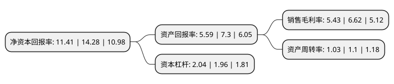

> 本页面由自动化程序生成于 2022年5月20日 01:11
> 内容可能存在错误，如有bug请提交issue至：https://github.com/Eroleice/doc-pi/issues
{.is-warning}

# 上市公司基本情况

## 基本资料

深圳王子新材料股份有限公司（以下简称“王子新材”）成立于1997年05月28日，深圳市。于2014年12月03日在深交所中小板上市。

王子新材注册资本21,328.538万元，塑料包装材料及产品的研发，设计，生产和销售以下是详细信息：

- 公司名称: 深圳王子新材料股份有限公司
- 股票代码: 002735.SZ
- 所在地: 广东 - 深圳市
- 成立日期: 1997年05月28日
- 注册资本: 21,328.538万元
- 法定代表人: 王进军
- 主营业务: 塑料包装材料及产品的研发，设计，生产和销售
- 公司官网: www.szwzxc.com
- 公司介绍: 公司集研发、设计、制造、销售为一体。主要生产和销售塑料包装膜、塑料托盘、塑料缓冲材料、彩色印刷、食、药品包装等。现已成为国内领先的新型环保包装材料集成供应商。公司已通过ISO9001、ISO14001、OHSAS18001体系认证，与富士康、伟创力、海尔、理光、爱普生、TCL、步步高、长城开发、创维、杜邦、泰克电子、好易通、佳能、康佳、联想、腾讯、德昌、东芝、西门子等多个国内外客户建立了良好的长期合作关系。公司历来重视环保材料的开发，是行业内首批执行欧盟RoHS标准的企业。

## 股东及高管情况

上市公司第一大股东为王进军，持股76,625,409股，占比35.93%，为上市公司实际控制人。

截至2022年03月31日，上市公司的前十大股东中，共有8名自然人股东，1名机构股东，1个产品账户，其中5%以上大股东共有2名。上市公司前十大股东明细如下：

> 截至2022年03月31日，上市公司前十大股东信息如下：

| 股东名称 | 持股数量（股） | 持股比例 |
| --- | --- | --- |
| 王进军 | 76,625,409 | 35.93% |
| 王武军 | 12,958,984 | 6.08% |
| 王孝军 | 8,036,000 | 3.77% |
| 江苏漫江碧透科技发展有限公司 | 6,785,000 | 3.18% |
| 梁建宏 | 5,310,025 | 2.49% |
| 王娟 | 2,258,200 | 1.06% |
| 广东龙盈资产管理有限公司-龙盈福兴1号私募证券投资基金 | 1,613,080 | 0.76% |
| 余舒 | 1,547,730 | 0.73% |
| 刘腊梅 | 1,322,126 | 0.62% |
| 雷杰 | 1,308,460 | 0.61% |

## 利润表分析

上市公司2021年总收入为17.35亿元，净利润为0.94亿元，实现盈利。

## 杜邦分析

> 数据列示周期：2021年 | 2020年 | 2019年
{.is-info}

上市公司的净资产收益率在近一年有所下降，下降幅度为-20.1%，其变化情况分解如下：
- 上市公司的销售毛利率在近一年下降了-17.98%，可能是生产效率的下降、商品原材料价格上涨或商品价格的下跌所致。
- 上市公司的资产周转率在近一年下降了-6.36%，可能是源自于更慢的销售回款或库存管理效果下降。
- 上市公司的财务杠杆比率在近一年上升了4.08%，可能是增加负债扩大生产规模。

