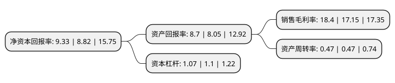

> 本页面由自动化程序生成于 2022年5月20日 01:14
> 内容可能存在错误，如有bug请提交issue至：https://github.com/Eroleice/doc-pi/issues
{.is-warning}

# 上市公司基本情况

## 基本资料

金富科技股份有限公司（以下简称“金富科技”）成立于2001年01月20日，东莞市。于2020年11月06日在深交所中小板上市。

金富科技注册资本26,000万元，主营业务为塑料防盗瓶盖等塑料包装用品的研发，生产和销售。公司的主要产品为塑料防盗瓶盖。以下是详细信息：

- 公司名称: 金富科技股份有限公司
- 股票代码: 003018.SZ
- 所在地: 广东 - 东莞市
- 成立日期: 2001年01月20日
- 注册资本: 26,000万元
- 法定代表人: 陈珊珊
- 主营业务: 主营业务为塑料防盗瓶盖等塑料包装用品的研发，生产和销售公司的主要产品为塑料防盗瓶盖
- 公司官网: www.jinfu-group.com
- 公司介绍: 公司是目前享益世界的国内最大瓶装水盖供应商之一，公司的主营业务为塑料防盗瓶盖等塑料包装用品的研发、生产和销售。公司的主要产品为塑料防盗瓶盖。公司产品按照应用领域的不同，主要可分为应用于瓶装纯净水、矿泉水的3025盖、2925盖、T2925盖、28盖及1.555L瓶装水提手；应用于桶装饮用水的PC桶装水盖、4.5L桶装水盖及4.5L桶装水提手；应用于瓶装功能饮料的38盖、1881盖；应用于酱油系列产品的两片盖和应用于糖浆、果冻、食用油系列的阀门嘴盖、吸嘴盖及应用于空调压缩机的开关盖、接线柱胶盖等产品。公司作为下游知名饮料制造企业的重要塑料防盗瓶盖供应商，已获得华润怡宝、景田、可口可乐、达能、华山泉颁发的优秀供应商奖，并于2018年获得华润怡宝颁发的十年合作贡献奖，公司产品被评为“广东省名牌产品”，公司荣获了“高新技术企业”、“中国包装饮用水行业优质配套供应商”等系列荣誉。

## 股东及高管情况

上市公司第一大股东为陈金培，持股137,265,800股，占比52.79%，为上市公司实际控制人。

截至2022年03月31日，上市公司的前十大股东中，共有6名自然人股东，4名机构股东，其中5%以上大股东共有2名。上市公司前十大股东明细如下：

> 截至2022年03月31日，上市公司前十大股东信息如下：

| 股东名称 | 持股数量（股） | 持股比例 |
| --- | --- | --- |
| 陈金培 | 137,265,800 | 52.79% |
| 陈婉如 | 30,150,000 | 11.6% |
| 东莞金盖投资合伙企业(有限合伙) | 7,500,000 | 2.88% |
| 东莞倍升投资合伙企业(有限合伙) | 7,500,000 | 2.88% |
| 东莞红土创业投资有限公司 | 4,545,600 | 1.75% |
| 深圳市创新投资集团有限公司 | 1,838,600 | 0.71% |
| 谢欢 | 1,161,700 | 0.45% |
| 欧敬昌 | 1,000,000 | 0.38% |
| 鲁振华 | 1,000,000 | 0.38% |
| 李永明 | 1,000,000 | 0.38% |

## 利润表分析

上市公司2021年总收入为6.59亿元，净利润为1.21亿元，实现盈利。

## 杜邦分析

> 数据列示周期：2021年 | 2020年 | 2019年
{.is-info}

上市公司的净资产收益率在近一年有所上升，上升幅度为5.78%，其变化情况分解如下：
- 上市公司的销售毛利率在近一年上升了7.29%，可能是生产效率的提升、商品原材料价格下跌或商品价格的上涨所致。
- 上市公司的资产周转率在近一年下降了0%，可能是源自于更慢的销售回款或库存管理效果下降。
- 上市公司的财务杠杆比率在近一年下降了-2.73%，可能是减少负债降低财务费用。

