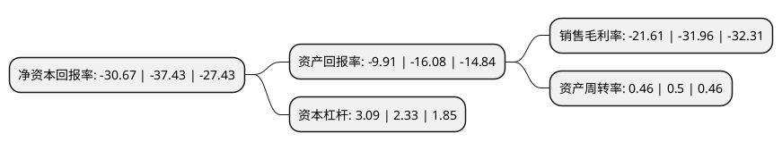

> 本页面由自动化程序生成于 2022年5月20日 01:15
> 内容可能存在错误，如有bug请提交issue至：https://github.com/Eroleice/doc-pi/issues
{.is-warning}

# 上市公司基本情况

## 基本资料

常州天晟新材料股份有限公司（以下简称“天晟新材”）成立于1998年07月27日，常州市。于2011年01月25日在深交所创业板上市。

天晟新材注册资本32,598.434万元，主要从事高分子发泡材料的研发，生产与销售，主要产品包括软质发泡材料，结构泡沫材料以及上述材料的后加工产品等。以下是详细信息：

- 公司名称: 常州天晟新材料股份有限公司
- 股票代码: 300169.SZ
- 所在地: 江苏 - 常州市
- 成立日期: 1998年07月27日
- 注册资本: 32,598.434万元
- 法定代表人: 吴海宙
- 主营业务: 主要从事高分子发泡材料的研发，生产与销售，主要产品包括软质发泡材料，结构泡沫材料以及上述材料的后加工产品等
- 公司官网: www.tschina.com
- 公司介绍: 公司作为全国知名的高分子发泡材料专业生产商，一直致力于高分子发泡材料的研究、开发、生产和销售，是江苏省高新技术企业。公司在软质泡沫材料、结构泡沫材料及上述材料的后加工产品领域。公司主要从事高分子发泡材料的研发、生产与销售，主要产品包括软质发泡材料、结构泡沫材料以及上述材料的后加工产品。是江苏省高新技术企业、税务A级纳税等级企业、常州市科技型中小企业、江苏省民营科技企业。公司拥有独立的研发机构(江苏省高分子泡沫材料工程技术研究中心、省级企业技术中心)和多项高新技术产品。其中公司自主研发的高新技术产品-结构泡沫芯材，已成功跨入风力发电、轨道交通、船舶制造、节能建筑等领域，填补了国内空白，获得了国家火炬计划项目证书。

## 股东及高管情况

上市公司第一大股东为青岛融海国投资产管理有限公司，持股30,000,000股，占比9.2%，**疑似为**上市公司实际控制人。

截至2022年03月31日，上市公司的前十大股东中，共有8名自然人股东，1名机构股东，1个产品账户，其中5%以上大股东共有2名。上市公司前十大股东明细如下：

> 未能通过持股比例判定出上市公司实际控制人（持股30%以上）
> 可能存在通过间接持股、联合持股、协议控制等方式拥有实际控制权的主体，具体请参考上市公司定期公告！
{.is-warning}

> 上市公司第一大股东持股不超过10%，请检查是否存在公司控制权风险！
{.is-danger}

> 截至2022年03月31日，上市公司前十大股东信息如下：

| 股东名称 | 持股数量（股） | 持股比例 |
| --- | --- | --- |
| 青岛融海国投资产管理有限公司 | 30,000,000 | 9.2% |
| 吴海宙 | 25,423,066 | 7.8% |
| 孙剑 | 13,050,000 | 4% |
| 吕泽伟 | 12,434,384 | 3.81% |
| 徐奕 | 6,908,346 | 2.12% |
| 张台华 | 4,937,100 | 1.51% |
| 长沙盈海私募股权基金管理合伙企业(有限合伙) | 4,889,700 | 1.5% |
| 王钧 | 3,333,243 | 1.02% |
| 戚建生 | 2,995,500 | 0.92% |
| 王艳 | 2,876,300 | 0.88% |

## 利润表分析

上市公司2021年总收入为7.61亿元，净利润为-1.65亿元，**未实现盈利**。

## 杜邦分析

> 数据列示周期：2021年 | 2020年 | 2019年
{.is-info}

上市公司的净资产收益率在近一年有所下降，下降幅度为-18.06%，其变化情况分解如下：
- 上市公司的销售毛利率在近一年下降了-32.38%，可能是生产效率的下降、商品原材料价格上涨或商品价格的下跌所致。
- 上市公司的资产周转率在近一年下降了-8%，可能是源自于更慢的销售回款或库存管理效果下降。
- 上市公司的财务杠杆比率在近一年上升了32.62%，可能是增加负债扩大生产规模。

