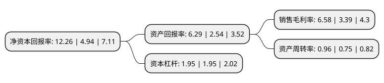

> 本页面由自动化程序生成于 2022年5月20日 01:15
> 内容可能存在错误，如有bug请提交issue至：https://github.com/Eroleice/doc-pi/issues
{.is-warning}

# 上市公司基本情况

## 基本资料

安徽安利材料科技股份有限公司（以下简称“安利股份”）成立于1994年07月12日，合肥市。于2011年05月18日在深交所创业板上市。

安利股份注册资本21,698.7万元，主营业务为中高档聚氨酯合成革复合材料的研发，生产，销售与服务，主要产品为生态功能性聚氨酯合成革和聚氨酯树脂。以下是详细信息：

- 公司名称: 安徽安利材料科技股份有限公司
- 股票代码: 300218.SZ
- 所在地: 安徽 - 合肥市
- 成立日期: 1994年07月12日
- 注册资本: 21,698.7万元
- 法定代表人: 姚和平
- 主营业务: 主营业务为中高档聚氨酯合成革复合材料的研发，生产，销售与服务，主要产品为生态功能性聚氨酯合成革和聚氨酯树脂
- 公司官网: www.chinapuleather.com
- 公司介绍: 公司的经营范围为：生产和销售各类生态功能性聚氨酯合成革及材料，以及其他高分子复合材料。公司产品品质优良，花色品种多样，广泛应用于功能鞋材、沙发家居、电子产品、体育装备、工程装饰、汽车内饰、手袋箱包等领域，产品畅销全国各地，并直接出口到多个国家和地区。公司承担了多项国家级及省市级科研项目，其中包括国家火炬计划项目、安徽省火炬计划项目、安徽政府“861”行动计划重点项目、安徽省地方重大科技项目等等。公司拥有人力资源和社会保障部和全国博士后管委会认定的“国家级博士后科研工作站”。公司主持参与制定国家和行业标准，公司产品还通过了“ISO9001质量管理体系”、“ISO/TS16949汽车行业生产件与相关服务件组织实施质量管理体系”、“ISO14001环境管理体系”、“OHSAS18001职业健康安全管理体系”等认证。

## 股东及高管情况

上市公司第一大股东为安徽安利科技投资集团股份有限公司，持股47,520,000股，占比21.9%，**疑似为**上市公司实际控制人。

截至2022年04月26日，上市公司的前十大股东中，共有10名机构股东，其中5%以上大股东共有10名。上市公司前十大股东明细如下：

> 未能通过持股比例判定出上市公司实际控制人（持股30%以上）
> 可能存在通过间接持股、联合持股、协议控制等方式拥有实际控制权的主体，具体请参考上市公司定期公告！
{.is-warning}

> 截至2022年04月26日，上市公司前十大股东信息如下：

| 股东名称 | 持股数量（股） | 持股比例 |
| --- | --- | --- |
| 安徽安利科技投资集团股份有限公司 | 47,520,000 | 21.9% |
| 安徽安利科技投资集团股份有限公司 | 47,520,000 | 21.9% |
| 安徽安利科技投资集团股份有限公司 | 47,520,000 | 21.9% |
| 安徽安利科技投资集团股份有限公司 | 47,520,000 | 21.9% |
| 合肥市工业投资控股有限公司 | 27,280,000 | 12.57% |
| 合肥市工业投资控股有限公司 | 27,280,000 | 12.57% |
| 合肥市工业投资控股有限公司 | 27,280,000 | 12.57% |
| 劲达企业有限公司(REAL TACT ENTERPRISE LIMITED) | 13,297,100 | 6.1281% |
| 劲达企业有限公司(REAL TACT ENTERPRISE LIMITED) | 12,984,800 | 5.9841% |
| 劲达企业有限公司(REAL TACT ENTERPRISE LIMITED) | 12,864,800 | 5.9288% |

## 利润表分析

上市公司2021年总收入为20.45亿元，净利润为1.34亿元，实现盈利。

## 杜邦分析

> 数据列示周期：2021年 | 2020年 | 2019年
{.is-info}

上市公司的净资产收益率在近一年有所上升，上升幅度为148.18%，其变化情况分解如下：
- 上市公司的销售毛利率在近一年上升了94.1%，可能是生产效率的提升、商品原材料价格下跌或商品价格的上涨所致。
- 上市公司的资产周转率在近一年上升了28%，可能是源自于更快的销售回款或库存管理效果提升。
- 上市公司的财务杠杆比率在近一年下降了0%，可能是减少负债降低财务费用。

