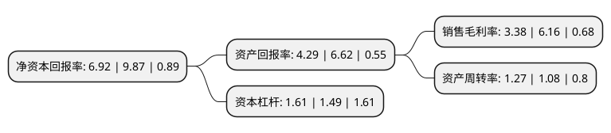

> 本页面由自动化程序生成于 2022年5月20日 01:15
> 内容可能存在错误，如有bug请提交issue至：https://github.com/Eroleice/doc-pi/issues
{.is-warning}

# 上市公司基本情况

## 基本资料

广东银禧科技股份有限公司（以下简称“银禧科技”）成立于1997年08月08日，东莞市。于2011年05月25日在深交所创业板上市。

银禧科技注册资本47,620.794万元，主营业务为生产和销售改性塑料。主要产品包括阻燃料，耐候料，增强增韧料，塑料合金料，环保耐用料和LED相关产品六大系列。以下是详细信息：

- 公司名称: 广东银禧科技股份有限公司
- 股票代码: 300221.SZ
- 所在地: 广东 - 东莞市
- 成立日期: 1997年08月08日
- 注册资本: 47,620.794万元
- 法定代表人: 谭文钊
- 主营业务: 主营业务为生产和销售改性塑料主要产品包括阻燃料，耐候料，增强增韧料，塑料合金料，环保耐用料和LED相关产品六大系列
- 公司官网: www.silverage.cn
- 公司介绍: 公司是一家集研发、生产、销售和技术服务于一体的高分子类新材料改性塑料供应商。公司主要生产PP、ABS、PC、PC/ABS合金、PS、PA、PBT、PPS、PVC、PVC/ABS合金、TPE等，包括阻燃料、耐侯料、增强增韧料、塑料合金料和环保耐用料等系列，被广泛应用于家用电器、汽车、IT电子、LED灯、电动工具、电线电缆、道路材料等领域。公司及关联企业目前开创了改性塑料，LED灯具配件加工，精密金属加工，3D打印等新兴科技领域的产业布局。经过多年的发展，公司已在东莞虎门等地建立了多家生产研发基地，形成了较强的改性高分子材料的生产能力，成为中国最重要的高分子新材料生产企业之一。

## 股东及高管情况

上市公司第一大股东为林登灿，持股10,070,700股，占比2.11%，**疑似为**上市公司实际控制人。

截至2022年03月31日，上市公司的前十大股东中，共有7名自然人股东，3名机构股东。上市公司前十大股东明细如下：

> 未能通过持股比例判定出上市公司实际控制人（持股30%以上）
> 可能存在通过间接持股、联合持股、协议控制等方式拥有实际控制权的主体，具体请参考上市公司定期公告！
{.is-warning}

> 上市公司第一大股东持股不超过10%，请检查是否存在公司控制权风险！
{.is-danger}

> 截至2022年03月31日，上市公司前十大股东信息如下：

| 股东名称 | 持股数量（股） | 持股比例 |
| --- | --- | --- |
| 林登灿 | 10,070,700 | 2.11% |
| 深圳市高新投集团有限公司 | 10,000,000 | 2.1% |
| 银禧集团有限公司 | 8,996,400 | 1.89% |
| 石河子市瑞晨股权投资合伙企业(有限合伙) | 4,503,528 | 0.95% |
| 谭颂斌 | 3,976,175 | 0.83% |
| 黄爱武 | 2,800,000 | 0.59% |
| 张林 | 2,500,000 | 0.52% |
| 羊正文 | 2,498,800 | 0.52% |
| 黄敬东 | 2,200,000 | 0.46% |
| 傅轶 | 2,013,400 | 0.42% |

## 利润表分析

上市公司2021年总收入为22.53亿元，净利润为0.76亿元，实现盈利。

## 杜邦分析

> 数据列示周期：2021年 | 2020年 | 2019年
{.is-info}

上市公司的净资产收益率在近一年有所下降，下降幅度为-29.89%，其变化情况分解如下：
- 上市公司的销售毛利率在近一年下降了-45.13%，可能是生产效率的下降、商品原材料价格上涨或商品价格的下跌所致。
- 上市公司的资产周转率在近一年上升了17.59%，可能是源自于更快的销售回款或库存管理效果提升。
- 上市公司的财务杠杆比率在近一年上升了8.05%，可能是增加负债扩大生产规模。

