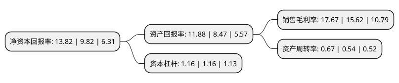

> 本页面由自动化程序生成于 2022年5月20日 01:16
> 内容可能存在错误，如有bug请提交issue至：https://github.com/Eroleice/doc-pi/issues
{.is-warning}

# 上市公司基本情况

## 基本资料

江苏裕兴薄膜科技股份有限公司（以下简称“裕兴股份”）成立于2004年12月10日，常州市。于2012年03月29日在深交所创业板上市。

裕兴股份注册资本28,875.3万元，中厚型特种功能性聚酯薄膜的研发，生产和销售。公司能根据市场和客户的不同需求，生产出不同规格，不同型号，不同用途的差异化特种功能性聚酯薄膜产品，目前公司特种功能性聚酯薄膜产品的厚度在50~400μm之间，是国内唯一一家能生产最大厚度为400μm的聚酯薄膜生产企业。以下是详细信息：

- 公司名称: 江苏裕兴薄膜科技股份有限公司
- 股票代码: 300305.SZ
- 所在地: 江苏 - 常州市
- 成立日期: 2004年12月10日
- 注册资本: 28,875.3万元
- 法定代表人: 王建新
- 主营业务: 中厚型特种功能性聚酯薄膜的研发，生产和销售公司能根据市场和客户的不同需求，生产出不同规格，不同型号，不同用途的差异化特种功能性聚酯薄膜产品，目前公司特种功能性聚酯薄膜产品的厚度在50~400μm之间，是国内唯一一家能生产最大厚度为400μm的聚酯薄膜生产企业
- 公司官网: www.czyuxing.com
- 公司介绍: 公司是一家专业生产差异化双向拉伸聚酯薄膜的制造商，是国内100微米以上中厚规格聚酯薄膜产销规模最大的企业之一。公司生产特种电气绝缘用薄膜、光学材料用薄膜、电子材料用薄膜等薄膜产品，现有世界先进技术水平的双向拉伸聚酯薄膜生产线，产品种类齐全、技术含量高，广泛应用于电子、电气绝缘、太阳能电池、纺织品装饰等领域。目前拥有多项国家发明专利，国家实用新型专利，以及江苏省高新技术产品。公司是经新标准认定的“高新技术企业”，一直坚持走技术创新路线，与国内多所知名高校开展了产、学、研联合研发，具备了强有力的技术开发持续创新能力。

## 股东及高管情况

上市公司第一大股东为王建新，持股68,213,400股，占比23.62%，**疑似为**上市公司实际控制人。

截至2022年03月31日，上市公司的前十大股东中，共有8名自然人股东，2名机构股东，其中5%以上大股东共有2名。上市公司前十大股东明细如下：

> 未能通过持股比例判定出上市公司实际控制人（持股30%以上）
> 可能存在通过间接持股、联合持股、协议控制等方式拥有实际控制权的主体，具体请参考上市公司定期公告！
{.is-warning}

> 截至2022年03月31日，上市公司前十大股东信息如下：

| 股东名称 | 持股数量（股） | 持股比例 |
| --- | --- | --- |
| 王建新 | 68,213,400 | 23.62% |
| 北京人济房地产开发集团有限公司 | 39,315,000 | 13.62% |
| 上海佳信企业发展有限公司 | 9,833,400 | 3.41% |
| 颜锦霞 | 4,623,100 | 1.6% |
| 王慷 | 4,012,795 | 1.39% |
| 董敏 | 3,827,000 | 1.33% |
| 刘全 | 3,359,400 | 1.16% |
| 姚炯 | 2,977,608 | 1.03% |
| 陈静 | 2,899,800 | 1% |
| 徐鹏 | 2,899,800 | 1% |

## 利润表分析

上市公司2021年总收入为13.65亿元，净利润为2.41亿元，实现盈利。

## 杜邦分析

> 数据列示周期：2021年 | 2020年 | 2019年
{.is-info}

上市公司的净资产收益率在近一年有所上升，上升幅度为40.73%，其变化情况分解如下：
- 上市公司的销售毛利率在近一年上升了13.12%，可能是生产效率的提升、商品原材料价格下跌或商品价格的上涨所致。
- 上市公司的资产周转率在近一年上升了24.07%，可能是源自于更快的销售回款或库存管理效果提升。
- 上市公司的财务杠杆比率在近一年下降了0%，可能是减少负债降低财务费用。

