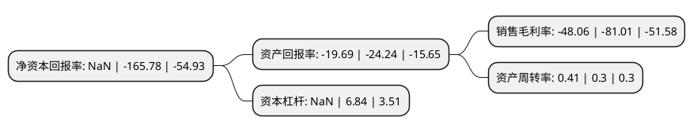

> 本页面由自动化程序生成于 2022年5月20日 01:16
> 内容可能存在错误，如有bug请提交issue至：https://github.com/Eroleice/doc-pi/issues
{.is-warning}

# 上市公司基本情况

## 基本资料

江苏德威新材料股份有限公司（以下简称“*ST德威”）成立于1995年12月18日，苏州市。于2012年06月01日在深交所创业板上市。

*ST德威注册资本100,574.309万元，主营业务为线缆用高分子材料的研制，生产，销售，为电力(火力，风力，核电)，汽车，船舶，铁路，家电，通信，建筑等多领域提供线缆用高分子材料。主要产品为交联聚乙烯(XLPE)绝缘材料，内外屏蔽料，汽车线束绝缘材料，弹性体材料，UL系列料，通用PVC护套，绝缘材料。以下是详细信息：

- 公司名称: 江苏德威新材料股份有限公司
- 股票代码: 300325.SZ
- 所在地: 江苏 - 苏州市
- 成立日期: 1995年12月18日
- 注册资本: 100,574.309万元
- 法定代表人: 周建明
- 主营业务: 主营业务为线缆用高分子材料的研制，生产，销售，为电力(火力，风力，核电)，汽车，船舶，铁路，家电，通信，建筑等多领域提供线缆用高分子材料主要产品为交联聚乙烯(XLPE)绝缘材料，内外屏蔽料，汽车线束绝缘材料，弹性体材料，UL系列料，通用PVC护套，绝缘材料
- 公司官网: www.chinadewei.com
- 公司介绍: 公司是一家专业从事线缆用高分子材料的研发、生产和销售的国家级高新技术企业。公司拥有多条瑞士BUSS公司制造的全封闭自动造粒生产线。主要生产XLPE绝缘材料、内外屏蔽材料、汽车线束绝缘材料、弹性体材料、UL系列材料及通用PVC材料等系列，覆盖了绝缘材料、屏蔽材料、护套材料等；是国内线缆用高分子材料行业产品种类最为丰富的企业之一。公司产品广泛应用于电力(火力、风力、核电)、汽车、船舶、铁路、家电、通信、建筑等多个领域。公司的技术创新能力在国内线缆用高分子材料领域中处于领先地位。凭借强大的技术实力，公司形成了以技术创新能力为主要内容的核心竞争优势，是国内线缆用高分子材料行业响应需求型技术创新能力较强的企业之一，是国内少数达到引导需求型技术创新层次的企业之一。公司在世界上首先采用化学共混法生产出聚酰胺弹性体材料，具有设备投资少、工艺操作简洁、产率高、能耗低、符合绿色环保等特点，对于提升我国高速铁路、航空线缆技术水平具有重要意义，该技术目前已获得国家专利局发明专利受理，属于世界领先。

## 股东及高管情况

上市公司第一大股东为德威投资集团有限公司，持股141,441,890股，占比14.06%，**疑似为**上市公司实际控制人。

截至2022年03月31日，上市公司的前十大股东中，共有8名自然人股东，2名机构股东，其中5%以上大股东共有1名。上市公司前十大股东明细如下：

> 未能通过持股比例判定出上市公司实际控制人（持股30%以上）
> 可能存在通过间接持股、联合持股、协议控制等方式拥有实际控制权的主体，具体请参考上市公司定期公告！
{.is-warning}

> 截至2022年03月31日，上市公司前十大股东信息如下：

| 股东名称 | 持股数量（股） | 持股比例 |
| --- | --- | --- |
| 德威投资集团有限公司 | 141,441,890 | 14.06% |
| 苏州蓝壹创业投资有限公司 | 12,227,539 | 1.22% |
| 孙文生 | 5,596,700 | 0.56% |
| 钱锟 | 5,177,587 | 0.51% |
| 朱建 | 4,924,900 | 0.49% |
| 汪剑 | 4,850,500 | 0.48% |
| 李霞 | 3,500,000 | 0.35% |
| 朱淑红 | 3,254,900 | 0.32% |
| 李炎 | 3,100,000 | 0.31% |
| 张颖 | 2,992,700 | 0.3% |

## 利润表分析

上市公司2021年总收入为10.57亿元，净利润为-5.09亿元，**未实现盈利**。

## 杜邦分析

> 数据列示周期：2021年 | 2020年 | 2019年
{.is-info}

上市公司的净资产收益率在近一年有所下降，下降幅度为NaN%，其变化情况分解如下：
- 上市公司的销售毛利率在近一年下降了-40.67%，可能是生产效率的下降、商品原材料价格上涨或商品价格的下跌所致。
- 上市公司的资产周转率在近一年上升了36.67%，可能是源自于更快的销售回款或库存管理效果提升。
- 上市公司的财务杠杆比率在近一年下降了NaN%，可能是减少负债降低财务费用。

