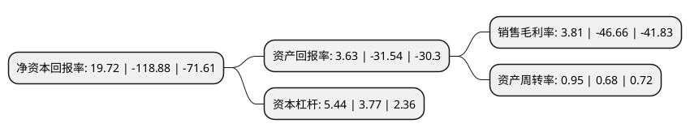

> 本页面由自动化程序生成于 2022年5月20日 01:18
> 内容可能存在错误，如有bug请提交issue至：https://github.com/Eroleice/doc-pi/issues
{.is-warning}

# 上市公司基本情况

## 基本资料

杭州高新橡塑材料股份有限公司（以下简称“杭州高新”）成立于2004年11月26日，杭州市。于2015年06月10日在深交所创业板上市。

杭州高新注册资本12,874.8万元，主营业务为线缆用高分子材料的研发，生产和销售，主要产品包括特种聚氯乙烯电缆料，无卤低烟阻燃电缆料，特种聚乙烯及交联聚乙烯电缆料，橡胶电缆料，橡塑改性弹性体，通用聚氯乙烯电缆料，共六大系列以下是详细信息：

- 公司名称: 杭州高新橡塑材料股份有限公司
- 股票代码: 300478.SZ
- 所在地: 浙江 - 杭州市
- 成立日期: 2004年11月26日
- 注册资本: 12,874.8万元
- 法定代表人: 胡宝泉
- 主营业务: 主营业务为线缆用高分子材料的研发，生产和销售，主要产品包括特种聚氯乙烯电缆料，无卤低烟阻燃电缆料，特种聚乙烯及交联聚乙烯电缆料，橡胶电缆料，橡塑改性弹性体，通用聚氯乙烯电缆料，共六大系列
- 公司官网: www.gxsl.com
- 公司介绍: 公司是一家集研发、生产电线电缆用塑料(电缆料)的企业，公司主营业务为线缆用高分子材料的研发、生产和销售，产品广泛运用于电力、船舶、轨道交通、通信、电气装备、建筑、新能源等领域。公司始终以市场为导向，坚持自主研发为主的技术创新道路，通过持续不断的研发创新与产品升级，已成为国内少数生产规模化、产品系列化、配方和生产工艺先进的线缆材料生产企业。公司先后通过了ISO9001:2008质量管理体系认证、ISO14001:2004环境管理体系认证、OHSAS18001:1999职业健康安全管理体系认证和“AA”测量管理体系认证，注册商标“双帆”牌被评为浙江省著名商标。公司主要荣誉有国家重点支持领域的高新技术企业、上市企业培育对象、余杭区第一批行业龙头标杆企业、浙江省工商企业AA级守合同重信用单位。公司不仅已发展成为电缆行业首选供应商之一，而且已稳步成为国内电缆行业最大规模和最佳效益企业之一。

## 股东及高管情况

上市公司第一大股东为浙江东杭控股集团有限公司，持股19,356,395股，占比15.0343%，**疑似为**上市公司实际控制人。

截至2022年04月28日，上市公司的前十大股东中，共有1名自然人股东，9名机构股东，其中5%以上大股东共有7名。上市公司前十大股东明细如下：

> 未能通过持股比例判定出上市公司实际控制人（持股30%以上）
> 可能存在通过间接持股、联合持股、协议控制等方式拥有实际控制权的主体，具体请参考上市公司定期公告！
{.is-warning}

> 截至2022年04月28日，上市公司前十大股东信息如下：

| 股东名称 | 持股数量（股） | 持股比例 |
| --- | --- | --- |
| 浙江东杭控股集团有限公司 | 19,356,395 | 15.0343% |
| 浙江东杭控股集团有限公司 | 15,880,395 | 12.3345% |
| 高兴控股集团有限公司 | 8,550,000 | 6.6409% |
| 高兴控股集团有限公司 | 8,550,000 | 6.6409% |
| 辽宁众科咨询管理中心(有限合伙) | 7,083,285 | 5.5017% |
| 辽宁众科咨询管理中心(有限合伙) | 7,083,285 | 5.5017% |
| 辽宁众科咨询管理中心(有限合伙) | 7,083,285 | 5.5% |
| 吕俊坤 | 6,333,728 | 4.92% |
| 万人中盈(厦门)股权投资合伙企业(有限合伙) | 6,333,650 | 4.92% |
| 北京中鼎嘉盛管理咨询服务合伙企业(有限合伙) | 2,746,930 | 2.13% |

## 利润表分析

上市公司2021年总收入为3.87亿元，净利润为0.14亿元，实现盈利。

## 杜邦分析

> 数据列示周期：2021年 | 2020年 | 2019年
{.is-info}

上市公司的净资产收益率在近一年有所下降，下降幅度为-116.59%，其变化情况分解如下：
- 上市公司的销售毛利率在近一年下降了-108.17%，可能是生产效率的下降、商品原材料价格上涨或商品价格的下跌所致。
- 上市公司的资产周转率在近一年上升了39.71%，可能是源自于更快的销售回款或库存管理效果提升。
- 上市公司的财务杠杆比率在近一年上升了44.3%，可能是增加负债扩大生产规模。

