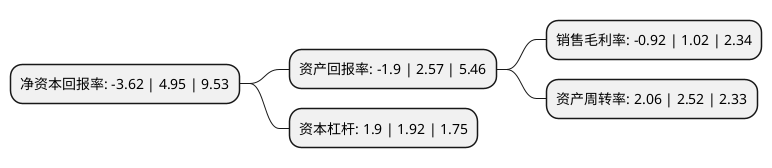

> 本页面由自动化程序生成于 2022年5月20日 01:18
> 内容可能存在错误，如有bug请提交issue至：https://github.com/Eroleice/doc-pi/issues
{.is-warning}

# 上市公司基本情况

## 基本资料

深圳市同益实业股份有限公司（以下简称“同益股份”）成立于2002年12月25日，深圳市。于2016年08月26日在深交所创业板上市。

同益股份注册资本18,191.857万元，主营业务:公司是中高端化工及电子材料应用服务型分销商，通过专业服务满足客户对材料应用品质，速度，成本和创新的需求，实现中高端化工及电子材料的销售。基于细分市场战略，凭借技术支持，产业链信息处理，库存协同管理等核心能力，公司在移动终端，家电，LED照明，太阳能等细分市场形成了独特的竞争优势。主要产品:工程塑料，弹性体塑料，手机油漆等化工材料及太阳能电池银浆，偏光片等电子材料。以下是详细信息：

- 公司名称: 深圳市同益实业股份有限公司
- 股票代码: 300538.SZ
- 所在地: 广东 - 深圳市
- 成立日期: 2002年12月25日
- 注册资本: 18,191.857万元
- 法定代表人: 邵羽南
- 主营业务: 主营业务:公司是中高端化工及电子材料应用服务型分销商，通过专业服务满足客户对材料应用品质，速度，成本和创新的需求，实现中高端化工及电子材料的销售基于细分市场战略，凭借技术支持，产业链信息处理，库存协同管理等核心能力，公司在移动终端，家电，LED照明，太阳能等细分市场形成了独特的竞争优势主要产品:工程塑料，弹性体塑料，手机油漆等化工材料及太阳能电池银浆，偏光片等电子材料
- 公司官网: www.tongyiplastic.com
- 公司介绍: 公司是国内从事化工及电子材料应用专业服务的先行者。公司基于卓越的技术服务能力，供应链管理能力，信息处理三大能力，整合来自于中国、中国台湾、美国、德国、日本等顶尖世界五百强化工企业优质资源，满足客户在品质、速度、成本及创新上的需求。同时，公司在管理上采用了业界主流的先进管理工具，建立了先进的战略管理体系以实现快速定位，快速响应，快速解决的目标，帮助客户实现价值最大化。公司基于细分市场战略，凭借技术支持、产业链信息处理、库存协同管理等核心能力，公司在移动终端、家电、LED照明、太阳能等细分市场形成了独特的竞争优势，目前拥有众多具有行业影响力的客户品牌，如华为、小米、中兴、步步高、TCL、魅族、酷派等。

## 股东及高管情况

上市公司第一大股东为华青翠，持股38,966,758股，占比21.42%，**疑似为**上市公司实际控制人。

截至2022年03月31日，上市公司的前十大股东中，共有6名自然人股东，3名机构股东，1个产品账户，其中5%以上大股东共有2名。上市公司前十大股东明细如下：

> 未能通过持股比例判定出上市公司实际控制人（持股30%以上）
> 可能存在通过间接持股、联合持股、协议控制等方式拥有实际控制权的主体，具体请参考上市公司定期公告！
{.is-warning}

> 截至2022年03月31日，上市公司前十大股东信息如下：

| 股东名称 | 持股数量（股） | 持股比例 |
| --- | --- | --- |
| 华青翠 | 38,966,758 | 21.42% |
| 邵羽南 | 36,211,265 | 19.91% |
| 华青春 | 8,082,369 | 4.44% |
| 赣州发展定增贰号投资合伙企业(有限合伙) | 5,853,658 | 3.22% |
| 信丰高新区投资开发有限公司 | 5,853,658 | 3.22% |
| 东台市汇金新特产业投资基金(有限合伙) | 4,878,048 | 2.68% |
| 东台市国创科技产业投资合伙企业(有限合伙) | 4,878,048 | 2.68% |
| 马远 | 4,490,155 | 2.47% |
| 华青柏 | 3,980,155 | 2.19% |
| 陈佐兴 | 3,339,689 | 1.84% |

## 利润表分析

上市公司2021年总收入为29.18亿元，净利润为-0.27亿元，**未实现盈利**。

## 杜邦分析

> 数据列示周期：2021年 | 2020年 | 2019年
{.is-info}

上市公司的净资产收益率在近一年有所下降，下降幅度为-173.13%，其变化情况分解如下：
- 上市公司的销售毛利率在近一年下降了-190.2%，可能是生产效率的下降、商品原材料价格上涨或商品价格的下跌所致。
- 上市公司的资产周转率在近一年下降了-18.25%，可能是源自于更慢的销售回款或库存管理效果下降。
- 上市公司的财务杠杆比率在近一年下降了-1.04%，可能是减少负债降低财务费用。

