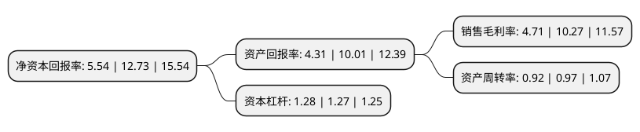

> 本页面由自动化程序生成于 2022年5月20日 01:19
> 内容可能存在错误，如有bug请提交issue至：https://github.com/Eroleice/doc-pi/issues
{.is-warning}

# 上市公司基本情况

## 基本资料

广东雄塑科技集团股份有限公司（以下简称“雄塑科技”）成立于2004年11月01日，佛山市。于2017年01月23日在深交所创业板上市。

雄塑科技注册资本35,813.157万元，公司所属行业为新型化学建材行业。公司自成立以来，专业从事“环保，安全，卫生，高性能”塑料管道的研发，生产和销售。经过多年发展，公司已经成为中国塑料管道行业内工艺技术先进，生产规模较大，产品规格齐全，品牌优势突出的领先企业。公司主要产品为聚氯乙烯(PVC)，聚乙烯(PE)，无规共聚聚丙烯(PPR)等系列管材管件，包括建筑用给排水管材管件，市政给排水(排污)管材管件，地下通信用塑料管材管件，高压电力电缆用护套管等众多系列。以下是详细信息：

- 公司名称: 广东雄塑科技集团股份有限公司
- 股票代码: 300599.SZ
- 所在地: 广东 - 佛山市
- 成立日期: 2004年11月01日
- 注册资本: 35,813.157万元
- 法定代表人: 黄淦雄
- 主营业务: 公司所属行业为新型化学建材行业公司自成立以来，专业从事“环保，安全，卫生，高性能”塑料管道的研发，生产和销售经过多年发展，公司已经成为中国塑料管道行业内工艺技术先进，生产规模较大，产品规格齐全，品牌优势突出的领先企业公司主要产品为聚氯乙烯(PVC)，聚乙烯(PE)，无规共聚聚丙烯(PPR)等系列管材管件，包括建筑用给排水管材管件，市政给排水(排污)管材管件，地下通信用塑料管材管件，高压电力电缆用护套管等众多系列
- 公司官网: www.xiongsu.cn
- 公司介绍: 公司是中国塑料管道行业内工艺技术先进、生产规模较大、产品规格齐全、品牌优势突出的领先企业。公司产品主要包括建筑用给排水管材管件、市政给排水(排污)管材管件、地下通信用塑料管材管件、采暖管、电工套管、高压电力电缆护套管等系列，品种丰富，产品规格齐全，品质优良，被评为“广东省名牌产品”，深受用户好评。公司产品广泛应用于保障性住房建设、农村饮水安全工程、污水处理工程、智能电网、通信网络等相关领域，是国家“实现产业转型升级，走新型工业化道路”的积极响应者和忠实履行者。公司认真贯彻“质量第一、精益求精求发展；顾客至上，用户满意为宗旨”的质量方针，严格控制产品质量，用心为顾客服务。公司创立以来，一贯注重产品研发，属“高新技术企业”，拥有一批资历较高的高水平技术及管理人才。公司将不断完善创新体系，提升技术水平，打造核心竞争力，立足国内，走向世界，把公司建设成为新型塑料建材行业的现代化标杆企业。

## 股东及高管情况

上市公司第一大股东为黄锦禧，持股87,629,800股，占比24.47%，**疑似为**上市公司实际控制人。

截至2022年03月31日，上市公司的前十大股东中，共有8名自然人股东，2名机构股东，其中5%以上大股东共有3名。上市公司前十大股东明细如下：

> 未能通过持股比例判定出上市公司实际控制人（持股30%以上）
> 可能存在通过间接持股、联合持股、协议控制等方式拥有实际控制权的主体，具体请参考上市公司定期公告！
{.is-warning}

> 截至2022年03月31日，上市公司前十大股东信息如下：

| 股东名称 | 持股数量（股） | 持股比例 |
| --- | --- | --- |
| 黄锦禧 | 87,629,800 | 24.47% |
| 黄淦雄 | 58,822,400 | 16.42% |
| 黄铭雄 | 50,315,200 | 14.05% |
| 佛山市雄进投资有限公司 | 8,195,200 | 2.29% |
| 关正生 | 4,324,372 | 1.21% |
| 宁勇 | 3,259,643 | 0.91% |
| 广东省九江酒厂有限公司 | 1,822,162 | 0.51% |
| 麦甘霖 | 1,655,321 | 0.46% |
| 曾文中 | 1,601,537 | 0.45% |
| 吴惠萍 | 1,567,443 | 0.44% |

## 利润表分析

上市公司2021年总收入为23.57亿元，净利润为1.11亿元，实现盈利。

## 杜邦分析

> 数据列示周期：2021年 | 2020年 | 2019年
{.is-info}

上市公司的净资产收益率在近一年有所下降，下降幅度为-56.48%，其变化情况分解如下：
- 上市公司的销售毛利率在近一年下降了-54.14%，可能是生产效率的下降、商品原材料价格上涨或商品价格的下跌所致。
- 上市公司的资产周转率在近一年下降了-5.15%，可能是源自于更慢的销售回款或库存管理效果下降。
- 上市公司的财务杠杆比率在近一年上升了0.79%，可能是增加负债扩大生产规模。

