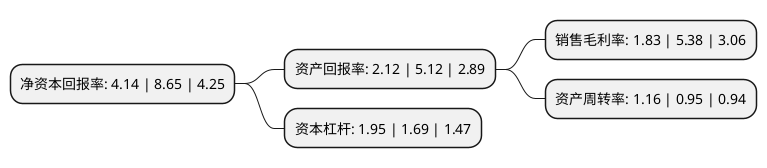

> 本页面由自动化程序生成于 2022年5月20日 01:19
> 内容可能存在错误，如有bug请提交issue至：https://github.com/Eroleice/doc-pi/issues
{.is-warning}

# 上市公司基本情况

## 基本资料

南京聚隆科技股份有限公司（以下简称“南京聚隆”）成立于1999年04月27日，南京市。于2018年02月06日在深交所创业板上市。

南京聚隆注册资本10,868.21万元，主营业务:改性塑料产品及塑木型材的研发，生产和销售。主要产品:高性能改性尼龙，高性能工程化聚丙烯，高性能合金材料和塑木环境工程材料，是生产轨道交通零部件，汽车零部件，电子电气及建筑工程等的原材料。以下是详细信息：

- 公司名称: 南京聚隆科技股份有限公司
- 股票代码: 300644.SZ
- 所在地: 江苏 - 南京市
- 成立日期: 1999年04月27日
- 注册资本: 10,868.21万元
- 法定代表人: 刘曙阳
- 主营业务: 主营业务:改性塑料产品及塑木型材的研发，生产和销售主要产品:高性能改性尼龙，高性能工程化聚丙烯，高性能合金材料和塑木环境工程材料，是生产轨道交通零部件，汽车零部件，电子电气及建筑工程等的原材料
- 公司官网: www.njjulong.cn
- 公司介绍: 公司是中国高铁及轨道交通尼龙改性材料的主要供应商，是中国汽车用尼龙、聚丙烯、塑料合金改性材料的重要供应商。公司拥有高性能改性尼龙、高性能工程化聚丙烯、长玻纤增强复合材料、高性能塑料合金和塑木环境工程材料等产品系列群，另有热塑性弹性体、功能性母粒、碳纤维复合材料、微发泡材料等新产品。公司产品广泛应用于汽车、高铁及轨道交通、电子电器、仪器仪表、机械、体育休闲、园林建设等领域。公司与四川大学、中科院化学所、南京大学、扬子石化研究院、白俄罗斯科学院新材料研究所/金属-聚合物材料研究所、中科院苏州纳米所等高等院校及专业科研院所保持着紧密的联系与合作。公司通过产学研合作创建了省改性塑料及塑木复合材料工程技术研究中心、省企业技术中心、省企业院士工作站和省博士后科研工作站，检测中心通过了中国合格评定国家认可委员会(CNAS)实验室的认可。公司建立了ERP和MES制造管理系统，生产关键工序控制达到国内领先水平。

## 股东及高管情况

上市公司第一大股东为刘越，持股15,956,458股，占比14.68%，**疑似为**上市公司实际控制人。

截至2022年03月31日，上市公司的前十大股东中，共有6名自然人股东，3名机构股东，1个产品账户，其中5%以上大股东共有4名。上市公司前十大股东明细如下：

> 未能通过持股比例判定出上市公司实际控制人（持股30%以上）
> 可能存在通过间接持股、联合持股、协议控制等方式拥有实际控制权的主体，具体请参考上市公司定期公告！
{.is-warning}

> 截至2022年03月31日，上市公司前十大股东信息如下：

| 股东名称 | 持股数量（股） | 持股比例 |
| --- | --- | --- |
| 刘越 | 15,956,458 | 14.68% |
| 江苏舜天股份有限公司 | 15,624,770 | 14.38% |
| 吴劲松 | 7,194,041 | 6.62% |
| 刘曙阳 | 5,709,608 | 5.25% |
| 蔡静 | 1,961,306 | 1.8% |
| 南京奶业(集团)有限公司 | 1,958,400 | 1.8% |
| 严渝荫 | 1,935,781 | 1.78% |
| 陈文健 | 1,430,000 | 1.32% |
| 南京高达梧桐创业投资基金(有限合伙) | 1,386,780 | 1.28% |
| 江苏舜天国际集团经济协作有限公司 | 1,175,040 | 1.08% |

## 利润表分析

上市公司2021年总收入为16.59亿元，净利润为0.3亿元，实现盈利。

## 杜邦分析

> 数据列示周期：2021年 | 2020年 | 2019年
{.is-info}

上市公司的净资产收益率在近一年有所下降，下降幅度为-52.14%，其变化情况分解如下：
- 上市公司的销售毛利率在近一年下降了-65.99%，可能是生产效率的下降、商品原材料价格上涨或商品价格的下跌所致。
- 上市公司的资产周转率在近一年上升了22.11%，可能是源自于更快的销售回款或库存管理效果提升。
- 上市公司的财务杠杆比率在近一年上升了15.38%，可能是增加负债扩大生产规模。

