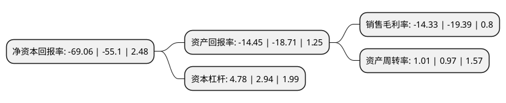

> 本页面由自动化程序生成于 2022年5月20日 01:19
> 内容可能存在错误，如有bug请提交issue至：https://github.com/Eroleice/doc-pi/issues
{.is-warning}

# 上市公司基本情况

## 基本资料

广东国立科技股份有限公司（以下简称“国立科技”）成立于2002年04月22日，东莞市。于2017年11月09日在深交所创业板上市。

国立科技注册资本16,002万元，公司的主营业务为低碳，环保，再生高分子材料及高分子材料制品的研发，生产，销售和技术服务，主要产品包括EVA环保改性材料及制品，TPR环保改性材料及制品，改性再生工程塑料等三大系列，产品被广泛应用于高档运动及休闲鞋材，运动器材，电子配套产品，家用电器，汽车汽配等领域。以下是详细信息：

- 公司名称: 广东国立科技股份有限公司
- 股票代码: 300716.SZ
- 所在地: 广东 - 东莞市
- 成立日期: 2002年04月22日
- 注册资本: 16,002万元
- 法定代表人: 邵鉴棠
- 主营业务: 公司的主营业务为低碳，环保，再生高分子材料及高分子材料制品的研发，生产，销售和技术服务，主要产品包括EVA环保改性材料及制品，TPR环保改性材料及制品，改性再生工程塑料等三大系列，产品被广泛应用于高档运动及休闲鞋材，运动器材，电子配套产品，家用电器，汽车汽配等领域
- 公司官网: www.guoligroup.com.cn
- 公司介绍: 公司专注改性环保橡塑材料的研发、生产、销售和技术服务。公司以大力推行节能低碳环保材料，发展科技产业，以推动世界绿色环保节能低碳为理念，专注低碳、环保、再生高分子材料及高分子材料制品的研发、生产、销售和技术服务，产品被广泛应用于高档鞋材、成品鞋、电子配套产品、运动器材、家用电器、汽车汽配等领域。公司重点开发可回收、可降解和废弃橡塑再利用等新型环保材料，大力推广以塑代钢，以塑代木。公司凭借在环保改性新材料领域多年积累的研发、生产经验，公司与下游客户建立了长期良好的合作关系，和客户共同开发产品。

## 股东及高管情况

上市公司第一大股东为东莞市永绿实业投资有限公司，持股53,960,895股，占比33.72%，为上市公司实际控制人。

截至2022年05月09日，上市公司的前十大股东中，共有3名自然人股东，7名机构股东，其中5%以上大股东共有9名。上市公司前十大股东明细如下：

> 截至2022年05月09日，上市公司前十大股东信息如下：

| 股东名称 | 持股数量（股） | 持股比例 |
| --- | --- | --- |
| 东莞市永绿实业投资有限公司 | 53,960,895 | 33.72% |
| 东莞市永绿实业投资有限公司 | 53,033,895 | 33.142% |
| 东莞市永绿实业投资有限公司 | 52,351,895 | 32.7158% |
| 东莞市盛和伟业投资有限公司 | 9,801,400 | 6.1251% |
| 东莞市盛和伟业投资有限公司 | 9,801,400 | 6.13% |
| 东莞市盛和伟业投资有限公司 | 9,801,400 | 6.13% |
| 杨国芬 | 8,100,000 | 5.0619% |
| 杨国芬 | 8,100,000 | 5.06% |
| 杨国芬 | 8,100,000 | 5.06% |
| 东莞红土创业投资有限公司 | 1,825,000 | 1.14% |

## 利润表分析

上市公司2021年总收入为19.01亿元，净利润为-2.73亿元，**未实现盈利**。

## 杜邦分析

> 数据列示周期：2021年 | 2020年 | 2019年
{.is-info}

上市公司的净资产收益率在近一年有所上升，上升幅度为25.34%，其变化情况分解如下：
- 上市公司的销售毛利率在近一年下降了-26.1%，可能是生产效率的下降、商品原材料价格上涨或商品价格的下跌所致。
- 上市公司的资产周转率在近一年上升了4.12%，可能是源自于更快的销售回款或库存管理效果提升。
- 上市公司的财务杠杆比率在近一年上升了62.59%，可能是增加负债扩大生产规模。

