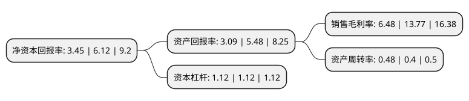

> 本页面由自动化程序生成于 2022年5月20日 01:19
> 内容可能存在错误，如有bug请提交issue至：https://github.com/Eroleice/doc-pi/issues
{.is-warning}

# 上市公司基本情况

## 基本资料

江苏华信新材料股份有限公司（以下简称“华信新材”）成立于2000年06月06日，徐州市。于2017年11月06日在深交所创业板上市。

华信新材注册资本10,240万元，主要业务:专业从事功能性塑料膜片材料的研发，生产和销售，目前主要为国内外智能卡生产企业及单位提供定制化的智能卡基材。。主要产品:主要生产PVC，PETG，ABS，PHA等四大系列20多种智能卡基材产品及生物环保新材料，涵盖智能卡生产的主要卡基材料种类，产品应用于金融，交通，医疗，电子信息，社会保障，安全保障，装饰，包装等领域。以下是详细信息：

- 公司名称: 江苏华信新材料股份有限公司
- 股票代码: 300717.SZ
- 所在地: 江苏 - 徐州市
- 成立日期: 2000年06月06日
- 注册资本: 10,240万元
- 法定代表人: 李振斌
- 主营业务: 专业从事功能性塑料膜片材料的研发，生产和销售，目前主要为国内外智能卡生产企业及单位提供定制化的智能卡基材主要产品:主要生产PVC，PETG，ABS，PHA等四大系列20多种智能卡基材产品及生物环保新材料，涵盖智能卡生产的主要卡基材料种类，产品应用于金融，交通，医疗，电子信息，社会保障，安全保障，装饰，包装等领域
- 公司官网: www.huaxinchina.cc
- 公司介绍: 公司是一家国内领先的功能性塑料膜片材料提供商，专业从事功能性塑料膜片材料的研发、生产和销售，目前主要为国内外智能卡生产企业及单位提供定制化的智能卡基材，已发展为国内中高档智能卡基材行业生产规模最大、产品档次最高、品种系列最全的企业之一，取得专利多项。公司研发的PETG材料是公安部指定的“第二代居民身份证”专用卡基材，被科技部等四部委认定为国家重点新产品，并获得国家金卡工程金蚂蚁奖，已广泛应用于各类证件卡制作生产;而且被评为“全国五一劳动奖状”、“全国模范职工之家”，先后通过“ISO9001质量管理体系认证”、“ISO14001环境管理体系认证”、“OHSAS18001职业健康安全管理体系认证”等多项认证。公司“华信”商标被国家工商总局认定为“中国驰名商标”。

## 股东及高管情况

上市公司第一大股东为江苏华智工贸实业有限公司，持股52,224,000股，占比51%，为上市公司实际控制人。

截至2022年03月31日，上市公司的前十大股东中，共有8名自然人股东，2名机构股东，其中5%以上大股东共有2名。上市公司前十大股东明细如下：

> 截至2022年03月31日，上市公司前十大股东信息如下：

| 股东名称 | 持股数量（股） | 持股比例 |
| --- | --- | --- |
| 江苏华智工贸实业有限公司 | 52,224,000 | 51% |
| 徐州华诚资产管理合伙企业(有限合伙) | 6,451,200 | 6.3% |
| 李振斌 | 1,228,800 | 1.2% |
| 刘斌 | 806,000 | 0.79% |
| 何悟琪 | 688,000 | 0.67% |
| 黄利桂 | 471,000 | 0.46% |
| 沈水雄 | 365,900 | 0.36% |
| 胡贵平 | 353,300 | 0.35% |
| 张锐汉 | 353,000 | 0.34% |
| 张云梅 | 314,280 | 0.31% |

## 利润表分析

上市公司2021年总收入为3.23亿元，净利润为0.2亿元，实现盈利。

## 杜邦分析

> 数据列示周期：2021年 | 2020年 | 2019年
{.is-info}

上市公司的净资产收益率在近一年有所下降，下降幅度为-43.63%，其变化情况分解如下：
- 上市公司的销售毛利率在近一年下降了-52.94%，可能是生产效率的下降、商品原材料价格上涨或商品价格的下跌所致。
- 上市公司的资产周转率在近一年上升了20%，可能是源自于更快的销售回款或库存管理效果提升。
- 上市公司的财务杠杆比率在近一年下降了0%，可能是减少负债降低财务费用。

