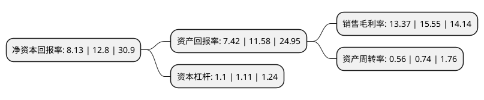

> 本页面由自动化程序生成于 2022年5月20日 01:21
> 内容可能存在错误，如有bug请提交issue至：https://github.com/Eroleice/doc-pi/issues
{.is-warning}

# 上市公司基本情况

## 基本资料

苏州宝丽迪材料科技股份有限公司（以下简称“宝丽迪”）成立于2002年12月13日，苏州市。于2020年11月05日在深交所创业板上市。

宝丽迪注册资本14,400万元，专注于化学纤维原液着色和功能改性的核心原材料——纤维母粒的研发，生产与销售以下是详细信息：

- 公司名称: 苏州宝丽迪材料科技股份有限公司
- 股票代码: 300905.SZ
- 所在地: 江苏 - 苏州市
- 成立日期: 2002年12月13日
- 注册资本: 14,400万元
- 法定代表人: 徐毅明
- 主营业务: 专注于化学纤维原液着色和功能改性的核心原材料——纤维母粒的研发，生产与销售
- 公司官网: www.ppm-sz.cn
- 公司介绍: 公司自设立以来，便致力于成为“原液着色技术”的引领者和推广者。公司将研发创新作为发展的持续动力，一直致力于化学纤维原液着色和功能改性领域的技术创新。作为江苏省高新技术企业，公司已拥有12项核心技术、10项发明专利、34项实用新型专利。2016年，公司与中国纺织科学研究院等单位共同承担了“十三五”国家“重点基础材料技术提升与产业化”项目——“高品质原液着色纤维开发及应用”的研发工作；2017年，公司荣获“全国化纤行业应用创新企业”称号；2018年，经中国化纤协会和国家纺织化纤产品开发中心联合认定，公司设立国家纤维功能母粒研发基地，为日后的持续创新奠定了坚实基础。公司作为中国化纤协会成员单位，利用自身在纤维母粒乃至绿色纤维领域的技术优势和生产经验，积极参与行业标准的起草与制订工作。截至招股说明书签署日，公司参与起草完成的化纤行业标准包括“再生阻燃涤纶短纤维(FZ/T52026-2012)”、“循环再利用化学纤维(涤纶)行业绿色采购规范(T/CCFA00006-2016)”、“绿色纤维评价技术要求(T/CCFA02007-2018)”，正在起草的纤维母粒行业标准为“纤维级聚酯(PET)色母粒(计划号2018-2169T-FZ)”。

## 股东及高管情况

上市公司第一大股东为徐闻达，持股38,262,226股，占比26.57%，**疑似为**上市公司实际控制人。

截至2022年03月31日，上市公司的前十大股东中，共有5名自然人股东，5名机构股东，其中5%以上大股东共有4名。上市公司前十大股东明细如下：

> 未能通过持股比例判定出上市公司实际控制人（持股30%以上）
> 可能存在通过间接持股、联合持股、协议控制等方式拥有实际控制权的主体，具体请参考上市公司定期公告！
{.is-warning}

> 截至2022年03月31日，上市公司前十大股东信息如下：

| 股东名称 | 持股数量（股） | 持股比例 |
| --- | --- | --- |
| 徐闻达 | 38,262,226 | 26.57% |
| 苏州聚星宝电子科技有限公司 | 32,717,758 | 22.72% |
| 徐毅明 | 11,098,266 | 7.71% |
| 苏州铕利合盛企业管理中心(有限合伙) | 9,343,838 | 6.49% |
| 龚福明 | 2,705,934 | 1.88% |
| 江苏新苏化纤有限公司 | 1,984,152 | 1.38% |
| 杨军辉 | 1,547,866 | 1.07% |
| 朱建国 | 1,320,666 | 0.92% |
| 苏州市相城埭溪创业投资有限责任公司 | 1,000,000 | 0.69% |
| 中纺资产管理有限公司 | 842,200 | 0.58% |

## 利润表分析

上市公司2021年总收入为7.72亿元，净利润为1.03亿元，实现盈利。

## 杜邦分析

> 数据列示周期：2021年 | 2020年 | 2019年
{.is-info}

上市公司的净资产收益率在近一年有所下降，下降幅度为-36.48%，其变化情况分解如下：
- 上市公司的销售毛利率在近一年下降了-14.02%，可能是生产效率的下降、商品原材料价格上涨或商品价格的下跌所致。
- 上市公司的资产周转率在近一年下降了-24.32%，可能是源自于更慢的销售回款或库存管理效果下降。
- 上市公司的财务杠杆比率在近一年下降了-0.9%，可能是减少负债降低财务费用。

