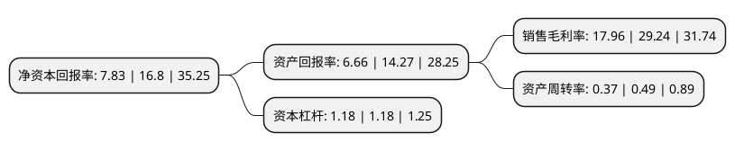

> 本页面由自动化程序生成于 2022年5月20日 01:21
> 内容可能存在错误，如有bug请提交issue至：https://github.com/Eroleice/doc-pi/issues
{.is-warning}

# 上市公司基本情况

## 基本资料

浙江润阳新材料科技股份有限公司（以下简称“润阳科技”）成立于2012年10月31日，湖州市。于2020年12月25日在深交所创业板上市。

润阳科技注册资本10,000万元，专业从事无毒环保高分子泡沫塑料的研发，生产和销售，主要产品为电子辐照交联聚乙烯(IXPE)。以下是详细信息：

- 公司名称: 浙江润阳新材料科技股份有限公司
- 股票代码: 300920.SZ
- 所在地: 浙江 - 湖州市
- 成立日期: 2012年10月31日
- 注册资本: 10,000万元
- 法定代表人: 杨庆锋
- 主营业务: 专业从事无毒环保高分子泡沫塑料的研发，生产和销售，主要产品为电子辐照交联聚乙烯(IXPE)
- 公司官网: www.zj-runyang.com
- 公司介绍: 公司为高新技术企业，专业从事无毒环保高分子泡沫塑料的研发、生产和销售，主要产品为电子辐照交联聚乙烯(IXPE)。IXPE产品是一种无毒环保、绿色健康的材料，其物理性能优异，具有无毒、无味、减震、降噪、隔热、耐腐蚀、抗菌、防水、手感舒适、光滑整洁等多种优良特性，主要应用于绿色健康生活相关的家居建筑装饰、汽车内饰及婴童用品等领域。公司注重自主创新，坚持以市场需求为导向，持续推进无毒环保高分子泡沫塑料产品的研发、生产技术的创新和产品应用的研究，重视相关技术的开发与储备，不断研发探索IXPE泡沫塑料的新配方、新工艺，持续拓展产品种类及其应用领域，掌握了多项拥有自主知识产权的核心技术。截至本招股说明书签署日，公司拥有各项专利技术76项(其中发明专利32项)。

## 股东及高管情况

上市公司第一大股东为张镤，持股41,163,754股，占比41.16%，为上市公司实际控制人。

截至2022年03月31日，上市公司的前十大股东中，共有5名自然人股东，3名机构股东，2个产品账户，其中5%以上大股东共有2名。上市公司前十大股东明细如下：

> 截至2022年03月31日，上市公司前十大股东信息如下：

| 股东名称 | 持股数量（股） | 持股比例 |
| --- | --- | --- |
| 张镤 | 41,163,754 | 41.16% |
| 费晓锋 | 5,900,271 | 5.9% |
| 宁波梅山保税港区明茂投资管理合伙企业(有限合伙) | 4,456,864 | 4.46% |
| 童晓玲 | 4,209,869 | 4.21% |
| 宁波梅山保税港区安扬投资管理合伙企业(有限合伙) | 3,809,930 | 3.81% |
| 上海天倚道投资管理有限公司-天倚道新弘21号私募证券投资基金 | 3,300,000 | 3.3% |
| 徐雄翔 | 3,092,795 | 3.09% |
| 兴业银行股份有限公司-圆信永丰优加生活股票型证券投资基金 | 1,200,092 | 1.2% |
| 长兴兴美投资管理合伙企业(有限合伙) | 1,190,392 | 1.19% |
| 宋行群 | 1,109,300 | 1.11% |

## 利润表分析

上市公司2021年总收入为5.01亿元，净利润为0.9亿元，实现盈利。

## 杜邦分析

> 数据列示周期：2021年 | 2020年 | 2019年
{.is-info}

上市公司的净资产收益率在近一年有所下降，下降幅度为-53.39%，其变化情况分解如下：
- 上市公司的销售毛利率在近一年下降了-38.58%，可能是生产效率的下降、商品原材料价格上涨或商品价格的下跌所致。
- 上市公司的资产周转率在近一年下降了-24.49%，可能是源自于更慢的销售回款或库存管理效果下降。
- 上市公司的财务杠杆比率在近一年下降了0%，可能是减少负债降低财务费用。

