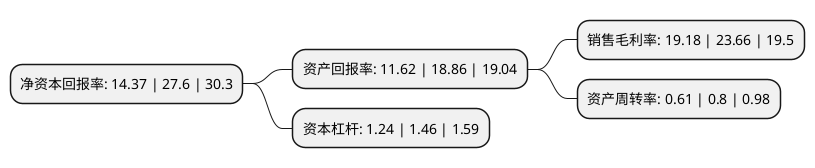

> 本页面由自动化程序生成于 2022年5月20日 01:22
> 内容可能存在错误，如有bug请提交issue至：https://github.com/Eroleice/doc-pi/issues
{.is-warning}

# 上市公司基本情况

## 基本资料

湖北祥源新材科技股份有限公司（以下简称“祥源新材”）成立于2003年04月29日，孝感市。于2021年04月21日在深交所创业板上市。

祥源新材注册资本7,189.806万元，公司主要生产电子辐照交联聚烯烃发泡材料(IXPE/IXPP)，该材料具备缓冲，吸音，减震，保温，过滤等功能，广泛应用于建筑，汽车，电子，医疗器械，航空等领域。以下是详细信息：

- 公司名称: 湖北祥源新材科技股份有限公司
- 股票代码: 300980.SZ
- 所在地: 湖北 - 孝感市
- 成立日期: 2003年04月29日
- 注册资本: 7,189.806万元
- 法定代表人: 魏志祥
- 主营业务: 公司主要生产电子辐照交联聚烯烃发泡材料(IXPE/IXPP)，该材料具备缓冲，吸音，减震，保温，过滤等功能，广泛应用于建筑，汽车，电子，医疗器械，航空等领域
- 公司官网: www.hbxyxc.com
- 公司介绍: 公司主要从事电子辐照交联聚乙烯发泡材料(IXPE)的研发、生产和销售.经过多年积累，公司已拥有丰富的电子辐射交联聚乙烯发泡材料的研发、生产经验，产品在市场上拥有良好的口碑，并已出口到日本、韩国、迪拜等13个国家。凭借出色的技术实力和规范安全的生产，公司2011年获得了由湖北省科学技术厅、财政厅、国税局、地税局颁布的高新技术企业证书，且2014年通过复审；2011年11月被湖北省科学技术厅评选为湖北省创新型企业建设试点单位；2012年2月被中共孝感市委人才工作领导小组评选为孝感市重点产业创新团队；2013年被中国创新创业大赛组委会评选为第二届中国创新创业大赛优秀企业；2013年2月由中共汉川市委员会、汉川市人民政府颁发了2012年度科技进步奖；2013年10月被湖北省科学技术厅评选为第二届中国创新创业大赛湖北赛区年度科技创业企业。公司长期致力于精益化管理，先后通过ISO9001:2008质量管理体系和ISO14001:2004环境管理体系认证并持续有效运行。

## 股东及高管情况

上市公司第一大股东为魏志祥，持股21,310,000股，占比29.64%，**疑似为**上市公司实际控制人。

截至2022年03月31日，上市公司的前十大股东中，共有2名自然人股东，7名机构股东，1个产品账户，其中5%以上大股东共有3名。上市公司前十大股东明细如下：

> 未能通过持股比例判定出上市公司实际控制人（持股30%以上）
> 可能存在通过间接持股、联合持股、协议控制等方式拥有实际控制权的主体，具体请参考上市公司定期公告！
{.is-warning}

> 截至2022年03月31日，上市公司前十大股东信息如下：

| 股东名称 | 持股数量（股） | 持股比例 |
| --- | --- | --- |
| 魏志祥 | 21,310,000 | 29.64% |
| 魏琼 | 14,000,000 | 19.47% |
| 湖北量科高投创业投资有限公司 | 4,277,600 | 5.95% |
| 湖北楚商澴锋创业投资中心(有限合伙) | 3,200,000 | 4.45% |
| 武汉祥源众鑫新材料投资合伙企业(有限合伙) | 2,580,000 | 3.59% |
| 宜昌悦和股权投资基金管理有限公司-湖北兴发高投新材料创业投资基金合伙企业(有限合伙) | 2,140,000 | 2.98% |
| 湖北高富信创业投资有限公司 | 2,138,800 | 2.97% |
| 宁波梅山保税港区领慧投资合伙企业(有限合伙) | 1,428,571 | 1.99% |
| 北京国圣资产管理有限公司-盛慧(广东)股权投资合伙企业(有限合伙) | 1,428,571 | 1.99% |
| 湖北省高新产业投资集团有限公司 | 1,420,000 | 1.98% |

## 利润表分析

上市公司2021年总收入为4.57亿元，净利润为0.87亿元，实现盈利。

## 杜邦分析

> 数据列示周期：2021年 | 2020年 | 2019年
{.is-info}

上市公司的净资产收益率在近一年有所下降，下降幅度为-47.93%，其变化情况分解如下：
- 上市公司的销售毛利率在近一年下降了-18.93%，可能是生产效率的下降、商品原材料价格上涨或商品价格的下跌所致。
- 上市公司的资产周转率在近一年下降了-23.75%，可能是源自于更慢的销售回款或库存管理效果下降。
- 上市公司的财务杠杆比率在近一年下降了-15.07%，可能是减少负债降低财务费用。

