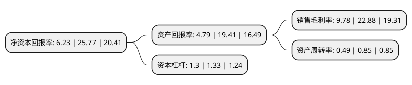

> 本页面由自动化程序生成于 2022年5月20日 01:22
> 内容可能存在错误，如有bug请提交issue至：https://github.com/Eroleice/doc-pi/issues
{.is-warning}

# 上市公司基本情况

## 基本资料

广东奇德新材料股份有限公司（以下简称“奇德新材”）成立于2007年08月16日，江门市。于2021年05月26日在深交所创业板上市。

奇德新材注册资本8,416万元，公司的主营业务为改性尼龙(PA)，改性聚丙烯(PP)为主的高性能高分子复合材料及其制品，精密注塑模具的研发设计，生产和销售及相关服务，主要产品包括改性尼龙复合材料及制品，改性聚丙烯复合材料及制品，其他改性复合材料及制品和精密注塑模具。以下是详细信息：

- 公司名称: 广东奇德新材料股份有限公司
- 股票代码: 300995.SZ
- 所在地: 广东 - 江门市
- 成立日期: 2007年08月16日
- 注册资本: 8,416万元
- 法定代表人: 饶德生
- 主营业务: 公司的主营业务为改性尼龙(PA)，改性聚丙烯(PP)为主的高性能高分子复合材料及其制品，精密注塑模具的研发设计，生产和销售及相关服务，主要产品包括改性尼龙复合材料及制品，改性聚丙烯复合材料及制品，其他改性复合材料及制品和精密注塑模具
- 公司官网: www.qide.cn
- 公司介绍: 公司的主营业务为改性尼龙(PA)、改性聚丙烯(PP)为主的高性能高分子复合材料及其制品、精密注塑模具的研发设计、生产和销售及相关服务，主要产品包括改性尼龙复合材料及制品、改性聚丙烯复合材料及制品、其他改性复合材料及制品和精密注塑模具。公司产品主要应用于高端婴童推车及儿童汽车安全座椅的关键结构件、运动器材核心结构件、汽车配件功能部件等，例如高端婴儿推车的关节、前叉、轮组，儿童汽车安全座椅安全卡扣、支撑结构件，溜冰鞋壳体，滑板车底板、轮座，汽车后视镜基座、门把手基座、空滤散热风轮等，该类应用部件对安全性及功能性、材料的机械性能、综合物理性能及稳定性等要求较高；此外，改性聚丙烯复合材料中熔喷专用料主要用于生产口罩专用的熔喷布、无纺布等防护用品。综上，公司产品可广泛应用于婴童出行用品、运动器材、汽车配件、家用电器、办公家具、防护用品等领域。

## 股东及高管情况

上市公司第一大股东为饶德生，持股28,000,000股，占比33.27%，为上市公司实际控制人。

截至2022年03月31日，上市公司的前十大股东中，共有5名自然人股东，5名机构股东，其中5%以上大股东共有3名。上市公司前十大股东明细如下：

> 截至2022年03月31日，上市公司前十大股东信息如下：

| 股东名称 | 持股数量（股） | 持股比例 |
| --- | --- | --- |
| 饶德生 | 28,000,000 | 33.27% |
| 江门市邦德投资有限公司 | 11,600,000 | 13.78% |
| 广东粤科创业投资管理有限公司--广东粤科汇盛创业投资合伙企业(有限合伙) | 6,270,000 | 7.45% |
| 陈栖养 | 4,200,000 | 4.99% |
| 陈云峰 | 4,200,000 | 4.99% |
| 广东奇德控股有限公司 | 3,345,000 | 3.97% |
| 奇德(珠海)商业中心(有限合伙) | 3,105,000 | 3.69% |
| 珠海邦塑科技企业(有限合伙) | 1,650,000 | 1.96% |
| 曾小平 | 519,376 | 0.62% |
| 姜晓春 | 375,000 | 0.45% |

## 利润表分析

上市公司2021年总收入为3.19亿元，净利润为0.31亿元，实现盈利。

## 杜邦分析

> 数据列示周期：2021年 | 2020年 | 2019年
{.is-info}

上市公司的净资产收益率在近一年有所下降，下降幅度为-75.82%，其变化情况分解如下：
- 上市公司的销售毛利率在近一年下降了-57.26%，可能是生产效率的下降、商品原材料价格上涨或商品价格的下跌所致。
- 上市公司的资产周转率在近一年下降了-42.35%，可能是源自于更慢的销售回款或库存管理效果下降。
- 上市公司的财务杠杆比率在近一年下降了-2.26%，可能是减少负债降低财务费用。

