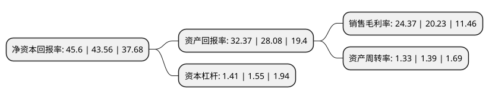

> 本页面由自动化程序生成于 2022年5月20日 01:22
> 内容可能存在错误，如有bug请提交issue至：https://github.com/Eroleice/doc-pi/issues
{.is-warning}

# 上市公司基本情况

## 基本资料

江苏博云塑业股份有限公司（以下简称“江苏博云”）成立于2006年06月27日，苏州市。于2021年06月01日在深交所创业板上市。

江苏博云注册资本5,826.667万元，公司主要从事改性塑料产品的研发，生产和销售。公司产品主要分为四大类，其中高性能改性尼龙(PEMARON)系列主要包含改性PA6，改性PA66等，高性能改性聚酯(AUTRON)系列主要包含改性PC/PBT，改性PC/ABS，改性PBT等，工程化聚烯烃(VENTRON)系列主要包含改性PP等，色母粒及功能性母粒(COLORON)系列主要为各类色母粒和功能性母粒。以下是详细信息：

- 公司名称: 江苏博云塑业股份有限公司
- 股票代码: 301003.SZ
- 所在地: 江苏 - 苏州市
- 成立日期: 2006年06月27日
- 注册资本: 5,826.667万元
- 法定代表人: 吕锋
- 主营业务: 公司主要从事改性塑料产品的研发，生产和销售公司产品主要分为四大类，其中高性能改性尼龙(PEMARON)系列主要包含改性PA6，改性PA66等，高性能改性聚酯(AUTRON)系列主要包含改性PC/PBT，改性PC/ABS，改性PBT等，工程化聚烯烃(VENTRON)系列主要包含改性PP等，色母粒及功能性母粒(COLORON)系列主要为各类色母粒和功能性母粒
- 公司官网: www.boiln.com
- 公司介绍: 公司主要从事改性塑料产品的研发、生产和销售。改性塑料行业是一个涵盖范围极为广泛的行业，其下游应用涉及各类工业制品。公司长期以来专注于部分具有较高技术含量和产品附加值的细分领域，在该等细分领域内深入研究市场发展变化和客户需求，持续投入资源进行创新与研发，在多个细分领域内已经形成了较强的竞争优势；并以此为基础不断拓展产品类别。经过多年的努力，公司已发展成为国内改性塑料行业中具有独特竞争优势及较强品牌影响力的企业。公司生产的改性塑料产品属于国家“十三五”期间大力支持的新材料，主要产品包括高性能改性尼龙、高性能改性聚酯、工程化聚烯烃及色母粒和功能性母粒等，广泛应用于电动工具、汽车零部件、家用电器、电子电气、办公家具类制品等多个行业领域，公司主要客户包括全球知名电动工具制造商史丹利百得(Stanley Black&Decker)、全球领先的汽车电子零部件企业安波福(Aptiv)等。

## 股东及高管情况

上市公司第一大股东为吕锋，持股16,625,916股，占比28.53%，**疑似为**上市公司实际控制人。

截至2022年03月31日，上市公司的前十大股东中，共有5名自然人股东，5名机构股东，其中5%以上大股东共有3名。上市公司前十大股东明细如下：

> 未能通过持股比例判定出上市公司实际控制人（持股30%以上）
> 可能存在通过间接持股、联合持股、协议控制等方式拥有实际控制权的主体，具体请参考上市公司定期公告！
{.is-warning}

> 截至2022年03月31日，上市公司前十大股东信息如下：

| 股东名称 | 持股数量（股） | 持股比例 |
| --- | --- | --- |
| 吕锋 | 16,625,916 | 28.53% |
| 陆士平 | 12,469,438 | 21.4% |
| 龚伟 | 7,369,438 | 12.65% |
| 苏州蔚蓝投资管理有限公司-苏州蓝叁创业投资有限公司 | 2,337,500 | 4.01% |
| 张家港市众韬企业管理合伙企业(有限合伙) | 1,200,000 | 2.06% |
| 苏州衍盈投资管理有限公司-太仓衍盈壹号投资管理中心(有限合伙) | 1,062,500 | 1.82% |
| 苏州缘尔丰企业管理合伙企业(有限合伙) | 850,000 | 1.46% |
| 苏州亿新熠合投资企业(有限合伙) | 850,000 | 1.46% |
| 查一丁 | 668,000 | 1.15% |
| 邓永清 | 623,472 | 1.07% |

## 利润表分析

上市公司2021年总收入为7.01亿元，净利润为1.34亿元，实现盈利。

## 杜邦分析

> 数据列示周期：2020年 | 2019年 | 2018年
{.is-info}

上市公司的净资产收益率在近一年有所上升，上升幅度为4.68%，其变化情况分解如下：
- 上市公司的销售毛利率在近一年上升了20.46%，可能是生产效率的提升、商品原材料价格下跌或商品价格的上涨所致。
- 上市公司的资产周转率在近一年下降了-4.32%，可能是源自于更慢的销售回款或库存管理效果下降。
- 上市公司的财务杠杆比率在近一年下降了-9.03%，可能是减少负债降低财务费用。

