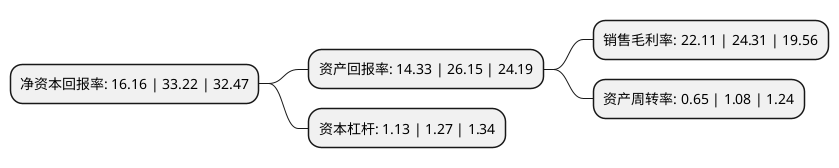

> 本页面由自动化程序生成于 2022年5月20日 01:22
> 内容可能存在错误，如有bug请提交issue至：https://github.com/Eroleice/doc-pi/issues
{.is-warning}

# 上市公司基本情况

## 基本资料

宁波色母粒股份有限公司（以下简称“宁波色母”）成立于1999年10月21日，宁波市。于2021年06月28日在深交所创业板上市。

宁波色母注册资本8,000万元，主要从事色母粒的研发，生产，销售和技术服务，致力于为客户提供塑料着色定制化产品，公司的主要产品为彩色母粒，白色母粒，黑色母粒，功能母粒等。以下是详细信息：

- 公司名称: 宁波色母粒股份有限公司
- 股票代码: 301019.SZ
- 所在地: 浙江 - 宁波市
- 成立日期: 1999年10月21日
- 注册资本: 8,000万元
- 法定代表人: 任卫庆
- 主营业务: 主要从事色母粒的研发，生产，销售和技术服务，致力于为客户提供塑料着色定制化产品，公司的主要产品为彩色母粒，白色母粒，黑色母粒，功能母粒等
- 公司官网: www.muli.com.cn
- 公司介绍: 公司主要从事色母粒的研发、生产、销售和技术服务，致力于为客户提供塑料着色定制化产品，精准满足客户塑料着色和功能需求，是一家具有自主研发和创新能力的高新技术企业。公司的主要产品为彩色母粒、白色母粒、黑色母粒、功能母粒等，公司是国内最早从事色母粒研究和生产的单位之一，自成立以来，专注于从事色母粒的研发、生产、销售和技术服务，经过多年发展，现已成为国内领先的塑料色母粒供应商。公司的色母粒产品产销量、销售额及市场占有率在行业中名列前茅，其中彩色母粒连续多年市场占有率为国内第一。公司拥有的“Mingzhou”色母粒商标是浙江省著名商标。截至本招股说明书签署日，公司拥有7项发明专利，具备较强的研发实力。公司还主持或参与起草了5项色母粒行业标准，参与修订了4项上下游行业标准，在行业内具备一定的影响力。

## 股东及高管情况

上市公司第一大股东为任卫庆，持股23,855,347股，占比29.82%，**疑似为**上市公司实际控制人。

截至2022年03月31日，上市公司的前十大股东中，共有7名自然人股东，3名机构股东，其中5%以上大股东共有3名。上市公司前十大股东明细如下：

> 未能通过持股比例判定出上市公司实际控制人（持股30%以上）
> 可能存在通过间接持股、联合持股、协议控制等方式拥有实际控制权的主体，具体请参考上市公司定期公告！
{.is-warning}

> 截至2022年03月31日，上市公司前十大股东信息如下：

| 股东名称 | 持股数量（股） | 持股比例 |
| --- | --- | --- |
| 任卫庆 | 23,855,347 | 29.82% |
| 宁波蓝润园股权投资合伙企业(有限合伙) | 4,442,281 | 5.55% |
| 宁波黄润园股权投资合伙企业(有限合伙) | 4,405,715 | 5.51% |
| 赵茂华 | 3,600,000 | 4.5% |
| 洪寅 | 2,057,143 | 2.57% |
| 毛春光 | 1,922,410 | 2.4% |
| 宁波红润园股权投资合伙企业(有限合伙) | 1,900,174 | 2.38% |
| 周必红 | 1,778,403 | 2.22% |
| 董小法 | 1,733,637 | 2.17% |
| 祖万年 | 1,549,478 | 1.94% |

## 利润表分析

上市公司2021年总收入为4.92亿元，净利润为1.08亿元，实现盈利。

## 杜邦分析

> 数据列示周期：2021年 | 2020年 | 2019年
{.is-info}

上市公司的净资产收益率在近一年有所下降，下降幅度为-51.35%，其变化情况分解如下：
- 上市公司的销售毛利率在近一年下降了-9.05%，可能是生产效率的下降、商品原材料价格上涨或商品价格的下跌所致。
- 上市公司的资产周转率在近一年下降了-39.81%，可能是源自于更慢的销售回款或库存管理效果下降。
- 上市公司的财务杠杆比率在近一年下降了-11.02%，可能是减少负债降低财务费用。

