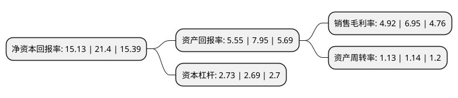

> 本页面由自动化程序生成于 2022年5月20日 01:23
> 内容可能存在错误，如有bug请提交issue至：https://github.com/Eroleice/doc-pi/issues
{.is-warning}

# 上市公司基本情况

## 基本资料

广州市聚赛龙工程塑料股份有限公司（以下简称“聚赛龙”）成立于1998年01月21日，广州市。于2022年03月14日在深交所创业板上市。

聚赛龙注册资本4,778万元，公司是一家专业从事改性塑料的研发，生产和销售的高新技术企业，主要产品包括改性通用塑料，改性工程塑料，改性特种工程塑料及其他高分子材料等产品。以下是详细信息：

- 公司名称: 广州市聚赛龙工程塑料股份有限公司
- 股票代码: 301131.SZ
- 所在地: 广东 - 广州市
- 成立日期: 1998年01月21日
- 注册资本: 4,778万元
- 法定代表人: 郝源增
- 主营业务: 公司是一家专业从事改性塑料的研发，生产和销售的高新技术企业，主要产品包括改性通用塑料，改性工程塑料，改性特种工程塑料及其他高分子材料等产品
- 公司官网: www.gzselon.com
- 公司介绍: 公司是一家专业从事改性塑料的研发、生产和销售的高新技术企业，主要产品包括改性通用塑料、改性工程塑料、改性特种工程塑料及其他高分子材料等产品。秉持着“重视顾客需求，赢得客户信赖，提供高科技产品，谋求共同发展”的理念，经过多年的持续耕耘，公司已经成为我国改性塑料领域的领先企业之一，能够在技术、质量、服务、供应等全方位不断为客户提供高性能、高价值的改性塑料综合解决方案。目前，公司的产品已广泛用于家用电器、汽车工业、医护用品、电子通信等领域，客户包括美的集团、苏泊尔、格兰仕集团、海信集团、丰田集团、延锋汽车、东风集团、普联技术等下游领域龙头或知名企业，公司品牌在市场内具备良好的声誉。2008年起，公司连续多年被认定为“高新技术企业”；2012年，公司被认定为“广东省创新型试点企业”；2014年，公司研发中心下属实验室被认定为“国家科技兴贸创新基地(新材料产业)重点实验室”；2015年，公司获授“广东省省级企业技术中心”；2017年，公司被认定为“广州市制造业骨干企业”，2018年，公司研发中心下属实验室被认定为“国家(CNAS)认证实验室”；2019年，公司被认定为“广东省高成长中小企业”。

## 股东及高管情况

上市公司第一大股东为郝源增，持股11,730,000股，占比24.55%，**疑似为**上市公司实际控制人。

截至2022年03月31日，上市公司的前十大股东中，共有3名自然人股东，7名机构股东，其中5%以上大股东共有2名。上市公司前十大股东明细如下：

> 未能通过持股比例判定出上市公司实际控制人（持股30%以上）
> 可能存在通过间接持股、联合持股、协议控制等方式拥有实际控制权的主体，具体请参考上市公司定期公告！
{.is-warning}

> 截至2022年03月31日，上市公司前十大股东信息如下：

| 股东名称 | 持股数量（股） | 持股比例 |
| --- | --- | --- |
| 郝源增 | 11,730,000 | 24.55% |
| 任萍 | 7,970,000 | 16.68% |
| 横琴聚合盈咨询管理企业(有限合伙) | 2,347,640 | 4.91% |
| 郝建鑫 | 2,300,000 | 4.81% |
| 深圳市同益实业股份有限公司 | 1,665,125 | 3.48% |
| 广东粤科泓润创业投资有限公司 | 1,387,604 | 2.9% |
| 广东粤科新鹤创业投资有限公司 | 1,387,604 | 2.9% |
| 珠海横琴聚赛龙咨询管理企业(有限合伙) | 1,258,427 | 2.63% |
| 横琴恒裕联创投资中心(有限合伙) | 1,000,000 | 2.09% |
| 舟山向日葵朝阳股权投资合伙企业(有限合伙) | 925,069 | 1.94% |

## 利润表分析

上市公司2021年总收入为13.03亿元，净利润为0.64亿元，实现盈利。

## 杜邦分析

> 数据列示周期：2021年 | 2020年 | 2019年
{.is-info}

上市公司的净资产收益率在近一年有所下降，下降幅度为-29.3%，其变化情况分解如下：
- 上市公司的销售毛利率在近一年下降了-29.21%，可能是生产效率的下降、商品原材料价格上涨或商品价格的下跌所致。
- 上市公司的资产周转率在近一年下降了-0.88%，可能是源自于更慢的销售回款或库存管理效果下降。
- 上市公司的财务杠杆比率在近一年上升了1.49%，可能是增加负债扩大生产规模。

