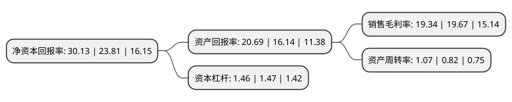

> 本页面由自动化程序生成于 2022年5月20日 01:23
> 内容可能存在错误，如有bug请提交issue至：https://github.com/Eroleice/doc-pi/issues
{.is-warning}

# 上市公司基本情况

## 基本资料

杭州和顺科技股份有限公司（以下简称“和顺科技”）成立于2003年06月16日，杭州市。于2022年03月23日在深交所创业板上市。

和顺科技注册资本8,000万元，专注于差异化，功能性双向拉伸聚酯薄膜(BOPET薄膜)研发，生产和销售，主要产品包括有色光电基膜，透明膜及其他功能膜。以下是详细信息：

- 公司名称: 杭州和顺科技股份有限公司
- 股票代码: 301237.SZ
- 所在地: 浙江 - 杭州市
- 成立日期: 2003年06月16日
- 注册资本: 8,000万元
- 法定代表人: 范和强
- 主营业务: 专注于差异化，功能性双向拉伸聚酯薄膜(BOPET薄膜)研发，生产和销售，主要产品包括有色光电基膜，透明膜及其他功能膜
- 公司官网: www.hzhssy.com
- 公司介绍: 公司是中国专业生产的双向拉伸聚酯薄膜(BOPET)的厂家，坐落于杭州余杭塘栖工业区，建筑面积12000平方米，是国内最大的有色聚薄膜生产厂家之一。公司拥有现代化标准的办公楼和厂房，拥有领先的实验室和研发中心，集研发、生产、销售为一体，被评为“杭州市高新技术企业”。公司已通过ISO1900、ISO1400体系认证。公司拥有一条年产4000吨的BOPET聚酯薄膜生产线，产品质量稳定。公司技术力量雄厚，生产设备精良，检测仪器先进，管理体系健全,拥有较强的自主研发能力，能根据客户的需求研制和生产不同特殊性能的有色聚酯薄膜产品。同时与国内多所知名大专院校建立长期的合作关系，走产，学，研共同发展的道路。公司已生产研发各类BOPET聚酯薄膜，产品包括触摸开关膜、马达膜、阻燃膜、黑膜、白膜、红膜、蓝膜、亚光膜、透明膜、半透明膜、离型膜等。

## 股东及高管情况

上市公司第一大股东为范和强，持股18,850,000股，占比23.56%，**疑似为**上市公司实际控制人。

截至2022年03月31日，上市公司的前十大股东中，共有5名自然人股东，4名机构股东，1个产品账户，其中5%以上大股东共有4名。上市公司前十大股东明细如下：

> 未能通过持股比例判定出上市公司实际控制人（持股30%以上）
> 可能存在通过间接持股、联合持股、协议控制等方式拥有实际控制权的主体，具体请参考上市公司定期公告！
{.is-warning}

> 截至2022年03月31日，上市公司前十大股东信息如下：

| 股东名称 | 持股数量（股） | 持股比例 |
| --- | --- | --- |
| 范和强 | 18,850,000 | 23.56% |
| 张静 | 10,150,000 | 12.69% |
| 范顺豪 | 8,000,000 | 10% |
| 杭州远宁荟鑫投资合伙企业(有限合伙) | 4,700,000 | 5.88% |
| 杭州一豪股权投资合伙企业(有限合伙) | 3,000,000 | 3.75% |
| 杭州广沣启沃股权投资合伙企业(有限合伙) | 3,000,000 | 3.75% |
| 陈伟 | 2,000,000 | 2.5% |
| 杭州金投智业创业投资合伙企业(有限合伙) | 1,500,000 | 1.88% |
| 桐庐浙富桐君股权投资基金合伙企业(有限合伙) | 1,000,000 | 1.25% |
| 胡建东 | 1,000,000 | 1.25% |

## 利润表分析

上市公司2021年总收入为6.39亿元，净利润为1.23亿元，实现盈利。

## 杜邦分析

> 数据列示周期：2021年 | 2020年 | 2019年
{.is-info}

上市公司的净资产收益率在近一年有所上升，上升幅度为26.54%，其变化情况分解如下：
- 上市公司的销售毛利率在近一年下降了-1.68%，可能是生产效率的下降、商品原材料价格上涨或商品价格的下跌所致。
- 上市公司的资产周转率在近一年上升了30.49%，可能是源自于更快的销售回款或库存管理效果提升。
- 上市公司的财务杠杆比率在近一年下降了-0.68%，可能是减少负债降低财务费用。

