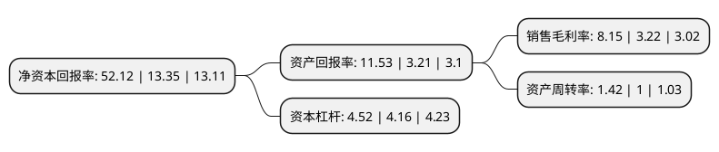

> 本页面由自动化程序生成于 2022年5月20日 01:26
> 内容可能存在错误，如有bug请提交issue至：https://github.com/Eroleice/doc-pi/issues
{.is-warning}

# 上市公司基本情况

## 基本资料

中化国际(控股)股份有限公司（以下简称“中化国际”）成立于1998年12月14日，上海市。于2000年03月01日在上交所主板上市。

中化国际注册资本276,516.647万元，主要产品:储罐，焦炭等冶金产品，农药及其他商品，化工物流，贸易，船务，储运，塑料原料，橡胶及橡胶制品，散化商品。以下是详细信息：

- 公司名称: 中化国际(控股)股份有限公司
- 股票代码: 600500.SH
- 所在地: 上海 - 上海市
- 成立日期: 1998年12月14日
- 注册资本: 276,516.647万元
- 法定代表人: 刘红生
- 主营业务: 主要产品:储罐，焦炭等冶金产品，农药及其他商品，化工物流，贸易，船务，储运，塑料原料，橡胶及橡胶制品，散化商品
- 公司官网: www.sinochemintl.com
- 公司介绍: 公司是在中间体及新材料、农用化学品、聚合物添加剂、天然橡胶等领域具有核心竞争力的国际化经营大型国有控股上市公司。公司专注于化工新材料、农药原药及剂型、电子化学品、汽车用材料及化学品等方面的研究，其中农药原药研究、橡胶化学品研究属行业领先。公司将商业实践与社会价值共融，追求可持续发展，注重环境保护，致力于建设资源节约型、环境友好型社会，实现“精细化学绿色生活”的企业发展愿景。荣获“中国上市公司治理百强”榜首、“中国最佳董事会”、“中国最受尊敬的上市公司”、“中国最具责任感上市公司”、“中国最佳治理上市公司”等诸多荣誉。

## 股东及高管情况

上市公司第一大股东为中国中化股份有限公司，持股1,498,885,610股，占比54.21%，为上市公司实际控制人。

截至2022年03月31日，上市公司的前十大股东中，共有5名自然人股东，3名机构股东，2个产品账户，其中5%以上大股东共有1名。上市公司前十大股东明细如下：

> 截至2022年03月31日，上市公司前十大股东信息如下：

| 股东名称 | 持股数量（股） | 持股比例 |
| --- | --- | --- |
| 中国中化股份有限公司 | 1,498,885,610 | 54.21% |
| 青岛凡益资产管理有限公司-凡益多策略与时偕行1号私募证券投资基金 | 58,700,000 | 2.12% |
| 中国石油销售有限责任公司 | 10,177,713 | 0.37% |
| 敖晓明 | 9,581,600 | 0.35% |
| 王国忠 | 8,610,000 | 0.31% |
| 北京中化金桥贸易有限公司 | 8,513,887 | 0.31% |
| 郑世武 | 7,308,309 | 0.26% |
| 中国农业银行股份有限公司-中证500交易型开放式指数证券投资基金 | 6,660,978 | 0.24% |
| 罗甄非 | 5,842,810 | 0.21% |
| 杨鄂 | 5,115,270 | 0.18% |

## 利润表分析

上市公司2021年总收入为806.47亿元，净利润为65.69亿元，实现盈利。

## 杜邦分析

> 数据列示周期：2021年 | 2020年 | 2019年
{.is-info}

上市公司的净资产收益率在近一年有所上升，上升幅度为290.41%，其变化情况分解如下：
- 上市公司的销售毛利率在近一年上升了153.11%，可能是生产效率的提升、商品原材料价格下跌或商品价格的上涨所致。
- 上市公司的资产周转率在近一年上升了42%，可能是源自于更快的销售回款或库存管理效果提升。
- 上市公司的财务杠杆比率在近一年上升了8.65%，可能是增加负债扩大生产规模。

