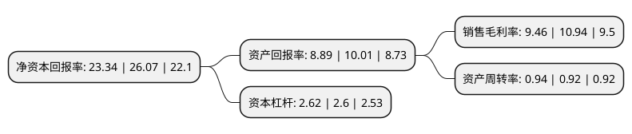

> 本页面由自动化程序生成于 2022年5月20日 01:32
> 内容可能存在错误，如有bug请提交issue至：https://github.com/Eroleice/doc-pi/issues
{.is-warning}

# 上市公司基本情况

## 基本资料

安徽万朗磁塑股份有限公司（以下简称“万朗磁塑”）成立于1999年10月27日，合肥市。于2022年01月24日在上交所主板上市。

万朗磁塑注册资本8,300万元，主要产品包括冰箱门封，吸塑，注塑和组件部装等，其中主导产品为冰箱门封。致力于以冰箱门封为核心的各类冰箱塑料部件产品的研发，生产，加工和销售。以下是详细信息：

- 公司名称: 安徽万朗磁塑股份有限公司
- 股票代码: 603150.SH
- 所在地: 安徽 - 合肥市
- 成立日期: 1999年10月27日
- 注册资本: 8,300万元
- 法定代表人: 时乾中
- 主营业务: 主要产品包括冰箱门封，吸塑，注塑和组件部装等，其中主导产品为冰箱门封致力于以冰箱门封为核心的各类冰箱塑料部件产品的研发，生产，加工和销售
- 公司官网: www.higasket.com
- 公司介绍: 自设立以来，公司一直致力于以冰箱门封为核心的各类冰箱塑料部件产品的研发、生产、加工和销售，主导产品为冰箱门封。2020年12月，公司“冰箱门密封条”被工信部、中国工业经济联合会认定为“制造业单项冠军产品(2021年-2023年)”。随着对冰箱节能降耗的要求越来越高，冰箱节能技术不断发展，对冰箱门封的保温、隔热、防发霉、防硬化、防变形等方面也提出了更高的要求。为此，公司持续进行研发创新，从材料改性、模具开发、门封焊接和产品开发等方面进行技术攻关，不断开发出符合绿色环保高效节能的门封产品。2016年10月，公司“TPE冰箱门密封条的研究与开发”项目已通过中国轻工业联合会科学技术成果鉴定，该项目将EPDM与SEBS复配的TPE材料应用于冰箱门密封领域，并形成多项专利技术，技术达到国际领先水平；2018年2月，公司“TPE冰箱门密封条的研究与开发”项目获得中国轻工业联合会科学技术进步奖三等奖。

## 股东及高管情况

上市公司第一大股东为时乾中，持股31,966,620股，占比38.514%，为上市公司实际控制人。

截至2022年03月31日，上市公司的前十大股东中，共有4名自然人股东，3名机构股东，3个产品账户，其中5%以上大股东共有3名。上市公司前十大股东明细如下：

> 截至2022年03月31日，上市公司前十大股东信息如下：

| 股东名称 | 持股数量（股） | 持股比例 |
| --- | --- | --- |
| 时乾中 | 31,966,620 | 38.514% |
| 安徽高新金通安益二期创业投资基金(有限合伙) | 7,200,000 | 8.6747% |
| 欧阳瑞群 | 5,211,060 | 6.2784% |
| 安徽安元投资基金有限公司 | 3,000,000 | 3.6145% |
| 深圳益沣成资产管理有限公司 | 2,994,000 | 3.6072% |
| 六安拾岳禾安一期创业投资合伙企业(有限合伙) | 2,250,000 | 2.7108% |
| 甄新中 | 1,800,000 | 2.1687% |
| 安徽高新毅达皖江产业发展创业投资基金(有限合伙) | 1,800,000 | 2.1687% |
| 安徽志道投资有限公司 | 1,800,000 | 2.1687% |
| 马功权 | 1,333,320 | 1.6064% |

## 利润表分析

上市公司2021年总收入为14.77亿元，净利润为1.39亿元，实现盈利。

## 杜邦分析

> 数据列示周期：2021年 | 2020年 | 2019年
{.is-info}

上市公司的净资产收益率在近一年有所下降，下降幅度为-10.47%，其变化情况分解如下：
- 上市公司的销售毛利率在近一年下降了-13.53%，可能是生产效率的下降、商品原材料价格上涨或商品价格的下跌所致。
- 上市公司的资产周转率在近一年上升了2.17%，可能是源自于更快的销售回款或库存管理效果提升。
- 上市公司的财务杠杆比率在近一年上升了0.77%，可能是增加负债扩大生产规模。

