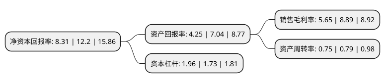

> 本页面由自动化程序生成于 2022年5月20日 01:33
> 内容可能存在错误，如有bug请提交issue至：https://github.com/Eroleice/doc-pi/issues
{.is-warning}

# 上市公司基本情况

## 基本资料

苏州赛伍应用技术股份有限公司（以下简称“赛伍技术”）成立于2008年11月04日，苏州市。于2020年04月30日在上交所主板上市。

赛伍技术注册资本40,407.4万元，薄膜形态功能性高分子材料的研发，生产和销售。以下是详细信息：

- 公司名称: 苏州赛伍应用技术股份有限公司
- 股票代码: 603212.SH
- 所在地: 江苏 - 苏州市
- 成立日期: 2008年11月04日
- 注册资本: 40,407.4万元
- 法定代表人: 吴小平
- 主营业务: 薄膜形态功能性高分子材料的研发，生产和销售
- 公司官网: www.cybrid.com.cn
- 公司介绍: 公司主要从事薄膜形态功能性高分子材料的研发、生产和销售。公司将“材料设计、树脂改性、胶粘剂配方、界面技术、测试评价”的基干技术与“涂布、复合、流延制膜”的工艺技术构成技术平台，在同一个技术平台上不断开发适用不同应用领域的功能性材料，实现同心圆多元化经营模式；同时公司在不同细分市场领域内通过创新工程实现差异化竞争优势或成本竞争优势。目前公司已形成光伏和非光伏两个业务板块，建立了光伏材料、工业胶带材料、电子电气材料三类产品体系，产品广泛应用于光伏、智能手机、声学产品、高铁车辆和智能空调等领域。

## 股东及高管情况

上市公司第一大股东为苏州高新区泛洋科技发展有限公司，持股115,968,024股，占比28.7%，**疑似为**上市公司实际控制人。

截至2022年05月10日，上市公司的前十大股东中，共有6名机构股东，1个产品账户，3个海外主体，其中5%以上大股东共有8名。上市公司前十大股东明细如下：

> 未能通过持股比例判定出上市公司实际控制人（持股30%以上）
> 可能存在通过间接持股、联合持股、协议控制等方式拥有实际控制权的主体，具体请参考上市公司定期公告！
{.is-warning}

> 截至2022年05月10日，上市公司前十大股东信息如下：

| 股东名称 | 持股数量（股） | 持股比例 |
| --- | --- | --- |
| 苏州高新区泛洋科技发展有限公司 | 115,968,024 | 28.7% |
| 苏州高新区泛洋科技发展有限公司 | 115,968,024 | 28.7% |
| SILVER GLOW INVESTMENTS LIMITED | 67,659,470 | 16.74% |
| SILVER GLOW INVESTMENTS LIMITED | 66,436,470 | 16.4415% |
| 吴江东运创业投资有限公司 | 31,615,682 | 7.82% |
| 苏州苏宇企业管理中心(有限合伙) | 27,319,622 | 6.76% |
| 苏州苏宇企业管理中心(有限合伙) | 27,319,622 | 6.76% |
| 上海汇至股权投资基金中心(有限合伙) | 22,660,000 | 5.61% |
| 苏州金茂新兴产业创业投资企业(有限合伙) | 5,622,300 | 1.39% |
| CHENG YU INVESTMENTS LIMITED | 3,988,775 | 0.99% |

## 利润表分析

上市公司2021年总收入为30.17亿元，净利润为1.7亿元，实现盈利。

## 杜邦分析

> 数据列示周期：2021年 | 2020年 | 2019年
{.is-info}

上市公司的净资产收益率在近一年有所下降，下降幅度为-31.89%，其变化情况分解如下：
- 上市公司的销售毛利率在近一年下降了-36.45%，可能是生产效率的下降、商品原材料价格上涨或商品价格的下跌所致。
- 上市公司的资产周转率在近一年下降了-5.06%，可能是源自于更慢的销售回款或库存管理效果下降。
- 上市公司的财务杠杆比率在近一年上升了13.29%，可能是增加负债扩大生产规模。

