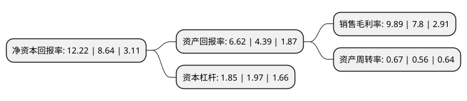

> 本页面由自动化程序生成于 2022年5月20日 01:33
> 内容可能存在错误，如有bug请提交issue至：https://github.com/Eroleice/doc-pi/issues
{.is-warning}

# 上市公司基本情况

## 基本资料

上海天洋热熔粘接材料股份有限公司（以下简称“上海天洋”）成立于2002年01月11日，上海市。于2017年02月13日在上交所主板上市。

上海天洋注册资本23,773.277万元，公司是热塑性高分子粘接材料及其应用制品的专业供应商，专注于各类热塑性环保粘接材料的研发，生产及销售。公司主要产品包括各类热熔胶胶粉及胶粒，热熔胶网膜，太阳能电池封装用EVA胶膜和热熔胶胶膜。以下是详细信息：

- 公司名称: 上海天洋热熔粘接材料股份有限公司
- 股票代码: 603330.SH
- 所在地: 上海 - 上海市
- 成立日期: 2002年01月11日
- 注册资本: 23,773.277万元
- 法定代表人: 李哲龙
- 主营业务: 公司是热塑性高分子粘接材料及其应用制品的专业供应商，专注于各类热塑性环保粘接材料的研发，生产及销售公司主要产品包括各类热熔胶胶粉及胶粒，热熔胶网膜，太阳能电池封装用EVA胶膜和热熔胶胶膜
- 公司官网: www.hotmelt.com.cn
- 公司介绍: 公司是热熔粘接材料及其应用制品的专业供应商，专注于各类热塑性环保粘接材料的研发、生产及销售。总部位于上海，并在江苏昆山等地拥有多座现代化工厂，专业研究和生产包括EVA、PA、PES、PU之胶膜、网膜、胶粒、胶粉等热熔粘接材料产品，产品被广泛应用于太阳能电池封装、服装衬布、汽车内装饰、鞋材、家具、过滤工业、工艺饰品和热转印等多个领域。上海天洋拥有独立的研发设计中心，产品、设备、技术相关专利多余项。对外与上海交通大学及华东理工大学等多个高等院校建立产学研合作关系，致力于提供环保、优质的创新型黏接材料解决方案。上海天洋同时参与起草制定多项胶黏剂国家行业标准，力求把绿色、安全的产品推广到生活的“衣、食、住、行”。上海天洋的JCC商标获得上海市著名商标称号。

## 股东及高管情况

上市公司第一大股东为李哲龙，持股77,268,227股，占比32.5%，为上市公司实际控制人。

截至2022年03月31日，上市公司的前十大股东中，共有7名自然人股东，3个产品账户，其中5%以上大股东共有2名。上市公司前十大股东明细如下：

> 截至2022年03月31日，上市公司前十大股东信息如下：

| 股东名称 | 持股数量（股） | 持股比例 |
| --- | --- | --- |
| 李哲龙 | 77,268,227 | 32.5% |
| 李明健 | 30,258,365 | 12.73% |
| 朴艺峰 | 11,789,312 | 4.96% |
| 中国银行股份有限公司-华夏行业景气混合型证券投资基金 | 6,581,934 | 2.77% |
| 李顺玉 | 3,226,532 | 1.36% |
| 上海天洋热熔粘接材料股份有限公司-第一期员工持股计划 | 2,771,364 | 1.17% |
| 华夏基金-信泰人寿保险股份有限公司-分红产品-华夏基金-信泰人寿1号单一资产管理计划 | 2,335,500 | 0.98% |
| 李铁山 | 1,645,392 | 0.69% |
| 田文玉 | 1,605,240 | 0.68% |
| 马为民 | 1,473,500 | 0.62% |

## 利润表分析

上市公司2021年总收入为10.67亿元，净利润为1.05亿元，实现盈利。

## 杜邦分析

> 数据列示周期：2021年 | 2020年 | 2019年
{.is-info}

上市公司的净资产收益率在近一年有所上升，上升幅度为41.44%，其变化情况分解如下：
- 上市公司的销售毛利率在近一年上升了26.79%，可能是生产效率的提升、商品原材料价格下跌或商品价格的上涨所致。
- 上市公司的资产周转率在近一年上升了19.64%，可能是源自于更快的销售回款或库存管理效果提升。
- 上市公司的财务杠杆比率在近一年下降了-6.09%，可能是减少负债降低财务费用。

