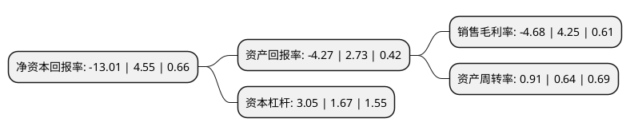

> 本页面由自动化程序生成于 2022年5月20日 01:35
> 内容可能存在错误，如有bug请提交issue至：https://github.com/Eroleice/doc-pi/issues
{.is-warning}

# 上市公司基本情况

## 基本资料

广东天安新材料股份有限公司（以下简称“天安新材”）成立于2000年05月15日，佛山市。于2017年09月06日在上交所主板上市。

天安新材注册资本20,944.2万元，主营业务:专业从事高分子复合饰面材料研发，设计，生产及销售，主要产品包括家居装饰饰面材料，汽车内饰饰面材料，薄膜及人造革。以下是详细信息：

- 公司名称: 广东天安新材料股份有限公司
- 股票代码: 603725.SH
- 所在地: 广东 - 佛山市
- 成立日期: 2000年05月15日
- 注册资本: 20,944.2万元
- 法定代表人: 吴启超
- 主营业务: 主营业务:专业从事高分子复合饰面材料研发，设计，生产及销售，主要产品包括家居装饰饰面材料，汽车内饰饰面材料，薄膜及人造革
- 公司官网: www.tianantech.com
- 公司介绍: 公司是一家专业从事高分子复合饰面材料设计、研发、生产及销售的高新技术企业，主要产品包括：家居装饰饰面材料、汽车内饰饰面材料、薄膜及人造革。公司具有较强的高分子新材料研究开发能力。公司采用PVC、PP、TPO等各种高分子材料，设计、生产出一系列符合美观、环保要求的饰面材料，形成了从材料研发、款式设计到生产加工、销售推广及终端应用的一体化业务体系。近年来，凭借持续的技术研发、客户开拓、跟踪与服务能力，公司实现了从传统产品逐步向更具核心竞争优势的环保新材料产品的成功升级。

## 股东及高管情况

上市公司第一大股东为吴启超，持股63,105,600股，占比30.13%，为上市公司实际控制人。

截至2022年03月31日，上市公司的前十大股东中，共有9名自然人股东，1个产品账户，其中5%以上大股东共有2名。上市公司前十大股东明细如下：

> 截至2022年03月31日，上市公司前十大股东信息如下：

| 股东名称 | 持股数量（股） | 持股比例 |
| --- | --- | --- |
| 吴启超 | 63,105,600 | 30.13% |
| 沈耀亮 | 12,005,755 | 5.73% |
| 孙泳慈 | 7,000,000 | 3.34% |
| 洪晓明 | 6,316,028 | 3.02% |
| 陈剑 | 5,947,757 | 2.84% |
| 中国工商银行股份有限公司-中欧潜力价值灵活配置混合型证券投资基金 | 5,121,940 | 2.45% |
| 王进花 | 3,281,080 | 1.57% |
| 梁梓聪 | 2,901,828 | 1.39% |
| 肖国华 | 2,601,371 | 1.24% |
| 肖在奎 | 1,850,040 | 0.88% |

## 杜邦分析

> 数据列示周期：2021年 | 2020年 | 2019年
{.is-info}

上市公司的净资产收益率在近一年有所下降，下降幅度为-385.93%，其变化情况分解如下：
- 上市公司的销售毛利率在近一年下降了-210.12%，可能是生产效率的下降、商品原材料价格上涨或商品价格的下跌所致。
- 上市公司的资产周转率在近一年上升了42.19%，可能是源自于更快的销售回款或库存管理效果提升。
- 上市公司的财务杠杆比率在近一年上升了82.63%，可能是增加负债扩大生产规模。

