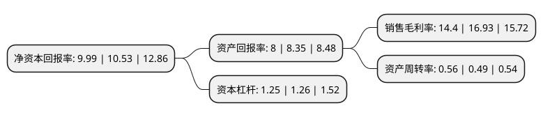

> 本页面由自动化程序生成于 2022年5月20日 01:39
> 内容可能存在错误，如有bug请提交issue至：https://github.com/Eroleice/doc-pi/issues
{.is-warning}

# 上市公司基本情况

## 基本资料

宁波长阳科技股份有限公司（以下简称“长阳科技”）成立于2010年11月16日，宁波市。于2019年11月06日在上交所科创板上市。

长阳科技注册资本28,517.756万元，光伏电站工程EPC总承包，光伏配套产品销售，光伏电站投资运营等以下是详细信息：

- 公司名称: 宁波长阳科技股份有限公司
- 股票代码: 688299.SH
- 所在地: 浙江 - 宁波市
- 成立日期: 2010年11月16日
- 注册资本: 28,517.756万元
- 法定代表人: 金亚东
- 主营业务: 光伏电站工程EPC总承包，光伏配套产品销售，光伏电站投资运营等
- 公司官网: www.solartrontech.com
- 公司介绍: 公司是一家拥有原创技术、核心专利、核心产品研发制造能力的全球领先高分子功能膜高新技术企业，致力于“成为中国领先、国际一流的功能膜公司”。公司主要从事反射膜、背板基膜、光学基膜及其它特种功能膜的研发、生产和销售，通过不断的进行研发投入和技术迭代升级，实现了液晶显示全尺寸应用领域的突破，公司也作为唯一的光学膜公司被中国电子材料行业协会和中国光学光电子行业协会液晶分会授予“中国新型显示产业链发展卓越贡献奖”。公司反射膜技术不断升级、品质不断提升、种类不断丰富，不仅改变了光学反射膜长期依赖进口的局面，更是大幅推进了反射膜大规模出口国际市场的进程。公司与韩国三星、韩国LG、群创光电等境外知名企业开展了深入的合作，并且在韩国三星电子VD部门全球600多家供应商中被选入其全球13家核心合作伙伴之一，成为了韩国三星电子光学膜片全球供应商。2017年末公司已成为全球光学反射膜细分行业龙头企业，反射膜出货面积位居全球第一，完成了反射膜的全面进口替代，打破了国外厂商长期以来的垄断，在过去6年内给我国液晶显示行业累计节省了数亿美元的成本。2018年公司反射膜产品获得了工信部单项冠军产品荣誉称号。

## 股东及高管情况

上市公司第一大股东为金亚东，持股45,543,922股，占比15.97%，**疑似为**上市公司实际控制人。

截至2022年03月31日，上市公司的前十大股东中，共有4名自然人股东，2名机构股东，4个产品账户，其中5%以上大股东共有1名。上市公司前十大股东明细如下：

> 未能通过持股比例判定出上市公司实际控制人（持股30%以上）
> 可能存在通过间接持股、联合持股、协议控制等方式拥有实际控制权的主体，具体请参考上市公司定期公告！
{.is-warning}

> 截至2022年03月31日，上市公司前十大股东信息如下：

| 股东名称 | 持股数量（股） | 持股比例 |
| --- | --- | --- |
| 金亚东 | 45,543,922 | 15.97% |
| 陈文 | 10,323,529 | 3.62% |
| 宁波长阳永汇投资管理合伙企业(有限合伙) | 9,639,227 | 3.38% |
| 中泰富力科技发展有限公司 | 8,528,500 | 2.99% |
| 上海阿杏投资管理有限公司-阿杏精诚一号私募证券投资基金 | 5,650,000 | 1.98% |
| 杭华 | 5,600,000 | 1.96% |
| 全国社保基金四一三组合 | 5,145,697 | 1.8% |
| 徐海鸥 | 4,000,000 | 1.4% |
| 中国银行股份有限公司-嘉实领先优势混合型证券投资基金 | 3,750,671 | 1.32% |
| 全国社保基金一零五组合 | 3,735,889 | 1.31% |

## 利润表分析

上市公司2021年总收入为12.96亿元，净利润为1.86亿元，实现盈利。

## 杜邦分析

> 数据列示周期：2021年 | 2020年 | 2019年
{.is-info}

上市公司的净资产收益率在近一年有所下降，下降幅度为-5.13%，其变化情况分解如下：
- 上市公司的销售毛利率在近一年下降了-14.94%，可能是生产效率的下降、商品原材料价格上涨或商品价格的下跌所致。
- 上市公司的资产周转率在近一年上升了14.29%，可能是源自于更快的销售回款或库存管理效果提升。
- 上市公司的财务杠杆比率在近一年下降了-0.79%，可能是减少负债降低财务费用。

