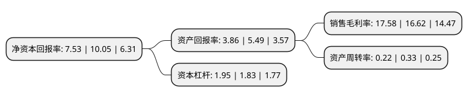

> 本页面由自动化程序生成于 2022年5月20日 01:39
> 内容可能存在错误，如有bug请提交issue至：https://github.com/Eroleice/doc-pi/issues
{.is-warning}

# 上市公司基本情况

## 基本资料

深圳瑞华泰薄膜科技股份有限公司（以下简称“瑞华泰”）成立于2004年12月17日，深圳市。于2021年04月28日在上交所科创板上市。

瑞华泰注册资本18,000万元，专业从事高性能PI薄膜的研发，生产和销售，主要产品系列包括热控PI薄膜，电子PI薄膜，电工PI薄膜等。以下是详细信息：

- 公司名称: 深圳瑞华泰薄膜科技股份有限公司
- 股票代码: 688323.SH
- 所在地: 广东 - 深圳市
- 成立日期: 2004年12月17日
- 注册资本: 18,000万元
- 法定代表人: 汤昌丹
- 主营业务: 专业从事高性能PI薄膜的研发，生产和销售，主要产品系列包括热控PI薄膜，电子PI薄膜，电工PI薄膜等
- 公司官网: www.rayitek.com
- 公司介绍: 公司作为国内高性能PI薄膜行业的先行者，于2010年完成了国家发改委“1000mm幅宽连续双向拉伸聚酰亚胺薄膜生产线”高技术产业化示范工程，同类产品达到国际先进水平，极大推动了高性能PI薄膜的国产化进程。通过15年的持续技术研发，公司掌握了配方、工艺及装备等完整的高性能PI薄膜制备核心技术，已成为全球高性能PI薄膜产品种类最丰富的供应商之一，公司工程技术中心于2020年被认定为省级工程技术研究中心。公司两项产品列入“中国制造2025重点新材料首批次应用示范目录(2017年版)”，双向拉伸PI薄膜产品荣获2012年中国新材料产业博览会金奖，无色PI薄膜产品荣获2014年中国国际新材料产业博览会金奖。

## 股东及高管情况

上市公司第一大股东为航科新世纪科技发展(深圳)有限公司，持股42,083,059股，占比23.38%，**疑似为**上市公司实际控制人。

截至2022年03月31日，上市公司的前十大股东中，共有2名自然人股东，5名机构股东，3个产品账户，其中5%以上大股东共有6名。上市公司前十大股东明细如下：

> 未能通过持股比例判定出上市公司实际控制人（持股30%以上）
> 可能存在通过间接持股、联合持股、协议控制等方式拥有实际控制权的主体，具体请参考上市公司定期公告！
{.is-warning}

> 截至2022年03月31日，上市公司前十大股东信息如下：

| 股东名称 | 持股数量（股） | 持股比例 |
| --- | --- | --- |
| 航科新世纪科技发展(深圳)有限公司 | 42,083,059 | 23.38% |
| 国投高科技投资有限公司 | 20,466,447 | 11.37% |
| 深圳泰巨科技投资管理合伙企业(有限合伙) | 17,616,612 | 9.79% |
| 上海联升创业投资有限公司 | 15,349,836 | 8.53% |
| 中国合伙人(上海)股权投资基金管理有限公司-宁波达科睿联股权投资合伙企业(有限合伙) | 10,000,000 | 5.56% |
| 中小企业(深圳)产业投资基金管理有限公司-深圳市华翼壹号股权投资合伙企业(有限合伙) | 9,057,028 | 5.03% |
| 徐炜群 | 5,070,000 | 2.82% |
| 上海联升承业创业投资有限公司 | 5,000,000 | 2.78% |
| 国信证券-农业银行-国信证券鼎信12号员工参与战略配售集合资产管理计划 | 4,215,000 | 2.34% |
| 龚小萍 | 3,330,147 | 1.85% |

## 利润表分析

上市公司2021年总收入为3.18亿元，净利润为0.56亿元，实现盈利。

## 杜邦分析

> 数据列示周期：2021年 | 2020年 | 2019年
{.is-info}

上市公司的净资产收益率在近一年有所下降，下降幅度为-25.07%，其变化情况分解如下：
- 上市公司的销售毛利率在近一年上升了5.78%，可能是生产效率的提升、商品原材料价格下跌或商品价格的上涨所致。
- 上市公司的资产周转率在近一年下降了-33.33%，可能是源自于更慢的销售回款或库存管理效果下降。
- 上市公司的财务杠杆比率在近一年上升了6.56%，可能是增加负债扩大生产规模。

