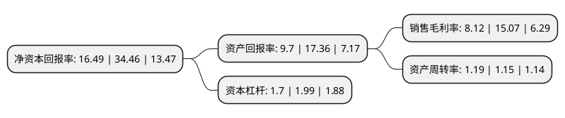

> 本页面由自动化程序生成于 2022年5月20日 01:40
> 内容可能存在错误，如有bug请提交issue至：https://github.com/Eroleice/doc-pi/issues
{.is-warning}

# 上市公司基本情况

## 基本资料

上海海优威新材料股份有限公司（以下简称“海优新材”）成立于2005年09月22日，上海市。于2021年01月22日在上交所科创板上市。

海优新材注册资本8,402万元，从事特种高分子薄膜的研发，生产和销售以下是详细信息：

- 公司名称: 上海海优威新材料股份有限公司
- 股票代码: 688680.SH
- 所在地: 上海 - 上海市
- 成立日期: 2005年09月22日
- 注册资本: 8,402万元
- 法定代表人: 李民
- 主营业务: 从事特种高分子薄膜的研发，生产和销售
- 公司官网: www.hiuv.net
- 公司介绍: 公司是从事特种高分子薄膜研发、生产和销售的高新技术企业，是一家具有国际化研发、管理、营销和服务能力，并兼具中国制造优势的特种高分子薄膜材料“智”造商，公司以薄膜技术为核心，长期立足于新能源、新材料产业，致力于为客户提供中高端薄膜产品。目前公司主要产品为透明EVA胶膜、白色增效EVA胶膜、多层共挤POE胶膜及玻璃胶膜等薄膜产品，公司以光伏组件封装行业为着力点，依靠先进的技术和高品质的产品达到光伏组件封装材料不断提升的质量标准，并满足客户不断增长的市场需求。在聚焦下游光伏组件封装行业的同时，公司充分发挥高分子膜材料技术、膜装备技术以及膜工艺技术的扎实基础及创新能力，积极在建筑、交通、电子、半导体、大消费等行业探索和开发新型膜材料产品，以求逐步发展为多元化的技术领先型特种高分子薄膜生产企业。基于公司的技术优势，公司获得上海市科技小巨人企业、上海市专利试点企业、上海市专精特新企业、浦东新区十三五战略新兴产业(重点培育企业)、上海市科技进步二等奖、浦东新区科技进步奖、浦东新区优秀专利奖、浦东新区创新成就奖等荣誉。

## 股东及高管情况

上市公司第一大股东为李民，持股20,020,120股，占比23.83%，**疑似为**上市公司实际控制人。

截至2022年03月31日，上市公司的前十大股东中，共有4名自然人股东，4名机构股东，2个产品账户，其中5%以上大股东共有2名。上市公司前十大股东明细如下：

> 未能通过持股比例判定出上市公司实际控制人（持股30%以上）
> 可能存在通过间接持股、联合持股、协议控制等方式拥有实际控制权的主体，具体请参考上市公司定期公告！
{.is-warning}

> 截至2022年03月31日，上市公司前十大股东信息如下：

| 股东名称 | 持股数量（股） | 持股比例 |
| --- | --- | --- |
| 李民 | 20,020,120 | 23.83% |
| 李晓昱 | 8,735,040 | 10.4% |
| 齐明 | 3,764,706 | 4.48% |
| 全杨 | 3,307,118 | 3.94% |
| 上海浦东发展银行股份有限公司-广发高端制造股票型发起式证券投资基金 | 2,620,360 | 3.12% |
| 深圳鹏瑞集团有限公司 | 2,139,680 | 2.55% |
| 昆山分享股权投资企业(有限合伙) | 2,032,480 | 2.42% |
| 上海海优威新投资管理合伙企业(有限合伙) | 1,721,680 | 2.05% |
| 上海海优威投资有限公司 | 1,466,960 | 1.75% |
| 中国工商银行股份有限公司-广发鑫享灵活配置混合型证券投资基金 | 1,214,578 | 1.45% |

## 利润表分析

上市公司2021年总收入为31.05亿元，净利润为2.52亿元，实现盈利。

## 杜邦分析

> 数据列示周期：2021年 | 2020年 | 2019年
{.is-info}

上市公司的净资产收益率在近一年有所下降，下降幅度为-52.15%，其变化情况分解如下：
- 上市公司的销售毛利率在近一年下降了-46.12%，可能是生产效率的下降、商品原材料价格上涨或商品价格的下跌所致。
- 上市公司的资产周转率在近一年上升了3.48%，可能是源自于更快的销售回款或库存管理效果提升。
- 上市公司的财务杠杆比率在近一年下降了-14.57%，可能是减少负债降低财务费用。

