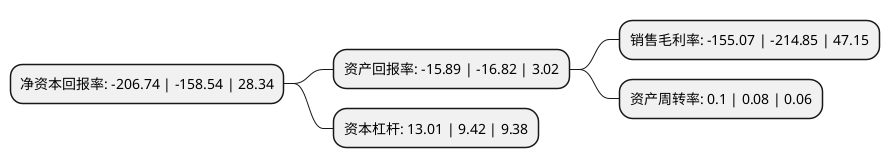

> 本页面由自动化程序生成于 2022年5月20日 01:01
> 内容可能存在错误，如有bug请提交issue至：https://github.com/Eroleice/doc-pi/issues
{.is-warning}

# 上市公司基本情况

## 基本资料

泛海控股股份有限公司（以下简称“泛海控股”）成立于1989年05月09日，北京市。于1994年09月12日在深交所主板上市。

泛海控股注册资本519,620.066万元，主要业务:房地产开发经营，项目投资。以下是详细信息：

- 公司名称: 泛海控股股份有限公司
- 股票代码: 000046.SZ
- 所在地: 北京 - 北京市
- 成立日期: 1989年05月09日
- 注册资本: 519,620.066万元
- 法定代表人: 栾先舟
- 主营业务: 房地产开发经营，项目投资
- 公司官网: www.fhkg.com
- 公司介绍: 公司成立于1989年，于1994年在深圳证券交易所挂牌上市。面对中国经济结构转型的历史性机遇，泛海控股敏锐感知宏观经济和行业市场的变化，重新规划了产业发展方向，在继续发挥房地产业务优势的基础上，融合具有较大发展潜力的金融、战略投资等业务板块，将公司打造成涵盖金融、房地产、战略投资等业务的综合性控股上市公司。在金融业务领域，泛海控股围绕构筑完整的金融服务体系，业务已涵盖证券、信托、保险、期货、基金、资产管理、互联网金融等领域，形成了以民生证券、民生信托、亚太财险为核心的金融布局和业态分布。在地产业务领域，泛海控股涉及规划设计、开发建设、商业管理及物业服务等，具备大体量、多业态综合开发能力，项目布局已从北京、上海、武汉等国内一、二线城市延伸至美国洛杉矶、旧金山、纽约等海外市场。在战略投资领域，泛海控股已形成境内以“泛海投资”、境外以“中泛集团”、“中泛控股”为核心的战略布局，以期与公司现有业务形成互补和平衡。

## 股东及高管情况

上市公司第一大股东为中国泛海控股集团有限公司，持股3,177,247,578股，占比61.15%，为上市公司实际控制人。

截至2022年03月31日，上市公司的前十大股东中，共有5名自然人股东，4名机构股东，1个海外主体，其中5%以上大股东共有1名。上市公司前十大股东明细如下：

> 截至2022年03月31日，上市公司前十大股东信息如下：

| 股东名称 | 持股数量（股） | 持股比例 |
| --- | --- | --- |
| 中国泛海控股集团有限公司 | 3,177,247,578 | 61.15% |
| 泛海能源控股股份有限公司 | 124,000,000 | 2.39% |
| 林芝锦华投资管理有限公司 | 61,111,111 | 1.18% |
| 德邦创新资本-渤海银行-中融国际信托有限公司 | 57,972,922 | 1.12% |
| 黄木顺 | 50,500,000 | 0.97% |
| 香港中央结算有限公司(陆股通) | 45,247,520 | 0.87% |
| 陈克春 | 44,139,492 | 0.85% |
| 阮京虹 | 22,571,690 | 0.43% |
| 王涛 | 21,990,100 | 0.42% |
| 周小丽 | 19,206,265 | 0.37% |

## 利润表分析

上市公司2021年总收入为149.22亿元，净利润为-130.88亿元，**未实现盈利**。

## 杜邦分析

> 数据列示周期：2021年 | 2020年 | 2019年
{.is-info}

上市公司的净资产收益率在近一年有所上升，上升幅度为30.4%，其变化情况分解如下：
- 上市公司的销售毛利率在近一年下降了-27.82%，可能是生产效率的下降、商品原材料价格上涨或商品价格的下跌所致。
- 上市公司的资产周转率在近一年上升了25%，可能是源自于更快的销售回款或库存管理效果提升。
- 上市公司的财务杠杆比率在近一年上升了38.11%，可能是增加负债扩大生产规模。

