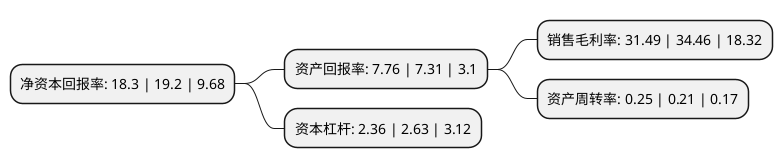

> 本页面由自动化程序生成于 2022年5月20日 01:02
> 内容可能存在错误，如有bug请提交issue至：https://github.com/Eroleice/doc-pi/issues
{.is-warning}

# 上市公司基本情况

## 基本资料

珠海华金资本股份有限公司（以下简称“华金资本”）成立于1992年10月28日，珠海市。于1994年01月03日在深交所主板上市。

华金资本注册资本34,470.834万元，主要业务:电子器件销售，远程教育，网络工程，技术服务与培训，IT产品代理，污水处理。以下是详细信息：

- 公司名称: 珠海华金资本股份有限公司
- 股票代码: 000532.SZ
- 所在地: 广东 - 珠海市
- 成立日期: 1992年10月28日
- 注册资本: 34,470.834万元
- 法定代表人: 郭瑾
- 主营业务: 电子器件销售，远程教育，网络工程，技术服务与培训，IT产品代理，污水处理
- 公司官网: www.huajinct.com
- 公司介绍: 公司是一家从事多个行业的集团型企业。2015年，公司启动战略转型，组建华金创新投资、华金资产管理等专业子公司，全力打造股权投资、资产管理、实体产业三大业务体系，构建了“创投+实业”双轮驱动的产业新格局。创投方面坚持价值投资理念，重点布局互联网、生物医药、高端制造、新能源、节能环保、文化传媒等领域，已成功投资博纳影业、优必选、和力辰光等众多优质项目；实业方面以华冠科技、华冠电容器、力合环保等为主体，做精做优，提质增效，充分发挥对上市公司的业绩支撑作用。公司立足中国，放眼国际，积极打造境内、境外业务平台。境内平台以北京、上海、深圳、天津为重点，境外平台以中国香港、美国硅谷为重点，形成以珠海中心、布局全国、辐射全球的业务布局体系。

## 股东及高管情况

上市公司第一大股东为珠海华发实体产业投资控股有限公司，持股98,078,081股，占比28.45%，**疑似为**上市公司实际控制人。

截至2022年03月31日，上市公司的前十大股东中，共有5名自然人股东，5名机构股东，其中5%以上大股东共有3名。上市公司前十大股东明细如下：

> 未能通过持股比例判定出上市公司实际控制人（持股30%以上）
> 可能存在通过间接持股、联合持股、协议控制等方式拥有实际控制权的主体，具体请参考上市公司定期公告！
{.is-warning}

> 截至2022年03月31日，上市公司前十大股东信息如下：

| 股东名称 | 持股数量（股） | 持股比例 |
| --- | --- | --- |
| 珠海华发实体产业投资控股有限公司 | 98,078,081 | 28.45% |
| 珠海水务环境控股集团有限公司 | 39,883,353 | 11.57% |
| 力合科创集团有限公司 | 31,574,891 | 9.16% |
| 珠海市联基控股有限公司 | 2,219,336 | 0.64% |
| 赖荣跃 | 1,903,118 | 0.55% |
| 黄建国 | 1,450,000 | 0.42% |
| 北京艾莱宏达商贸有限公司 | 1,130,000 | 0.33% |
| 王毅 | 1,090,800 | 0.32% |
| 常英 | 900,000 | 0.26% |
| 赖盛群 | 787,890 | 0.23% |

## 利润表分析

上市公司2021年总收入为6.3亿元，净利润为1.98亿元，实现盈利。

## 杜邦分析

> 数据列示周期：2021年 | 2020年 | 2019年
{.is-info}

上市公司的净资产收益率在近一年有所下降，下降幅度为-4.69%，其变化情况分解如下：
- 上市公司的销售毛利率在近一年下降了-8.62%，可能是生产效率的下降、商品原材料价格上涨或商品价格的下跌所致。
- 上市公司的资产周转率在近一年上升了19.05%，可能是源自于更快的销售回款或库存管理效果提升。
- 上市公司的财务杠杆比率在近一年下降了-10.27%，可能是减少负债降低财务费用。

