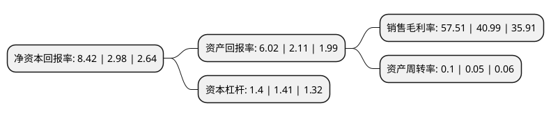

> 本页面由自动化程序生成于 2022年5月20日 01:02
> 内容可能存在错误，如有bug请提交issue至：https://github.com/Eroleice/doc-pi/issues
{.is-warning}

# 上市公司基本情况

## 基本资料

海南海德资本管理股份有限公司（以下简称“海德股份”）成立于1987年03月02日，海口市。于1994年05月25日在深交所主板上市。

海德股份注册资本64,113.893万元，不良资产管理以下是详细信息：

- 公司名称: 海南海德资本管理股份有限公司
- 股票代码: 000567.SZ
- 所在地: 海南 - 海口市
- 成立日期: 1987年03月02日
- 注册资本: 64,113.893万元
- 法定代表人: 王广西
- 主营业务: 不良资产管理
- 公司官网: www.000567.com
- 公司介绍: 公司先后从事纺织、房地产开发业务,现以金融为方向以资产管理起步的转型发展战略，打造中国不良资管第一股。公司主要业务有：进行收购管理各类债权、股权、动产、不动产等形式的不良资产，通过债务追偿、债务重组、债转股、企业重整、资产证券化等多种处置方式，致力于在资产收购、处置、经营、管理等方面，为地方企业重组、产业整合、转型升级提供高质量、专业化的金融服务。公司转型金融领域后，各项业务健康快速发展。已在全国多地与地方政府、金融机构、大型企业建立起战略合作关系，共谋产融大局;在京、沪、深等城市，与知名机构合作，搭建起辐射全国的不良资产处置产业链体系及资管业务平台。

## 股东及高管情况

上市公司第一大股东为永泰集团有限公司，持股421,898,926股，占比65.8%，为上市公司实际控制人。

截至2022年03月31日，上市公司的前十大股东中，共有5名自然人股东，3名机构股东，1个海外主体，1名其他股东，其中5%以上大股东共有2名。上市公司前十大股东明细如下：

> 截至2022年03月31日，上市公司前十大股东信息如下：

| 股东名称 | 持股数量（股） | 持股比例 |
| --- | --- | --- |
| 永泰集团有限公司 | 421,898,926 | 65.8% |
| 海南祥源投资有限公司 | 49,000,049 | 7.64% |
| 海南新海基投资有限公司 | 11,766,750 | 1.84% |
| 关闭海南发展银行清算组 | 4,594,166 | 0.72% |
| 敬祥友 | 2,286,000 | 0.36% |
| 王赤平 | 1,901,900 | 0.3% |
| 香港中央结算有限公司(陆股通) | 1,593,950 | 0.25% |
| 宋文霞 | 1,504,600 | 0.23% |
| 盛杜妹 | 1,418,825 | 0.22% |
| 崔云川 | 1,344,290 | 0.21% |

## 利润表分析

上市公司2021年总收入为6.66亿元，净利润为3.83亿元，实现盈利。

## 杜邦分析

> 数据列示周期：2021年 | 2020年 | 2019年
{.is-info}

上市公司的净资产收益率在近一年有所上升，上升幅度为182.55%，其变化情况分解如下：
- 上市公司的销售毛利率在近一年上升了40.3%，可能是生产效率的提升、商品原材料价格下跌或商品价格的上涨所致。
- 上市公司的资产周转率在近一年上升了100%，可能是源自于更快的销售回款或库存管理效果提升。
- 上市公司的财务杠杆比率在近一年下降了-0.71%，可能是减少负债降低财务费用。

