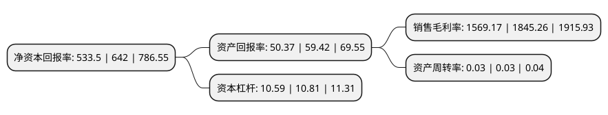

> 本页面由自动化程序生成于 2022年5月20日 01:02
> 内容可能存在错误，如有bug请提交issue至：https://github.com/Eroleice/doc-pi/issues
{.is-warning}

# 上市公司基本情况

## 基本资料

中国石油集团资本股份有限公司（以下简称“中油资本”）成立于1996年10月11日，克拉玛依市。于1996年10月22日在深交所主板上市。

中油资本注册资本1,264,207.908万元，主营业务:柴油机，柴油机发电机组，气体机，气体发电机组的生产和销售业务。主要产品包括:柴油机及发电机组，气体机及发电机组。以下是详细信息：

- 公司名称: 中国石油集团资本股份有限公司
- 股票代码: 000617.SZ
- 所在地: 新疆 - 克拉玛依市
- 成立日期: 1996年10月11日
- 注册资本: 1,264,207.908万元
- 法定代表人: 蒋尚军
- 主营业务: 主营业务:柴油机，柴油机发电机组，气体机，气体发电机组的生产和销售业务主要产品包括:柴油机及发电机组，气体机及发电机组
- 公司官网: www.cnpccapital.cn
- 公司介绍: 公司的原主营业务为内燃机的制造、研发及销售，主要产品是190mm缸径中高速柴油机、气体机及发电机组，主要应用于石油石化，近海、内河航运及渔业捕捞，煤层气、高炉尾气、沼气等气体发电等领域。公司通过重大资产重组，将原有资产置出，同时中油资本100%股权的置入，公司持有中油资本100%股权，并通过中油资本及其下属全资公司持有中油财务、昆仑银行、昆仑金融租赁、昆仑信托、中意人寿、中意财险、专属保险、昆仑保险经纪、中银国际、中债信增等公司的相关股权。公司的业务范围涵盖财务公司、银行、金融租赁、信托、保险、保险经纪、证券等多项金融业务，成为全方位综合性金融业务公司。公司将持续做大做强金融业务，形成依托中石油集团强大实业背景和品牌资源，拥有行业内较多金融牌照的金融业务新格局。

## 股东及高管情况

上市公司第一大股东为中国石油天然气集团有限公司，持股9,778,839,652股，占比77.35%，为上市公司实际控制人。

截至2022年03月31日，上市公司的前十大股东中，共有7名机构股东，3个产品账户，其中5%以上大股东共有1名。上市公司前十大股东明细如下：

> 截至2022年03月31日，上市公司前十大股东信息如下：

| 股东名称 | 持股数量（股） | 持股比例 |
| --- | --- | --- |
| 中国石油天然气集团有限公司 | 9,778,839,652 | 77.35% |
| 泰康资产丰华股票专项型养老金产品-中国工商银行股份有限公司 | 265,494,911 | 2.1% |
| 航天信息股份有限公司 | 246,068,455 | 1.95% |
| 中国国有资本风险投资基金股份有限公司 | 246,068,455 | 1.95% |
| 北京市燃气集团有限责任公司 | 246,068,455 | 1.95% |
| 中建资本控股有限公司 | 246,068,455 | 1.95% |
| 中国石油集团济柴动力有限公司 | 241,532,928 | 1.91% |
| 海峡能源产业基金管理(厦门)有限公司 | 229,291,155 | 1.81% |
| 中国长城资产管理股份有限公司 | 111,951,707 | 0.89% |
| 中车金证投资有限公司 | 103,107,770 | 0.82% |

## 利润表分析

上市公司2021年总收入为309.63亿元，净利润为115.88亿元，实现盈利。

## 杜邦分析

> 数据列示周期：2021年 | 2020年 | 2019年
{.is-info}

上市公司的净资产收益率在近一年有所下降，下降幅度为-16.9%，其变化情况分解如下：
- 上市公司的销售毛利率在近一年下降了-14.96%，可能是生产效率的下降、商品原材料价格上涨或商品价格的下跌所致。
- 上市公司的资产周转率在近一年下降了0%，可能是源自于更慢的销售回款或库存管理效果下降。
- 上市公司的财务杠杆比率在近一年下降了-2.04%，可能是减少负债降低财务费用。

